<div align="center">

<pre>
  ___                    _   _  ___  _____
 / _ \ _ __  ___  _ ___ | | | |/ __\/ ___/
| | | | '_ \/ _ \| '_  \| |_| | |   \___ \
| |_| | |_||| __/| | | ||  _  | |__  __/ |
 \___/| .__/\___||_| |_||_| |_|\___/\____/
      |_|           High-Content Screening
</pre>

**Bioimage analysis platform for high-content screening**\
**Compile-time validation · Bidirectional GUI↔Code · Multi-GPU · LLM pipeline generation · 574+ functions**

[](https://pypi.org/project/openhcs/)
[](https://opensource.org/licenses/MIT)
[](https://www.python.org/downloads/)
[](https://github.com/OpenHCSDev/OpenHCS)
[](https://openhcs.readthedocs.io)

</div>

---

## 🎬 Demo

[](https://github.com/OpenHCSDev/OpenHCS/blob/main/docs/source/_static/openhcs.mp4)

Watch in GitHub player: https://github.com/OpenHCSDev/OpenHCS/blob/main/docs/source/_static/openhcs.mp4  
Direct MP4 (full quality): https://raw.githubusercontent.com/OpenHCSDev/OpenHCS/refs/heads/main/docs/source/_static/openhcs.mp4

---

OpenHCS processes large microscopy datasets (100GB+) with a **compile-then-execute** architecture. Pipelines are validated across all wells *before* any processing starts, preventing failures after hours of computation. Design pipelines in the GUI, export to Python, edit as code, and re-import — switching seamlessly between visual and programmatic workflows.

```mermaid
graph LR
    subgraph Microscopes
        IX[ImageXpress]
        OP[Opera Phenix]
        OM[OMERO]
    end

    subgraph OpenHCS Platform
        PD["Pipeline Designer<br/>(GUI ⇄ Code ⇄ LLM)"]
        CO["5-Phase Compiler<br/>(validate)"]
        EX["Multi-Process Executor<br/>(1 process/well · multi-GPU)"]
        FN["574+ Unified Functions<br/>scikit-image · CuPy · pyclesperanto<br/>PyTorch · JAX · TF · CuCIM · custom"]
        PS["PolyStore<br/>(Memory ↔ Disk ↔ ZARR ↔ Stream)"]
    end

    subgraph Viewers
        NA[Napari]
        FJ[Fiji/ImageJ]
    end

    IX --> PD
    OP --> PD
    OM --> PD
    PD --> CO --> EX
    EX --> FN --> PS
    PS --> NA
    PS --> FJ
```



---

## ⚡ Key Capabilities

<table>
<tr>
<td width="50%" valign="top">

### 🛡️ Compile-Time Validation
Pipelines are compiled through **5 phases** before execution — path planning, store declaration, materialization flags, memory contract validation, GPU assignment — then frozen into immutable contexts. Errors surface immediately, not after hours of processing.

</td>
<td width="50%" valign="top">

### 🔄 Bidirectional GUI ↔ Code
Design pipelines visually, export as executable Python, edit in your IDE, re-import to the GUI. Code generation works at **any scope level** — function patterns, individual steps, pipeline configs, full orchestrator scripts — any window holding objects can generate and re-import code.

</td>
</tr>
<tr>
<td width="50%" valign="top">

### 🧠 LLM Pipeline Generation
Describe a pipeline in natural language and get executable code. Built-in chat panel with local Ollama or remote LLM endpoints. Dynamic system prompts built from the actual function registry — the LLM knows every available function and its signature.

</td>
<td width="50%" valign="top">

### ⚡ Full Multiprocessing & Multi-GPU
**1 process per well** via `ProcessPoolExecutor` with GPU scheduler assigning devices to workers. CUDA spawn-safe. Scales from laptops to multi-GPU workstations — process 100GB+ datasets with OME-ZARR compression (LZ4, ZSTD, Blosc).

</td>
</tr>
<tr>
<td width="50%" valign="top">

### 🔌 Any Python Function
Register **any** Python function by decorating it with `@numpy`, `@cupy`, `@pyclesperanto`, `@torch`, or other memory type decorators. Custom functions get automatic contract validation, UI integration, and appear alongside built-in functions. Persisted to `~/.openhcs/custom_functions/`.

</td>
<td width="50%" valign="top">

### 📊 Results Materialization
`@special_outputs` declaratively routes analysis results to **CSV**, **JSON**, **ROI ZIP** (ImageJ-compatible), or **TIFF stacks** via pluggable format writers. ROIs stream to Fiji/ImageJ. Results appear alongside processed images with no manual I/O code.

</td>
</tr>
<tr>
<td width="50%" valign="top">

### 🔬 Process-Isolated Napari & Fiji
Stream images to **Napari** and **Fiji/ImageJ** in real-time during pipeline execution. Viewers run in separate processes via ZeroMQ — no Qt threading conflicts. Persistent viewers survive pipeline completion. PolyStore treats viewers as streaming backends.

</td>
<td width="50%" valign="top">

### 🪟 Live Cross-Window Updates
Edit a value in `GlobalPipelineConfig` — watch it propagate in real-time to `PipelineConfig` and `StepConfig` windows. Dual-axis resolution (context hierarchy × class MRO) with scope isolation per orchestrator.

</td>
</tr>
</table>

---

## 🧩 The OpenHCS Ecosystem

OpenHCS is built on **8 purpose-extracted libraries** — each solving a general problem, each independently publishable, all woven into a cohesive platform:


| Library | Role in OpenHCS | What It Does |
|:--------|:----------------|:-------------|
| [**ObjectState**](https://github.com/OpenHCSDev/ObjectState) | Configuration framework | Lazy dataclasses with dual-axis inheritance (context hierarchy × class MRO) and `contextvars`-based resolution |
| [**ArrayBridge**](https://github.com/OpenHCSDev/ArrayBridge) | Memory type conversion | Unified API across NumPy, CuPy, PyTorch, JAX, TensorFlow, pyclesperanto with DLPack zero-copy transfers |
| [**PolyStore**](https://github.com/OpenHCSDev/PolyStore) | Unified I/O & streaming | Pluggable backends for storage (disk, memory, ZARR) *and* streaming (Napari, Fiji) — viewers are just backends. Virtual workspace, atomic writes, format detection, ROI extraction |
| [**ZMQRuntime**](https://github.com/OpenHCSDev/ZMQRuntime) | Distributed execution | ZMQ client-server for remote pipeline execution, progress streaming, and OMERO server-side processing |
| [**PyQT-reactive**](https://github.com/OpenHCSDev/PyQT-reactive) | UI form generation | React-style reactive forms from dataclasses with cross-window sync and flash animations |
| [**pycodify**](https://github.com/OpenHCSDev/pycodify) | Code ↔ object conversion | Python source as serialization format — type-preserving, diffable, editable, with collision handling |
| [**python-introspect**](https://github.com/OpenHCSDev/python-introspect) | Signature analysis | Pure-Python function/dataclass introspection for automatic UI generation and contract analysis |
| [**metaclass-registry**](https://github.com/OpenHCSDev/metaclass-registry) | Plugin discovery | Zero-boilerplate registry system powering microscope handler and storage backend auto-discovery |

---

## 🔬 Microscope & Function Support

<table>
<tr>
<td width="40%" valign="top">

**Microscope Systems**

| System | Vendor |
|:-------|:-------|
| ImageXpress | Molecular Devices |
| Opera Phenix | PerkinElmer |
| OMERO | Open Microscopy |
| OpenHCS Format | Native |

Auto-detected. Extensible via `metaclass-registry`.

</td>
<td width="60%" valign="top">

**574+ Functions — Automatic Discovery**

| Library | Functions | Acceleration |
|:--------|:---------:|:------------:|
| pyclesperanto | 230+ | OpenCL GPU |
| CuCIM/CuPy | 124+ | CUDA GPU |
| scikit-image | 110+ | CPU |
| PyTorch / JAX / TF | ✓ | CUDA GPU |
| OpenHCS native | ✓ | Mixed |

Unified contracts, automatic memory conversion via `ArrayBridge`.

</td>
</tr>
</table>

**Processing domains**: image preprocessing · segmentation · cell counting · stitching (MIST + Ashlar GPU) · neurite tracing · morphology · measurements

---

## 🚀 Quick Start

```bash
# Basic installation with GUI
pip install openhcs[gui]

# Add Napari viewer
pip install openhcs[gui,napari]

# Add Fiji/ImageJ viewer
pip install openhcs[gui,fiji]

# Add both viewers
pip install openhcs[gui,viz]

# Add GPU acceleration (CUDA 12.x required)
pip install openhcs[gui,gpu]

# Full installation (GUI + viewers + GPU)
pip install openhcs[gui,viz,gpu]

# Launch the application
openhcs
```

```python
# Or use programmatically — real pipeline from a neuroscience experiment
from openhcs.core.orchestrator.orchestrator import PipelineOrchestrator
from openhcs.core.steps.function_step import FunctionStep
from openhcs.constants.constants import VariableComponents
from openhcs.processing.backends.processors.cupy_processor import (
    stack_percentile_normalize, tophat, create_composite
)
from openhcs.processing.backends.pos_gen.ashlar_main_gpu import ashlar_compute_tile_positions_gpu
from openhcs.processing.backends.assemblers.assemble_stack_cupy import assemble_stack_cupy
from openhcs.processing.backends.analysis.cell_counting_cpu import count_cells_single_channel

steps = [
    FunctionStep(func=[
        (stack_percentile_normalize, {'low_percentile': 1.0, 'high_percentile': 99.0}),
        (tophat, {'selem_radius': 50, 'downsample_factor': 4})
    ], name="preprocess", variable_components=[VariableComponents.SITE]),

    FunctionStep(func=[create_composite],
                 name="composite", variable_components=[VariableComponents.CHANNEL]),

    FunctionStep(func=[ashlar_compute_tile_positions_gpu],
                 name="find_positions", variable_components=[VariableComponents.SITE]),

    FunctionStep(func=[(assemble_stack_cupy, {'blend_method': 'fixed'})],
                 name="assemble", variable_components=[VariableComponents.SITE],
                 force_disk_output=True),

    FunctionStep(func=[count_cells_single_channel],
                 name="count_cells", variable_components=[VariableComponents.SITE]),
]

orchestrator = PipelineOrchestrator("path/to/plate")
orchestrator.initialize()
compiled = orchestrator.compile_pipelines(steps)  # Validates everything first
orchestrator.execute_compiled_plate(steps, compiled, max_workers=5)
```

<details>
<summary><b>📦 All installation options</b></summary>

```bash
pip install openhcs              # Headless (servers, CI)
pip install openhcs[gui]         # Desktop GUI
pip install openhcs[gui,napari]  # GUI + Napari viewer
pip install openhcs[gui,viz]     # GUI + Napari + Fiji
pip install openhcs[gui,viz,gpu] # Full installation
pip install openhcs[gpu]         # Headless + GPU
pip install openhcs[omero]       # OMERO integration
pip install -e ".[all,dev]"      # Development (all features)
```

GPU requires CUDA 12.x. For CPU-only: `OPENHCS_CPU_ONLY=true pip install openhcs[gui]`

</details>

<details>
<summary><b>🗄️ OMERO integration</b></summary>

OMERO requires `zeroc-ice` (not on PyPI). The custom `setup.py` installs it automatically:

```bash
pip install 'openhcs[omero]'     # Auto-installs zeroc-ice
```

If that fails, alternatives:
```bash
python scripts/install_omero_deps.py   # Standalone script
pip install -r requirements-omero.txt  # Requirements file
```

Supported on Python 3.11 and 3.12. See [Glencoe Software](https://www.glencoesoftware.com/blog/2023/12/08/ice-binaries-for-omero.html) for manual installation.

</details>

---

## 📖 Documentation

| | |
|:---|:---|
| 📘 **[Read the Docs](https://openhcs.readthedocs.io/)** | Full API docs, tutorials, guides |
| 📊 **[Coverage Reports](https://trissim.github.io/openhcs/coverage/)** | Test coverage analysis |
| 🏗️ **[Architecture](https://openhcs.readthedocs.io/en/latest/architecture/)** | Pipeline system · GPU management · VFS · Config framework |
| 🎓 **[Getting Started](https://openhcs.readthedocs.io/en/latest/getting_started/)** | Installation · First pipeline |

---

## ⚙️ Architecture Highlights

<details>
<summary><b>5-Phase Pipeline Compilation</b> — catch errors before execution starts</summary>

```
Define → Compile → Freeze → Execute
         ├─ 1. Path planning
         ├─ 2. ZARR store declaration
         ├─ 3. Materialization flags
         ├─ 4. Memory contract validation
         └─ 5. GPU assignment
              → context.freeze()  # immutable
```

Pipelines are compiled for **every well** before any processing begins. Frozen contexts prevent state mutation during execution. [Read more →](https://openhcs.readthedocs.io/en/latest/architecture/pipeline-compilation-system.html)

</details>

<details>
<summary><b>Dual-Axis Configuration</b> — context hierarchy × class MRO</summary>

Resolution walks two axes simultaneously: the **context stack** (Global → Pipeline → Step) and the **class MRO** (inheritance chain). Built on `contextvars` for thread-safe, scope-isolated resolution. Preserves `None` vs concrete value distinction for proper field-level inheritance. Powered by `ObjectState`. [Read more →](https://openhcs.readthedocs.io/en/latest/architecture/configuration_framework.html)

</details>

<details>
<summary><b>Bidirectional GUI ↔ Code</b> — code generation at any scope level</summary>

Any window holding `ObjectState` objects can generate and re-import executable Python:

```
Function patterns · Individual steps · Pipeline configs · Full orchestrator scripts
              ↕  generate / AST-parse back  ↕
```

Each scope encapsulates all lower-scope imports. Generated code is fully executable without additional setup. Edit in your IDE or external editor, save, and the GUI re-imports via AST parsing. Powered by `pycodify` + `python-introspect`. [Read more →](https://openhcs.readthedocs.io/en/latest/architecture/code_ui_interconversion.html)

</details>

<details>
<summary><b>Cross-Window Live Updates</b> — class-level registry + Qt signals</summary>

A class-level registry tracks all active form managers. When a value changes in any config window, Qt signals propagate the change to every affected window with debounced, scope-isolated refreshes. Global → Pipeline → Step cascading with per-orchestrator isolation. Powered by `PyQT-reactive`. [Read more →](https://openhcs.readthedocs.io/en/latest/architecture/parameter_form_lifecycle.html)

</details>

<details>
<summary><b>More patterns</b> — PolyStore streaming, function discovery, memory types</summary>

- **PolyStore Unified I/O**: Storage backends (disk, memory, ZARR) and streaming backends (Napari, Fiji) behind one API — viewers are just backends. Virtual workspace path translation, atomic writes, ROI extraction.
- **Automatic Function Discovery**: 574+ functions with contract analysis and type-safe integration via `python-introspect` + `metaclass-registry`
- **Memory Type Management**: Compile-time validation of array type compatibility with zero-copy conversion via `ArrayBridge`
- **Custom Function Registration**: Any Python function decorated with `@numpy`, `@cupy`, `@pyclesperanto`, etc. is auto-integrated with contracts, UI forms, and the function registry
- **Evolution-Proof UI**: Type-based form generation from Python annotations — adapts automatically when signatures change

[Full architecture docs →](https://openhcs.readthedocs.io/en/latest/architecture/)

</details>

---

## 🤝 Contributing

```bash
git clone https://github.com/OpenHCSDev/OpenHCS.git && cd OpenHCS
pip install -e ".[all,dev]"
pytest tests/
```

**Contribution areas**: microscope formats · processing functions · GPU backends · documentation

---

## 📄 License

MIT — see [LICENSE](LICENSE).

## 🙏 Acknowledgments

OpenHCS evolved from [EZStitcher](https://github.com/OpenHCSDev/ezstitcher) and builds on [Ashlar](https://github.com/labsyspharm/ashlar) (stitching), [MIST](https://github.com/usnistgov/MIST) (phase correlation), [pyclesperanto](https://github.com/clEsperanto/pyclesperanto_prototype) (GPU image processing), and [scikit-image](https://scikit-image.org/) (image analysis).
