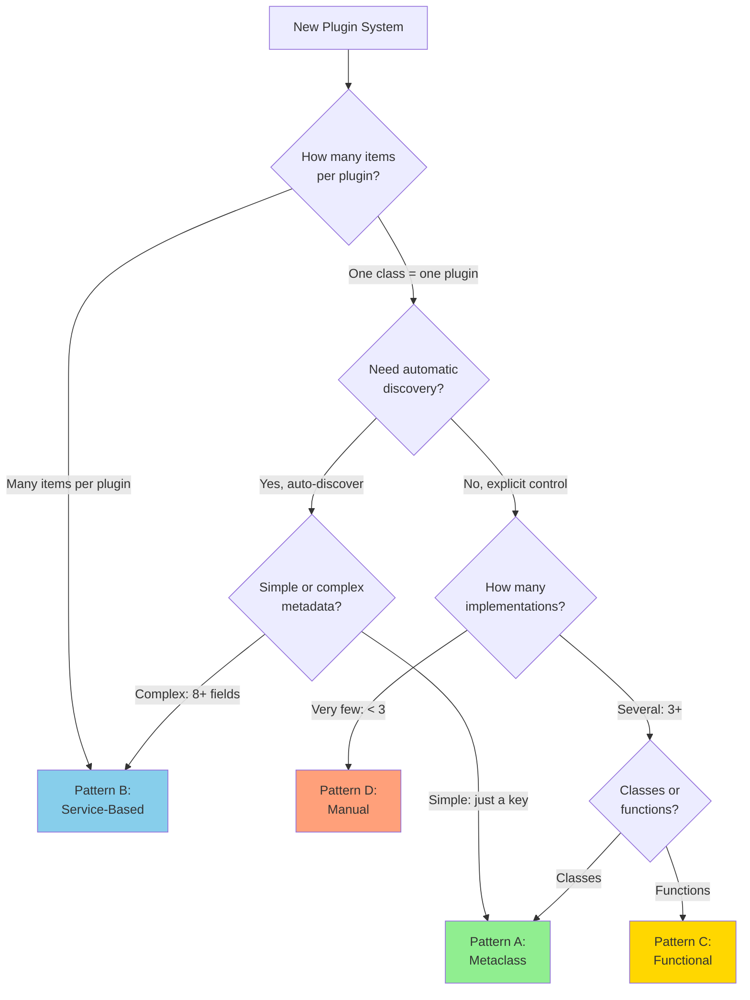

# OpenHCS Registry Framework

## Overview

The OpenHCS Registry Framework provides **four well-defined patterns** for plugin and extension systems. Every registry system in OpenHCS follows one of these patterns, ensuring consistency, discoverability, and maintainability.

**Vision**: Developers should know immediately which pattern to use for new plugin systems, and all existing systems should follow established patterns.

## The Four Registry Patterns

| Pattern | Use Case | Examples | Complexity |
|---------|----------|----------|------------|
| **[Pattern A: Metaclass](#pattern-a-metaclass-auto-registration)** | 1:1 class-to-plugin mapping | Microscope handlers, Storage backends | Medium |
| **[Pattern B: Service-Based](#pattern-b-service-based-registry)** | Many-to-one with rich metadata | Function registry, Format registry | High |
| **[Pattern C: Functional](#pattern-c-functional-registry)** | Simple type-to-handler mappings | Widget creation, Configuration | Low |
| **[Pattern D: Manual](#pattern-d-manual-registration)** | Complex init or rare plugins | ZMQ servers, Pipeline steps | Variable |

## Decision Tree



## Pattern A: Metaclass Auto-Registration

**When to use**:
- ✅ 1:1 class-to-plugin mapping
- ✅ Automatic discovery desired
- ✅ Simple metadata (just a registration key)
- ✅ 3-20+ implementations

**Examples**: Microscope handlers (5), Storage backends (4), Context providers (3)

**Infrastructure**: `openhcs/core/auto_register_meta.py`

**Quick Start**:
```python
from openhcs.core.auto_register_meta import AutoRegisterMeta, RegistryConfig

# 1. Create registry dict
MY_HANDLERS = {}

# 2. Configure registration
_HANDLER_CONFIG = RegistryConfig(
    registry_dict=MY_HANDLERS,
    key_attribute='_handler_type',
    skip_if_no_key=False,
    log_registration=True,
    registry_name='my handler'
)

# 3. Create metaclass
class MyHandlerMeta(AutoRegisterMeta):
    def __new__(mcs, name, bases, attrs):
        return super().__new__(mcs, name, bases, attrs,
                              registry_config=_HANDLER_CONFIG)

# 4. Use in classes
class MyHandler(metaclass=MyHandlerMeta):
    _handler_type = None  # Override in subclasses

class ImageHandler(MyHandler):
    _handler_type = 'image'  # Auto-registered!
```

**[Full Documentation →](pattern-a-metaclass-registry.md)**

## Pattern B: Service-Based Registry

**When to use**:
- ✅ Many-to-one mapping (multiple items per plugin)
- ✅ Rich metadata (8+ fields per item)
- ✅ Need aggregation across sources
- ✅ Discovery is expensive (needs caching)

**Examples**: Function registry (574+ functions from 4 libraries), Format registry (multiple microscope formats)

**Infrastructure**: ABC + Service pattern with `discover_registry_classes()`

**Quick Start**:
```python
from abc import ABC, abstractmethod
from dataclasses import dataclass
from openhcs.core.registry_discovery import discover_registry_classes

# 1. Define metadata dataclass
@dataclass(frozen=True)
class ItemMetadata:
    name: str
    func: Callable
    module: str
    doc: str
    tags: List[str]

# 2. Create abstract base class
class MyRegistryBase(ABC):
    def __init__(self, registry_name: str):
        self.registry_name = registry_name
    
    @abstractmethod
    def discover_items(self) -> Dict[str, ItemMetadata]:
        """Discover and return items."""
        pass

# 3. Implement concrete registries
class LibraryARegistry(MyRegistryBase):
    def __init__(self):
        super().__init__('library_a')
    
    def discover_items(self):
        # Discovery logic here
        return {...}

# 4. Create service for unified access
class RegistryService:
    @classmethod
    def get_all_items(cls):
        registries = discover_registry_classes(
            package_path=my_package.__path__,
            package_prefix=my_package.__name__ + ".",
            base_class=MyRegistryBase
        )
        all_items = {}
        for registry_class in registries:
            registry = registry_class()
            items = registry.discover_items()
            all_items.update(items)
        return all_items
```

**[Full Documentation →](pattern-b-service-based-registry.md)**

## Pattern C: Functional Registry

**When to use**:
- ✅ Simple type-to-handler mappings
- ✅ No state needed (stateless functions)
- ✅ Functional programming style
- ✅ Runtime type dispatch

**Examples**: Widget creation, Widget configuration, Placeholder strategies

**Infrastructure**: Simple dicts mapping types to functions

**Quick Start**:
```python
from typing import Dict, Type, Callable

# 1. Define registry
WIDGET_CREATORS: Dict[Type, Callable] = {
    int: lambda value: create_int_widget(value),
    float: lambda value: create_float_widget(value),
    str: lambda value: create_str_widget(value),
}

# 2. Use with dispatch
def create_widget(param_type: Type, value: Any):
    creator = WIDGET_CREATORS.get(param_type)
    if creator:
        return creator(value)
    return create_default_widget(value)

# 3. Extend easily
WIDGET_CREATORS[MyCustomType] = lambda value: create_custom_widget(value)
```

**[Full Documentation →](pattern-c-functional-registry.md)**

## Pattern D: Manual Registration

**When to use**:
- ✅ Complex initialization logic
- ✅ Explicit control needed
- ✅ Very few implementations (< 3)
- ✅ Rare additions (< 1 per year)

**Examples**: ZMQ servers (2), Pipeline steps (user-defined)

**Infrastructure**: ABC with explicit instantiation

**Quick Start**:
```python
from abc import ABC, abstractmethod

# 1. Define abstract base class
class MyServer(ABC):
    def __init__(self, port, host='*', **complex_config):
        self.port = port
        self.host = host
        # ... complex initialization
    
    @abstractmethod
    def handle_message(self, message):
        """Handle messages. Subclasses must implement."""
        pass

# 2. Implement concrete classes
class ExecutionServer(MyServer):
    def __init__(self, port=7777, **kwargs):
        super().__init__(port, **kwargs)
        # ... more complex setup
    
    def handle_message(self, message):
        # Implementation
        pass

# 3. Use explicitly
server = ExecutionServer(port=7777, transport_mode='TCP')
server.start()
```

**[Full Documentation →](pattern-d-manual-registration.md)**

## Pattern Selection Guide

### Start Here

1. **How many items per plugin?**
   - One class = one plugin → Consider Pattern A or D
   - Many items per plugin → **Pattern B**

2. **Need automatic discovery?**
   - Yes → Pattern A or B
   - No → Pattern C or D

3. **How complex is the metadata?**
   - Simple (just a key) → **Pattern A**
   - Rich (8+ fields) → **Pattern B**

4. **How many implementations?**
   - Very few (< 3) → **Pattern D**
   - Several (3+) → Pattern A or C

5. **Classes or functions?**
   - Classes → **Pattern A**
   - Functions → **Pattern C**

### Quick Reference

| Your Situation | Recommended Pattern |
|----------------|---------------------|
| Plugin classes with auto-discovery | **Pattern A** |
| Many functions per library | **Pattern B** |
| Type-to-widget mapping | **Pattern C** |
| 2 servers with complex init | **Pattern D** |
| Microscope handlers | **Pattern A** |
| Processing functions | **Pattern B** |
| Widget configurators | **Pattern C** |
| ZMQ servers | **Pattern D** |

## Registry Systems in OpenHCS

### Pattern A Systems (Metaclass)

| System | Registry Dict | Implementations | File |
|--------|--------------|-----------------|------|
| Microscope Handlers | `MICROSCOPE_HANDLERS` | 5 | `openhcs/microscopes/microscope_base.py` |
| Storage Backends | `STORAGE_BACKENDS` | 4 | `openhcs/io/backend_registry.py` |
| Context Providers | `CONTEXT_PROVIDERS` | 3 | `openhcs/config_framework/lazy_factory.py` |

### Pattern B Systems (Service-Based)

| System | Service Class | Items | File |
|--------|--------------|-------|------|
| Function Registry | `RegistryService` | 574+ functions | `openhcs/processing/backends/lib_registry/` |
| Format Registry | `FormatRegistryService` | Multiple formats | `openhcs/processing/backends/experimental_analysis/` |

### Pattern C Systems (Functional)

| System | Registry Dict | Purpose | File |
|--------|--------------|---------|------|
| Widget Replacement | `WIDGET_REPLACEMENT_REGISTRY` | Type → widget creator | `openhcs/pyqt_gui/widgets/shared/widget_strategies.py` |
| Widget Configuration | `CONFIGURATION_REGISTRY` | Type → configurator | `openhcs/pyqt_gui/widgets/shared/widget_strategies.py` |
| Placeholder Strategies | `WIDGET_PLACEHOLDER_STRATEGIES` | Widget → placeholder applier | `openhcs/pyqt_gui/widgets/shared/widget_strategies.py` |

### Pattern D Systems (Manual)

| System | Base Class | Implementations | File |
|--------|-----------|-----------------|------|
| ZMQ Servers | `ZMQServer` | 2 | `openhcs/runtime/zmq_base.py` |
| Pipeline Steps | `AbstractStep` | 10+ (user-defined) | `openhcs/core/steps/abstract.py` |

## Generic Discovery Utilities

All patterns can use the generic discovery utilities in `openhcs/core/registry_discovery.py`:

- `discover_registry_classes()` - Non-recursive discovery
- `discover_registry_classes_recursive()` - Recursive discovery

These utilities are used by Pattern A (metaclass) and Pattern B (service-based) systems.

## Best Practices

### 1. Choose the Right Pattern

Don't force a pattern that doesn't fit:
- ❌ Don't use metaclass for 2 implementations
- ❌ Don't use service pattern for simple type dispatch
- ❌ Don't use manual registration for 20+ plugins

### 2. Document Your Choice

Add comments explaining why you chose a pattern:

```python
# Pattern A: Metaclass auto-registration
# Rationale: 5 microscope handlers, simple metadata (just type),
# automatic discovery desired for extensibility
class MicroscopeHandlerMeta(AutoRegisterMeta):
    ...
```

### 3. Follow Established Patterns

If a similar system exists, use the same pattern:
- New handler types → Pattern A (like microscope handlers)
- New function libraries → Pattern B (like existing registries)
- New widget types → Pattern C (like existing widget registries)

### 4. Keep It Simple

Start with the simplest pattern that works:
- 2 implementations? → Pattern D (manual)
- Simple type dispatch? → Pattern C (functional)
- Only add complexity when needed

## Migration Between Patterns

### When to Migrate

Consider migrating if:
- Pattern D → Pattern A: Implementations grow from 2 to 5+
- Pattern C → Pattern A: Need automatic discovery
- Pattern A → Pattern B: Metadata becomes complex (8+ fields)

### How to Migrate

See individual pattern documentation for migration guides:
- [Pattern A Migration Guide](pattern-a-metaclass-registry.md#migration-guide)
- [Pattern B Migration Guide](pattern-b-service-based-registry.md#migration-guide)
- [Pattern C Migration Guide](pattern-c-functional-registry.md#migration-guide)
- [Pattern D Migration Guide](pattern-d-manual-registration.md#when-to-migrate-from-pattern-d)

## See Also

- [Pattern A: Metaclass Auto-Registration](pattern-a-metaclass-registry.md)
- [Pattern B: Service-Based Registry](pattern-b-service-based-registry.md)
- [Pattern C: Functional Registry](pattern-c-functional-registry.md)
- [Pattern D: Manual Registration](pattern-d-manual-registration.md)
- [Generic Discovery Utilities](../api/registry-discovery.md)

