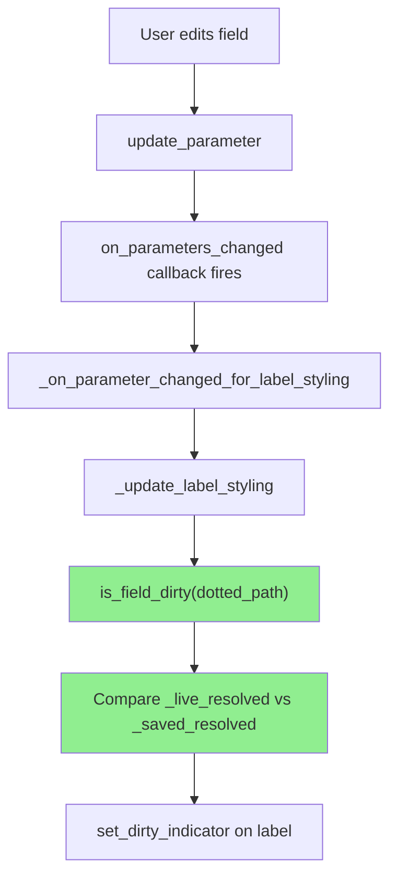
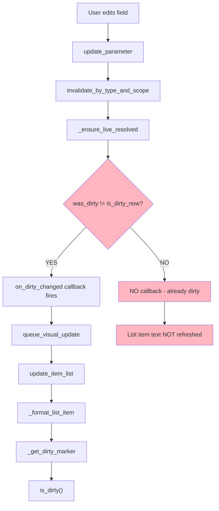
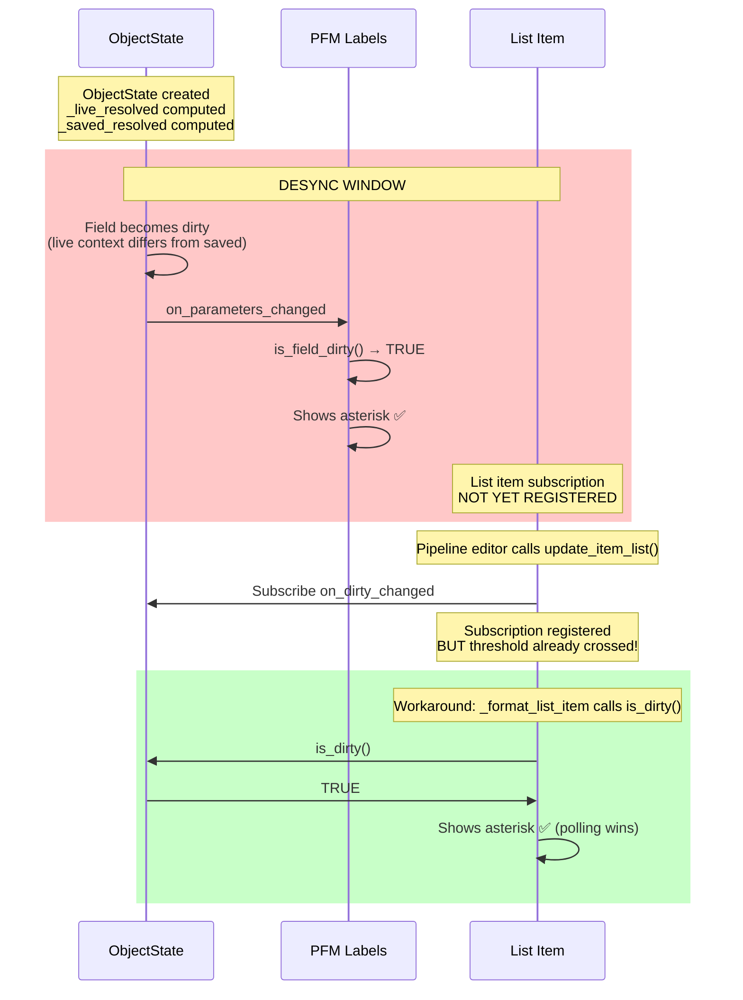
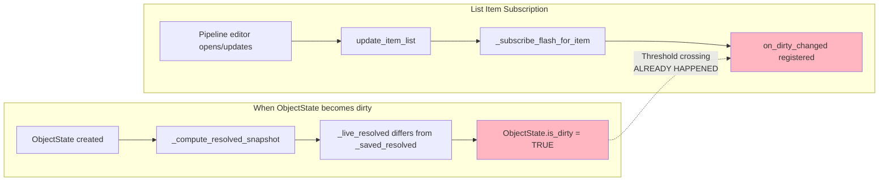

# Dirty Tracking: Two Sources of Truth Analysis

## Summary

**PFM Labels are MORE accurate** - they use `is_field_dirty()` directly on every parameter change.  
**List Items can DESYNC** - they rely on threshold-crossing callbacks that can miss the initial dirty state.

---

## The Two Mechanisms

### 1. PFM Label Dirty Indicator (Accurate ✅)



**Key Property**: Calls `is_field_dirty()` **synchronously on EVERY parameter change**.

### 2. List Item Dirty Marker (Can Desync ❌)



**Key Property**: Only triggers on **threshold crossings** (clean→dirty or dirty→clean).

---

## The Desync Scenario



---

## When Does List Item Actually Update?

The list item dirty marker is updated via TWO mechanisms:

### Mechanism A: Callback (Reactive)
- `on_dirty_changed` fires → `queue_visual_update()` → `update_item_list()`
- **Problem**: Only fires on threshold crossings

### Mechanism B: Polling (During Redraw)
- `_format_list_item()` calls `_get_dirty_marker()` which calls `is_dirty()`
- **This is the safety net** - but only works when list is redrawn

---

## Root Cause of Desync



**The Problem**: If ObjectState becomes dirty BEFORE the list item subscribes, 
the `on_dirty_changed` callback was never invoked for that transition.

---

## Why PFM Labels Work

1. **Immediate subscription**: PFM subscribes to `on_parameters_changed` in `__init__`
2. **Per-field granularity**: Every parameter change triggers label update
3. **Direct query**: Always calls `is_field_dirty()` - never relies on cached state

## Why List Items Can Fail

1. **Delayed subscription**: List items subscribe when `update_item_list()` runs
2. **Threshold-based**: `on_dirty_changed` only fires on transitions
3. **Initial state missed**: If already dirty when subscribed, no callback fires

---

## The Fix Options

### Option 1: Immediate Dirty Check on Subscription
When subscribing to `on_dirty_changed`, immediately check current dirty state:

```python
def _subscribe_flash_for_item(self, item, list_item, scope_id):
    # ... existing subscription code ...
    
    # NEW: Check current dirty state and update immediately
    if state.is_dirty():
        self.queue_visual_update()  # Force redraw with dirty marker
```

### Option 2: Use on_parameters_changed Instead
Subscribe to `on_parameters_changed` which fires on EVERY change, not just transitions.

### Option 3: Rely on Polling Only
Remove `on_dirty_changed` subscription and rely on `_get_dirty_marker()` polling.
But this requires ensuring `update_item_list()` is called when needed.

