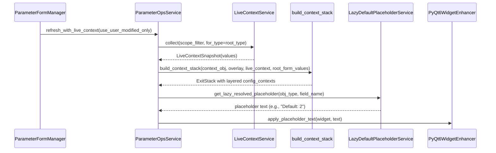
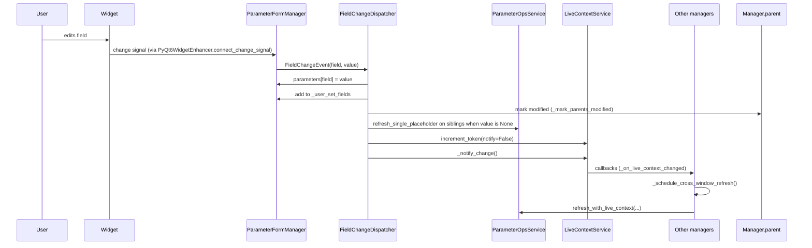
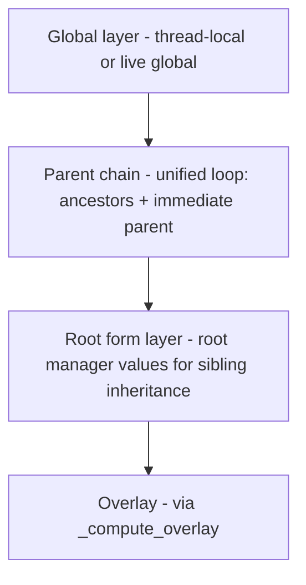
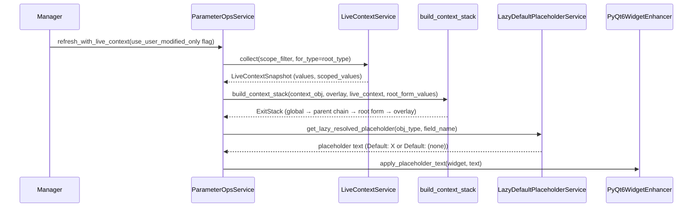
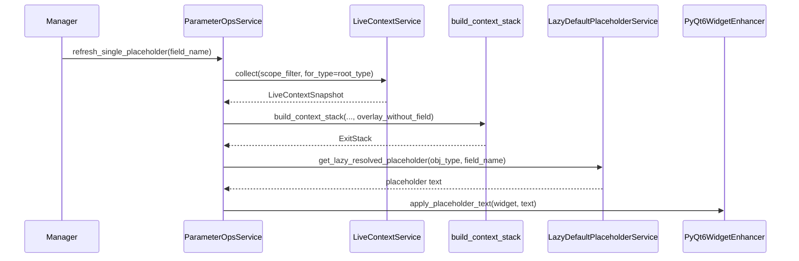
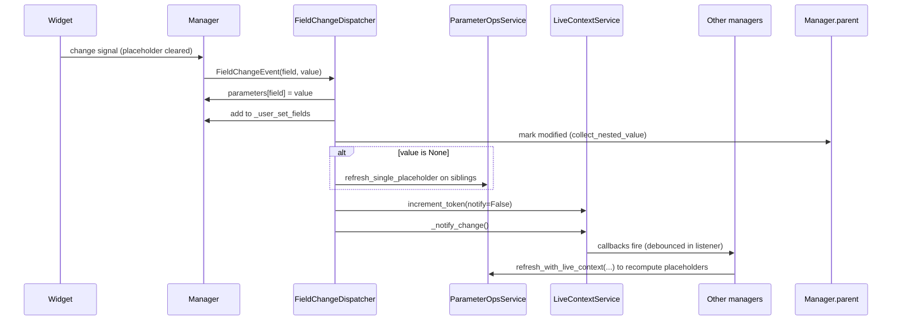
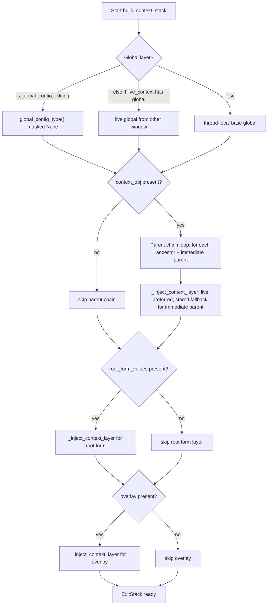
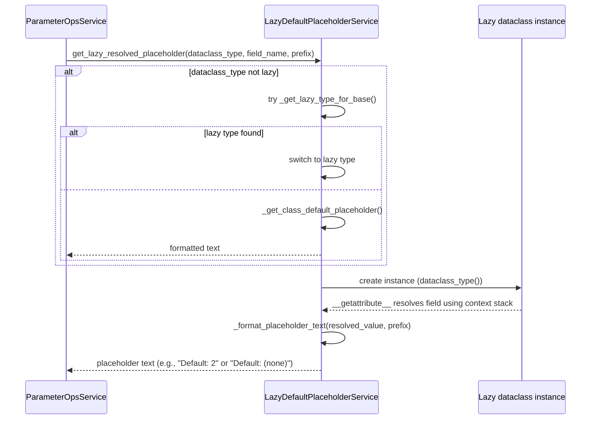
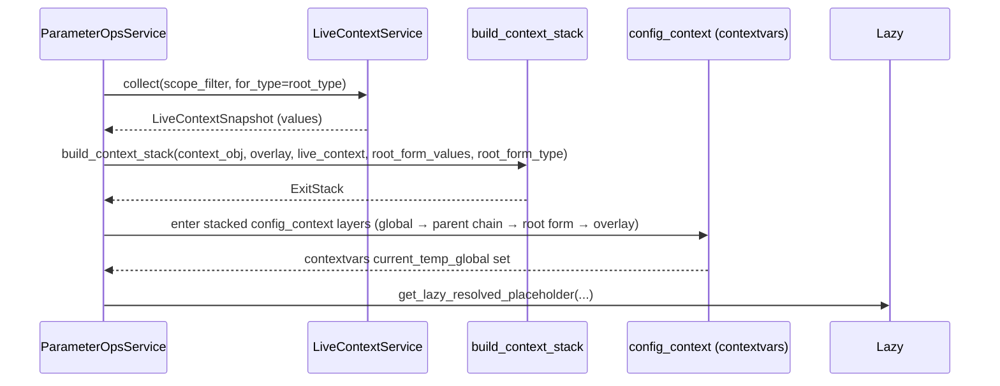
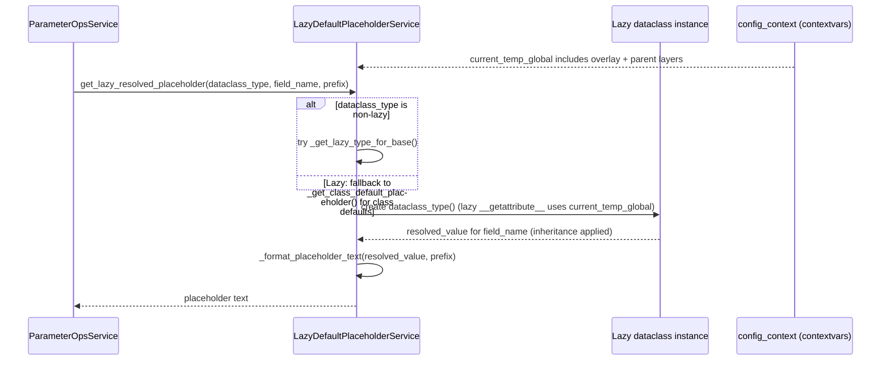

# Placeholder resolution trace

Walkthrough of how parameter form placeholders are produced, refreshed, and cleared in the PyQt6 form manager stack.

## High-level flow (initial + bulk refresh)



- `use_user_modified_only` is the boolean flag on `refresh_with_live_context`:
  - False (default) → overlay uses `manager.parameters` so placeholders include inherited current values.
  - True → overlay uses only `get_user_modified_values()`, useful when you want to avoid unresolved `None` values in the overlay from masking inherited defaults (e.g., targeted refreshes after selective changes).

## Change event and sibling/cross-window refresh



## Detailed trace (call stack + responsibilities)

- Creation (`openhcs/pyqt_gui/widgets/shared/parameter_form_manager.py`):
  - Root managers register with `LiveContextService` and connect `_on_live_context_changed` during `__init__`.
  - `InitialRefreshStrategy.execute()` triggers a first `refresh_with_live_context` so every `None` field renders an inherited placeholder.

- Placeholder computation (`openhcs/pyqt_gui/widgets/shared/services/parameter_ops_service.py`):
  - `refresh_with_live_context` recurses through nested managers, calling `refresh_all_placeholders`.
  - For each manager:
    - Collect live values from other open forms via `ParameterFormManager.collect_live_context` → `LiveContextService.collect` (scope-aware, ancestor-filtered).
    - Build a context stack with `config_framework.build_context_stack`:
      - Global layer (thread-local or other window’s global edits; masks with static defaults when editing global config).
      - Parent chain (unified loop over ancestors + immediate parent, live values preferred, stored fallback for immediate parent).
      - Root form layer (root form’s live values for sibling inheritance).
      - Overlay of this form’s own values (via `_compute_overlay`).
    - With the stack active, call `ParameterFormService.get_placeholder_text` → `LazyDefaultPlaceholderService.get_lazy_resolved_placeholder`. This instantiates the lazy config to let its resolver compute the inherited value, then formats `"Default: <value>"` (or `(none)`).
    - `PyQt6WidgetEnhancer.apply_placeholder_text` paints the widget: strategy per widget type, sets `is_placeholder_state` + tooltips, and caches the placeholder text to avoid redundant updates.

- Single-field refresh:
  - `refresh_single_placeholder` (same service) bypasses bulk work for a single `None` field: rebuilds a stack with `overlay_without_field` to avoid self-shadowing, then applies placeholder to that widget only.

- Change dispatch path (`openhcs/pyqt_gui/widgets/shared/services/field_change_dispatcher.py`):
  - Signals from widgets are connected through `PyQt6WidgetEnhancer.connect_change_signal`, which first clears placeholder styling (`_clear_placeholder_state`) before emitting a `FieldChangeEvent`.
  - Dispatcher updates `parameters` and `_user_set_fields`, marks parent chains modified, refreshes sibling placeholders that share the field, invalidates the live-context token (deferred notify), then notifies `LiveContextService` listeners for cross-window refresh.
  - Root manager emits `parameter_changed` and `context_changed` (with `scope_id`), which other forms receive via `_on_live_context_changed` and debounce through `_schedule_cross_window_refresh`.

- Live context production (`openhcs/pyqt_gui/widgets/shared/services/live_context_service.py`):
  - `collect()` walks all active managers (and nested ones), pulling `get_user_modified_values()`. Nested values are reconstructed into the parent’s entry for sibling inheritance.
  - Returns `LiveContextSnapshot` keyed by config type; token-based cache avoids recompute inside a dispatch cycle.

- Widget behavior (`openhcs/pyqt_gui/widgets/shared/widget_strategies.py`):
  - Placeholder strategies per widget (LineEdit, SpinBox, ComboBox, CheckBox, CheckboxGroup, Path).
  - ComboBoxes use `setPlaceholder`/`setCurrentIndex(-1)` to show inherited value while keeping `None` concrete selection.
  - `_clear_placeholder_state` removes styling + cached text so resets back to `None` can reapply placeholders.

## Context stack layers (visual)



## Key edge cases

- `refresh_single_placeholder` excludes the target field from the overlay so its `None` doesn’t shadow inherited parent/sibling values.
- Live context collection prefers subclass matches (e.g., `StepWellFilterConfig` values satisfy `WellFilterConfig` placeholders) via `_find_live_values_for_type`.
- `_user_set_fields` drives what flows into live context; `reset` keeps `None` in `_user_set_fields` so placeholders and preview labels stay consistent across windows.

## Deeper resolution flow

### Bulk/initial placeholder resolution (refresh_all_placeholders)



- Overlay: computed via `_compute_overlay(manager, use_user_modified_only)`.
- Root form values: pulled from live context when nested, for sibling inheritance.
- Stack layers: global, parent chain (ancestors + immediate parent), root form layer, overlay.
- Lazy resolution happens inside `LazyDefaultPlaceholderService` while the stack is active; it instantiates the lazy dataclass and reads the field to get the inherited value.

### Targeted single-field refresh (refresh_single_placeholder)



- Uses `overlay_without_field` so the field’s own `None` doesn’t mask inherited values.
- Same stack layering and lazy resolution path as bulk refresh.

### Change-driven refresh path (user edits)



- LiveContextSnapshot contains only user-modified fields (including explicit `None`). Unresolved lazy values are not computed in the snapshot; they resolve during placeholder computation under the context stack.
- `use_user_modified_only=False` is typical for normal refreshes; `True` is used selectively to avoid `None` overlays masking inherited defaults.

### Bulk vs targeted (side-by-side)

```mermaid
flowchart LR
    subgraph Bulk: refresh_with_live_context
        B1[collect live_context] --> B2["_compute_overlay(use_user_modified_only)"]
        B2 --> B3["build_context_stack with overlay"]
        B3 --> B4[resolve placeholders for all None fields]
        B4 --> B5[recurse into nested managers]
    end
    subgraph Targeted: refresh_single_placeholder
        T1[collect live_context] --> T2["_compute_overlay(use_user_modified_only, exclude_field)"]
        T2 --> T3[build_context_stack (overlay_without_field)]
        T3 --> T4[resolve placeholder for one field]
        T4 --> T5[no recursion]
    end
```

Key differences:
- Overlay: bulk uses full overlay; targeted excludes the changing field so its `None` doesn’t shadow inherited values.
- Scope: bulk refreshes all `None` fields and nested managers; targeted refreshes one field only.
- Cost: targeted skips recursion and field iteration, reducing work on sibling updates.

### build_context_stack (layer-by-layer)



- Global layer is cached per dispatch cycle for performance.
- Parent chain uses unified `_inject_context_layer` helper for dataclass/SimpleNamespace handling.
- Root form layer supplies sibling inheritance (root form values from live context).
- Overlay via `_compute_overlay(manager, use_user_modified_only, exclude_field)`.

### get_lazy_resolved_placeholder internals



- Resolution happens with `config_context` layers already active from `build_context_stack`.
- If the type is lazy, field access triggers its resolver to apply inheritance.
- Formatting handles enums, lists, nested dataclasses, and `(none)` for None.

### build_context_stack call path (who sets the stack)



The stack is entered before calling `LazyDefaultPlaceholderService`, so the lazy dataclass resolves under those contextvars layers.

### Lazy placeholder resolution with contextvars



### What `_get_class_default_placeholder()` does

- Location: `openhcs/core/lazy_placeholder_simplified.py`.
- Used when the type is not lazy and no lazy equivalent exists.
- Reads the class attribute default (without instantiating) and formats it with the prefix, returning `None` if no default is found.
