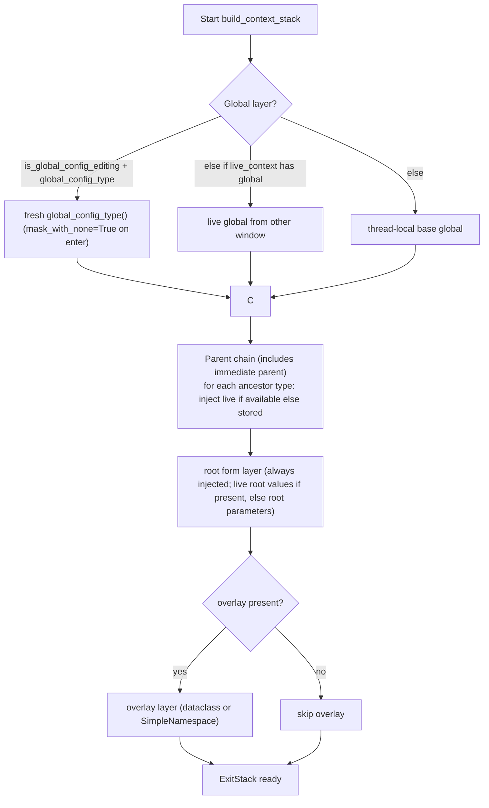
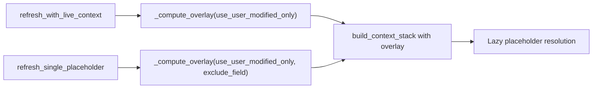
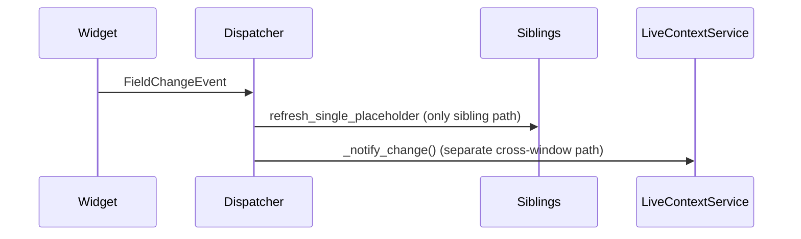
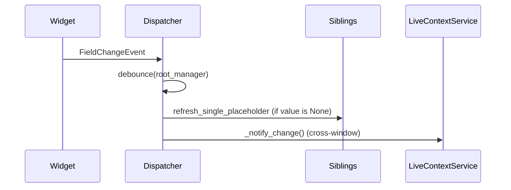
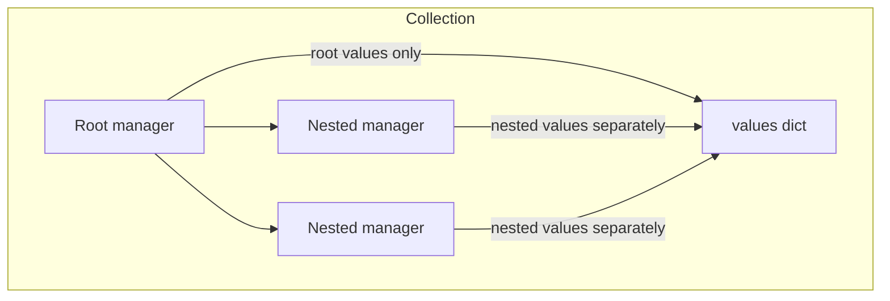
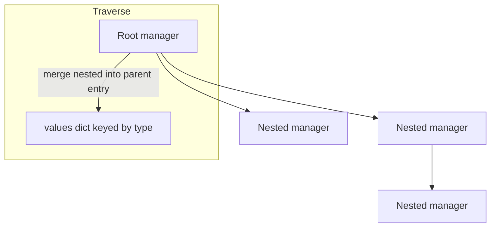

# Context Stack Simplification Plan

Goal: flatten “intermediate ancestors” vs “immediate parent” into a single parent-chain injection while preserving behavior (live values preferred, stored otherwise). Keep root-form and overlay layers for sibling inheritance and current edits. Respect architectural contracts (no defensive duck-typing).

## Target files and changes

- `openhcs/config_framework/context_manager.py`
  - Refactor `build_context_stack` to build one ordered parent chain (including the immediate parent) and inject each layer with live values if available, else stored.
  - Remove/fold `_inject_intermediate_layers` logic into the single-pass parent chain.
  - Keep global layer logic, root-form layer, and overlay layer.
- `docs/placeholder_resolution_trace.md`
  - Update diagrams/text to reflect the flattened parent chain (no separate intermediate vs parent) and always-present root form layer (overlay still wins).

## Proposed flow (flattened, updated)



## Implementation sketch

**build_context_stack (flattened parent chain, contract-driven)**

- Replace:
  - `_inject_intermediate_layers(stack, type(context_obj), live_context)`
  - separate injection of `context_obj` layer
- With:
  ```python
  # derive ordered parent types including the immediate parent
  parent_types = get_types_before_in_stack(type(context_obj)) if context_obj else []
  parent_types = parent_types + ([type(context_obj)] if context_obj else [])

  for t in parent_types:
      live_vals = _find_live_values_for_type(t, live_context) if live_context else None
      if live_vals is not None:
          import dataclasses
          if dataclasses.is_dataclass(t):
              inst = t(**live_vals)  # respect dataclass/lazy contracts; fail loud on bad ctor
          else:
              # Non-dataclass types participate via SimpleNamespace to expose live values
              inst = SimpleNamespace(**live_vals)
          stack.enter_context(config_context(inst))
      elif context_obj and isinstance(context_obj, t):
          stack.enter_context(config_context(context_obj))
      # else: no layer for this type (no live values and no stored instance)
  ```

- Keep global layer selection and caching untouched.
- Keep root form layer and overlay layer logic unchanged.

**Always provide root_form_values for uniform stack**

- In `ParameterOpsService.refresh_all_placeholders`, set `root_values` unconditionally:
  - Prefer live context: `root_values = live_context.get(root_type)` when available.
  - Otherwise: fallback to `root_manager.parameters` (or `get_current_values()` if you want stricter freshness).
  - Pass `root_form_values=root_values` and `root_form_type=root_type` to `build_context_stack` regardless of nesting.
- In `build_context_stack`, keep the root-form injection path; overlay still follows and wins precedence, so behavior remains correct while the stack shape is consistent even when the current manager is the root.

**Delete/inline** `_inject_intermediate_layers` or leave as thin helper that the new loop replaces.

## Notes on behavior parity

- Live-over-stored preference remains: each ancestor (including immediate parent) tries live values first.
- Parent is guaranteed to be injected if provided (stored `context_obj`) even when no live data exists.
- Ancestors above the parent are only injected if live data exists (same as today).
- Sibling inheritance still relies on the root-form layer; keep it.
- Overlay still prefers full `parameters` unless `use_user_modified_only=True`.

## Post-change doc updates

- `docs/placeholder_resolution_trace.md`: adjust the context stack diagrams/text to show a single “parent chain” block instead of “intermediate ancestors” + “context_obj”.

## Optional validation steps

- Add temporary logging in `build_context_stack` to print injected layer order (type names, source: live/stored) during placeholder refresh; remove after verification.
- Run a quick UI smoke test: open two windows, change parent config in one, confirm placeholders in child form update (cross-window live path intact).

## Other simplification candidates

- Signal/refresh wiring: unify sibling vs cross-window refresh paths behind one debounce pipeline if they only differ by source.
- Live context collection: ensure one traversal for root/nested managers that always merges nested values into the parent entry, reducing conditional flows.

### Overlay selection helper (code + diagram, contract-aware)

**Goal:** one path for overlay computation in both bulk and targeted refresh (optional `exclude_field`), avoiding repeated branching.

**Helper sketch (e.g., in ParameterOpsService):**
```python
def _compute_overlay(manager, use_user_modified_only: bool, exclude_field: str | None = None):
    # manager.parameters and manager.exclude_params are guaranteed by PFM; no duck typing
    base = manager.get_user_modified_values() if use_user_modified_only else manager.parameters
    overlay = base.copy()  # base may be empty dict; return empty overlay instead of None
    if exclude_field:
        overlay.pop(exclude_field, None)
    # handle exclude_params passthrough for hidden fields (anti-duck-typing)
    import dataclasses
    exclude_params = manager.exclude_params or []
    obj = manager.object_instance
    if obj and exclude_params:
        if dataclasses.is_dataclass(obj):
            allowed = {f.name for f in dataclasses.fields(obj)}
        else:
            # SimpleNamespace or other non-dataclass layers: allow all exclude_params explicitly
            allowed = set(exclude_params)
        for excluded in exclude_params:
            if excluded not in overlay and excluded in allowed:
                overlay[excluded] = object.__getattribute__(obj, excluded)
    # If object_instance is another non-dataclass type that needs stricter handling,
    # add a typed path per object type (do not use hasattr/getattr duck typing).
    return overlay
```

**Usage:**
- Bulk: `overlay = _compute_overlay(manager, use_user_modified_only)`
- Targeted: `overlay = _compute_overlay(manager, use_user_modified_only, exclude_field=field_name)`

**Mermaid (shared overlay path):**


### Unified signal/refresh wiring (code + diagram)

**Goal:** one debounce pipeline that handles both sibling refresh and cross-window refresh, instead of separate paths.

**Before (separate paths):**


**After (unified debounce):**
```python
# FieldChangeDispatcher._dispatch_impl
root = self._get_root_manager(source)

def refresh_targets():
    # sibling targeting: only refresh placeholders where needed
    self._refresh_siblings(source, event.field_name, event.value)
    # bulk/cross-window: trigger registered listeners once
    LiveContextService._notify_change()

self._debounce_refresh(root, refresh_targets)

def _refresh_siblings(self, source, field_name, value):
    parent = source._parent_manager
    if not parent:
        return
    for name, sibling in parent.nested_managers.items():
        if sibling is source:
            continue
        if field_name in sibling.widgets and value is None:
            sibling._parameter_ops_service.refresh_single_placeholder(sibling, field_name)

def _debounce_refresh(self, root_manager, fn):
    # single QTimer per root_manager; reset/start on each change
    if hasattr(root_manager, "_refresh_timer") and root_manager._refresh_timer.isActive():
        root_manager._refresh_timer.stop()
    else:
        from PyQt6.QtCore import QTimer
        root_manager._refresh_timer = QTimer()
        root_manager._refresh_timer.setSingleShot(True)
        root_manager._refresh_timer.timeout.connect(fn)
    root_manager._refresh_timer.start(10)
```

**Mermaid:**


### Live context collection (single traversal) (code + diagram)

**Goal:** one traversal that always merges nested values into the parent entry; avoid separate paths for root/nested.

**Before (separate root/nested handling):**


**After (single traversal, merge nested into parent entry):**
```python
def collect(cls, ...):
    ...
    def collect_manager(manager, aggregated):
        if not manager.object_instance:
            return
        values = manager.get_user_modified_values()
        # merge nested values into parent's entry
        for field_name, nested in manager.nested_managers.items():
            if nested.object_instance:
                nested_values = nested.get_user_modified_values()
                if nested_values:
                    try:
                        values[field_name] = type(nested.object_instance)(**nested_values)
                    except Exception:
                        values[field_name] = SimpleNamespace(**nested_values)
        aggregated[type(manager.object_instance)] = values

        for nested in manager.nested_managers.values():
            collect_manager(nested, aggregated)

    aggregated = {}
    for manager in cls._active_form_managers:
        collect_manager(manager, aggregated)
    return LiveContextSnapshot(token=cls._live_context_token_counter, values=aggregated, scoped_values=...)
```

**Mermaid (after):**

