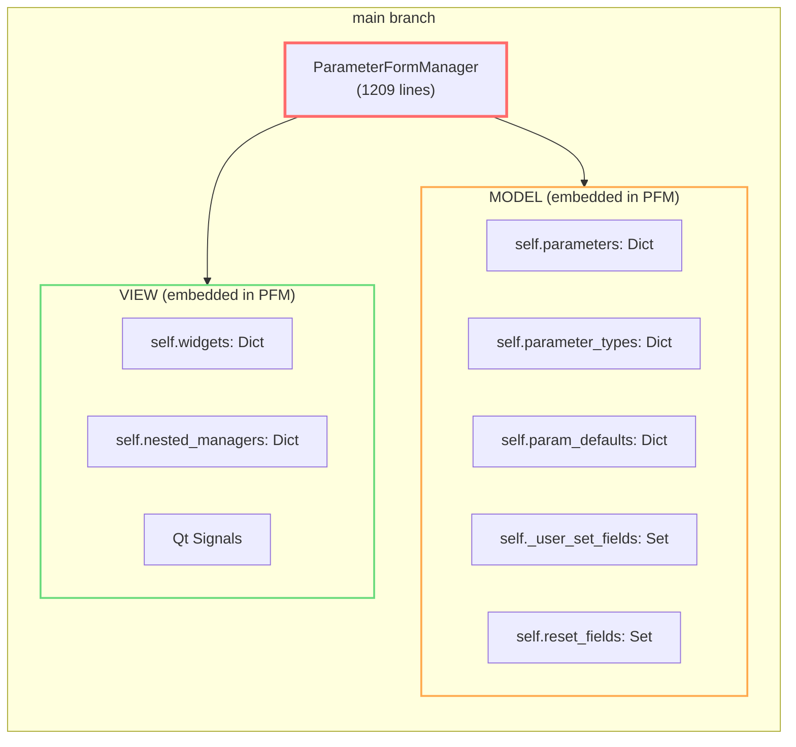
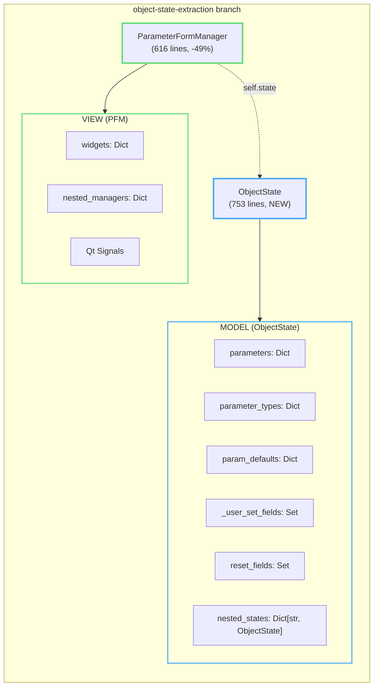
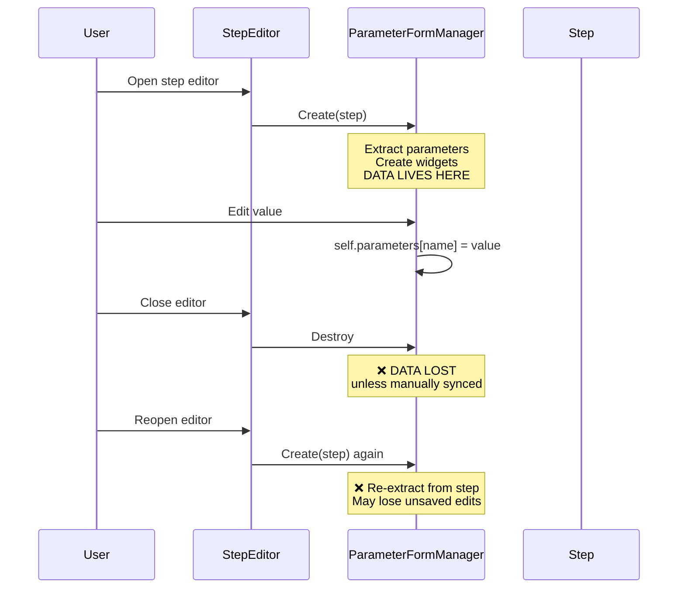
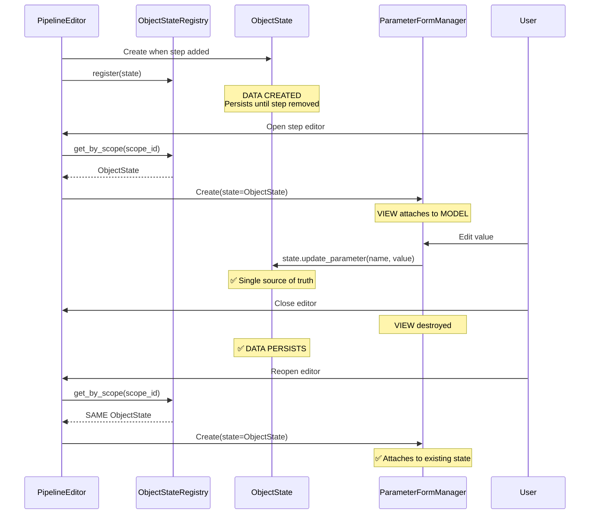
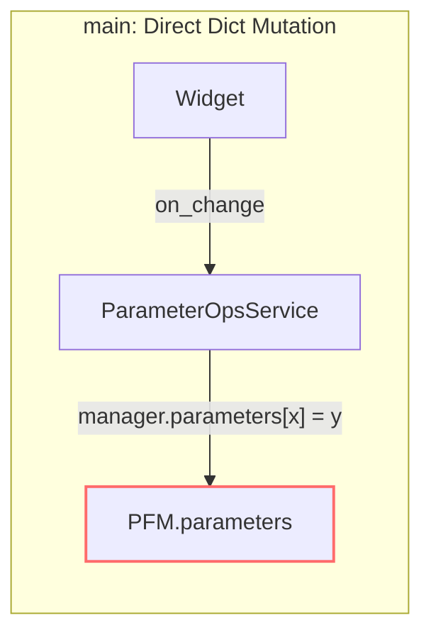
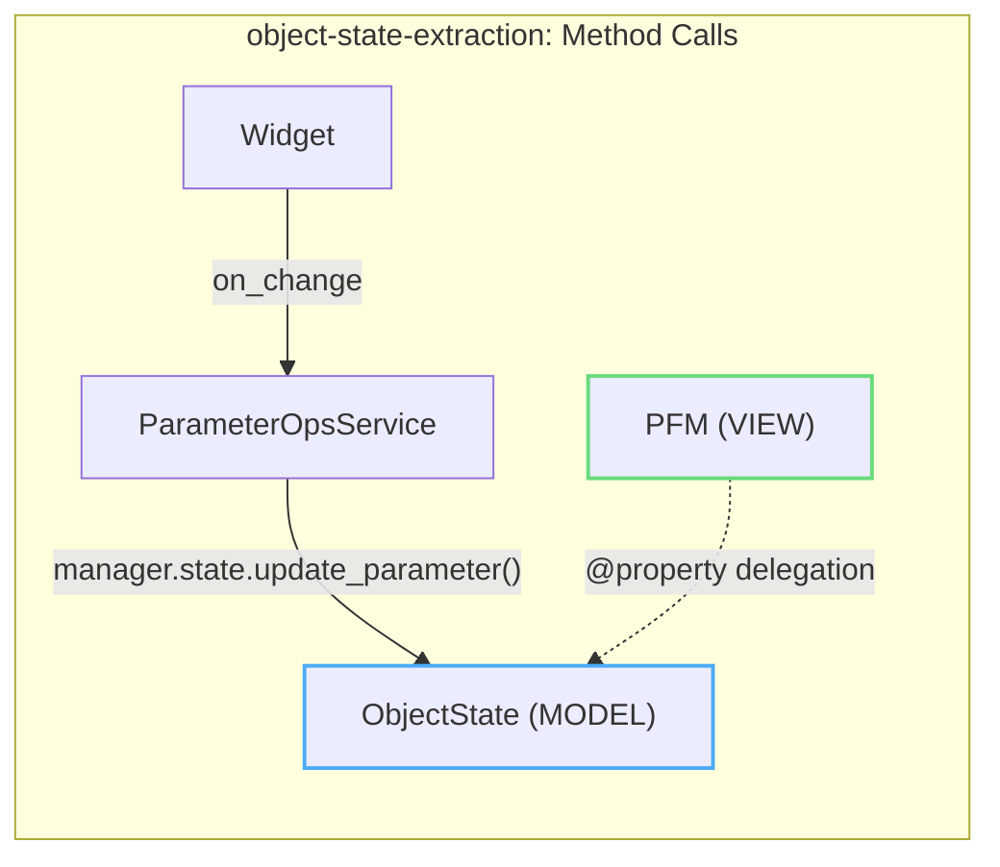
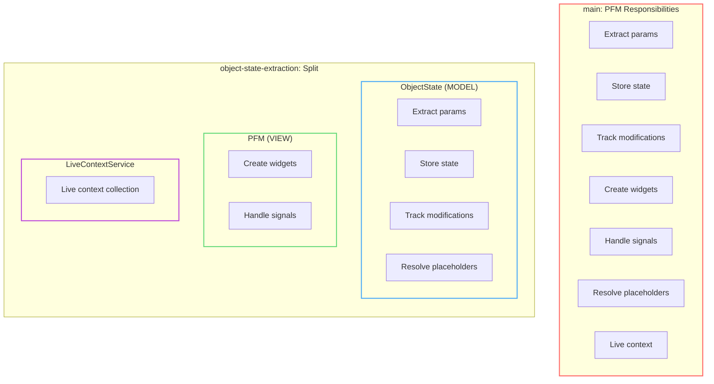
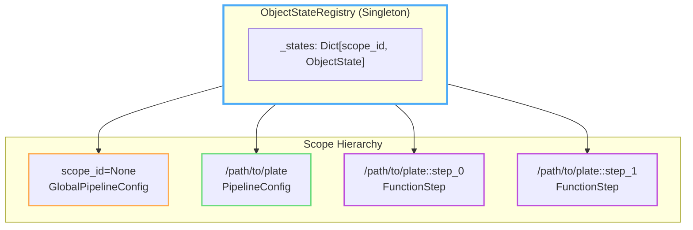
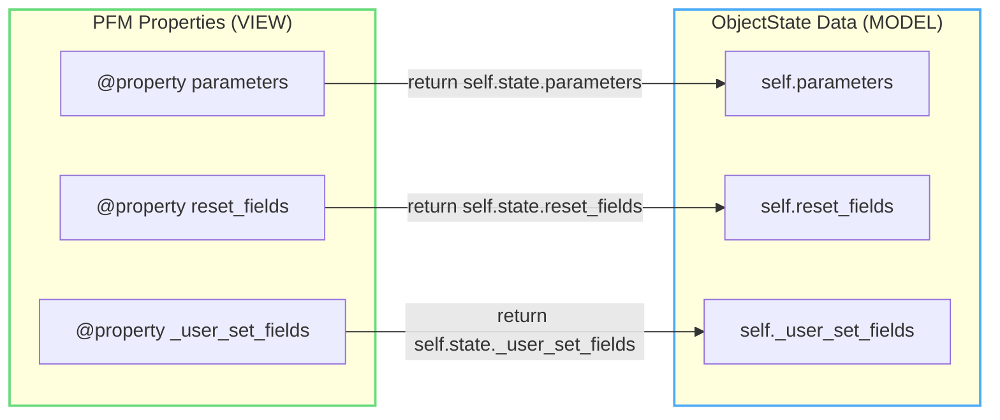
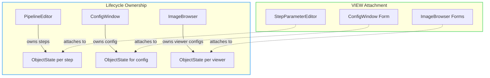

# ObjectState Extraction Refactor

**Branch:** `object-state-extraction`  
**Commits:** 20 commits, +1539 net lines  
**Core Change:** Extract MODEL from ParameterFormManager into ObjectState for proper MVC separation

## Summary

This refactor separates MODEL (data/state) from VIEW (widgets/UI) in the OpenHCS GUI layer. Before this change, `ParameterFormManager` (PFM) was a 1209-line monolith that owned both data and widgets. After, PFM is 616 lines of pure VIEW logic, with all MODEL responsibilities moved to the new `ObjectState` class (753 lines).

---

## Architecture Comparison

### Before (main): Monolithic PFM

### After (object-state-extraction): Clean MVC

---

## Lifecycle Comparison

### Before: PFM Lifecycle = Data Lifecycle

### After: ObjectState Lifecycle Independent of UI

---

## Data Flow Comparison

### Before: Direct Mutation

### After: ObjectState Methods

---

## Class Responsibility Shift

---

## Registry Architecture

---

## Property Delegation Pattern

PFM delegates state access to ObjectState via `@property` decorators:

---

## Files Changed Summary

| File | Before | After | Change |
|------|--------|-------|--------|
| `object_state.py` | 0 | 753 | **NEW** |
| `parameter_form_manager.py` | 1209 | 616 | **-49%** |
| `parameter_ops_service.py` | 292 | 256 | -36 |
| `scope_token_service.py` | 0 | 178 | **NEW** |

### Key Deletions from PFM
- `from_dataclass_instance()` factory method
- `NoneAwareLineEdit`, `NoneAwareIntEdit` (→ widget_strategies.py)
- `create_widget()`, `_make_widget_readonly()` (→ WidgetService)
- `collect_live_context()`, `trigger_global_cross_window_refresh()` (→ LiveContextService)
- Direct state manipulation (`self.parameters[x] = y`)

### Key Additions to ObjectState
- `update_parameter(name, value)` - single mutation entry point
- `reset_parameter(name)` - handles tracking internally
- `get_current_values()` - collect all parameter values
- `get_user_modified_values()` - only user-set fields
- `update_thread_local_global_config()` - live updates for GlobalConfig
- `nested_states: Dict[str, ObjectState]` - recursive MODEL structure

---

## Conceptual Model

---

## Benefits

1. **Data Persistence**: State survives UI close/reopen cycles
2. **Testability**: ObjectState is pure Python, no Qt dependencies
3. **Single Source of Truth**: All mutations through ObjectState methods
4. **Cleaner Code**: PFM reduced 49%, clear responsibility boundaries
5. **Registry Lookup**: `ObjectStateRegistry.get_by_scope(scope_id)` finds state anywhere
6. **Nested State**: `ObjectState.nested_states` mirrors dataclass structure

