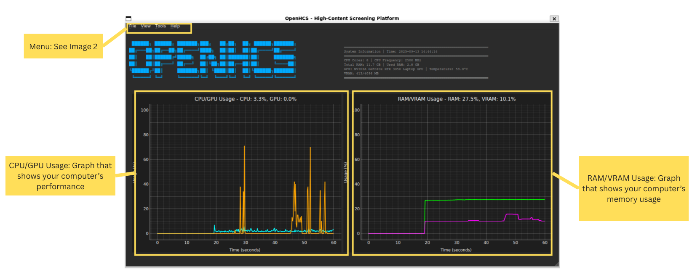
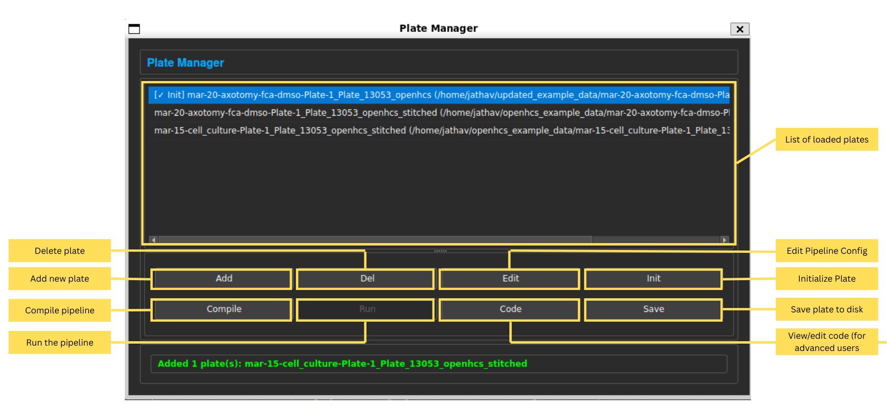

Basic Interface
===========================

This page is a visual and practical guide to the OpenHCS user interface. It is designed for biologists and other non-technical users who want to quickly understand how to navigate and use the main features of OpenHCS. Use this guide as both a quick reference and a step-by-step introduction.

.. contents::
   :local:
   :depth: 2

----------------------------

Main Window Overview
--------------------

The main window that opens when you launch OpenHCS.

*Main Window Overview.*
 

   *Tip: OpenHCS is designed to be efficient in performance and memory usage. If your computer is struggling and these graphs showcase high usage, something might be wrong.*

.. collapse:: Submenus

      View submenus

      .. figure:: ../_static/view_window.png
         :alt: View Window
               
      Tool submenu

      .. figure:: ../_static/tool_window.png
         :alt: Tool Window

----------------------------

Plate Manager
-------------

The Plate Manager helps you organize and view your experimental plates and wells.

   *Note: Options that can't be used at that moment are greyed out. For example, you can't compile *

----------------------------

Pipeline Editor
---------------

The Pipeline Editor is where you build and customize your analysis workflows.

.. figure:: _static/ui_pipeline_editor_placeholder.png
   :alt: Pipeline Editor

   *Placeholder: Add a screenshot of the Pipeline Editor. Annotate the list of available analysis steps, the pipeline flow, and controls for adding/removing steps.*

**What to describe:**
- Adding analysis steps to your pipeline
- Reordering or removing steps
- Saving and loading pipelines

----------------------------

Image Viewer (Napari)
---------------------

The Image Viewer lets you look at your raw and processed images.

.. figure:: _static/ui_image_viewer_placeholder.png
   :alt: Image Viewer

   *Placeholder: Add a screenshot of the Image Viewer. Annotate the image display area, zoom controls, and channel selection.*

**What to describe:**
- Navigating between images (wells, sites, channels)
- Adjusting zoom and contrast
- Viewing analysis results overlays

----------------------------

Running and Monitoring Analysis
--------------------------------

How to start, pause, and monitor your analysis jobs.

.. figure:: _static/ui_run_analysis_placeholder.png
   :alt: Running Analysis

   *Placeholder: Add a screenshot showing the analysis progress bar or job monitor. Annotate the start/pause buttons and progress indicators.*

**What to describe:**
- How to start an analysis
- How to check progress
- Where to find error or completion messages

----------------------------

Exporting Results
-----------------

How to save and export your analysis results.

.. figure:: _static/ui_export_results_placeholder.png
   :alt: Exporting Results

   *Placeholder: Add a screenshot of the export dialog or results table. Annotate export options and file format selectors.*

**What to describe:**
- Exporting tables or images
- Choosing file formats (e.g., CSV, MetaXpress)
- Where exported files are saved

----------------------------

