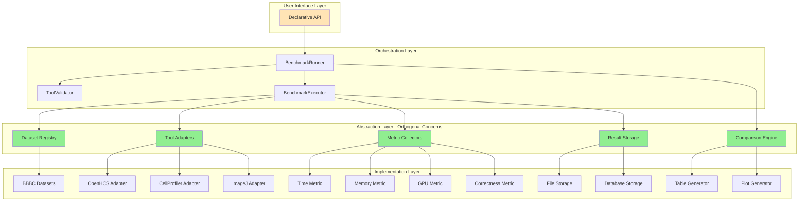
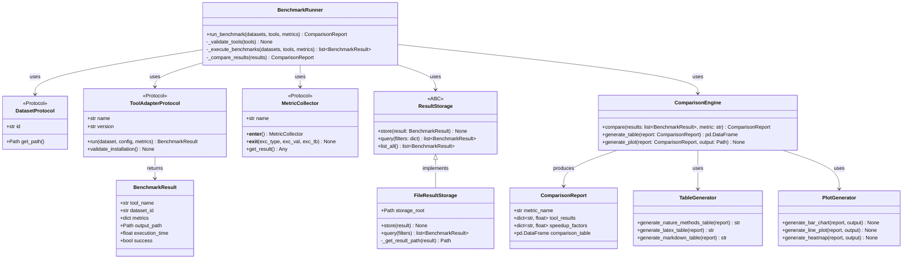
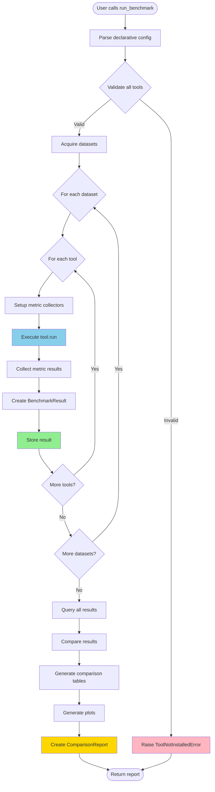
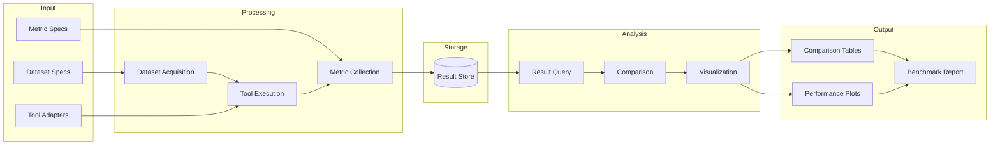

# plan_01_benchmark_infrastructure.md
## Component: Benchmark Infrastructure

### Objective
Create orthogonal benchmark infrastructure that makes comparing OpenHCS to other tools **trivial by construction**. Not "a benchmarking script" — a **benchmark platform** where adding new tools/datasets/metrics is declarative configuration, not code.

---

## System Architecture Diagram



---

## UML Class Diagram



---

## Benchmark Execution Flow



---

## Data Flow Diagram



---

### Plan

1. **Benchmark Contract (Orthogonal Abstraction #1)**
   - Define what it means to "run a benchmark"
   - Input: Dataset specification, Tool specification, Metric specification
   - Output: Structured results (timing, memory, correctness)
   - Contract is tool-agnostic — works for OpenHCS, CellProfiler, ImageJ, custom scripts

2. **Dataset Registry (Orthogonal Abstraction #2)**
   - Declarative dataset specifications
   - Each dataset is a frozen dataclass: `BBBCDataset(id, url, expected_files, ground_truth)`
   - Auto-download, auto-verify, auto-cache
   - No imperative "download this, unzip that" — declare what you need, system handles it

3. **Tool Adapter Protocol (Orthogonal Abstraction #3)**
   - Each tool (OpenHCS, CellProfiler, ImageJ) implements same interface
   - `ToolAdapter.run(dataset, pipeline_config) -> BenchmarkResult`
   - Adapters handle tool-specific invocation, but return normalized results
   - Adding new tool = implement adapter, not modify benchmark code

4. **Metric Collectors (Orthogonal Abstraction #4)**
   - Time, memory, GPU utilization, correctness — each is independent collector
   - Collectors attach to tool execution via context managers
   - Declarative: `@collect_metrics(time=True, memory=True, gpu=True)`
   - No manual instrumentation scattered through code

5. **Result Storage (Orthogonal Abstraction #5)**
   - Structured storage: `results/{tool}/{dataset}/{metric}/{timestamp}.json`
   - Immutable results (append-only, never modify)
   - Automatic versioning (git-style: results are commits)
   - Query interface: "Give me all timing results for BBBC021 across all tools"

6. **Comparison Engine (Orthogonal Abstraction #6)**
   - Takes N tool results, produces comparison tables/plots
   - Declarative comparison specs: "Compare OpenHCS vs CellProfiler on processing_time"
   - Generates Nature Methods-ready figures automatically
   - No manual matplotlib wrangling — declare what you want, system renders it

### Findings

**Key Insight from Manifesto**: 
> "The goal is not to build software. The goal is to make building software unnecessary."

Applied to benchmarking:
- Don't write benchmark scripts
- Write benchmark **infrastructure** that makes scripts unnecessary
- Adding BBBC023 should be: add one dataclass declaration
- Adding QuPath comparison should be: implement ToolAdapter, done
- Generating Figure 5 should be: declare comparison spec, system renders

**Orthogonality Test**:
- Can I add a dataset without touching tool code? ✓
- Can I add a tool without touching dataset code? ✓
- Can I add a metric without touching either? ✓
- Can I change result storage without touching collection? ✓

Each abstraction solves one problem completely.

### Architecture

```
benchmark/
├── contracts/
│   ├── dataset.py          # Dataset protocol
│   ├── tool_adapter.py     # Tool adapter protocol
│   ├── metric.py           # Metric collector protocol
│   └── result.py           # Result storage protocol
├── datasets/
│   ├── bbbc.py             # BBBC dataset declarations
│   └── synthetic.py        # Synthetic dataset generators
├── adapters/
│   ├── openhcs.py          # OpenHCS adapter
│   ├── cellprofiler.py     # CellProfiler adapter
│   ├── imagej.py           # ImageJ adapter
│   └── python_script.py    # Custom script adapter
├── metrics/
│   ├── timing.py           # Time measurement
│   ├── memory.py           # Memory profiling
│   ├── gpu.py              # GPU utilization
│   └── correctness.py      # Numerical accuracy
├── storage/
│   └── result_store.py     # Immutable result storage
├── comparison/
│   └── engine.py           # Comparison + visualization
└── pipelines/
    ├── nuclei_segmentation.py   # Equivalent pipelines across tools
    ├── cell_painting.py
    └── feature_extraction.py
```

### Declarative Example

```python
# This is ALL the code needed to run a benchmark
from benchmark import run_benchmark, BBBCDataset, OpenHCSAdapter, CellProfilerAdapter
from benchmark.metrics import Time, Memory, Correctness

results = run_benchmark(
    datasets=[
        BBBCDataset.BBBC021,
        BBBCDataset.BBBC022,
    ],
    tools=[
        OpenHCSAdapter(pipeline="nuclei_segmentation"),
        CellProfilerAdapter(pipeline="nuclei_segmentation"),
    ],
    metrics=[Time(), Memory(), Correctness()],
)

# Generate Nature Methods Figure 5
from benchmark.comparison import generate_figure

generate_figure(
    results=results,
    comparison="processing_time",
    output="paper/figures/figure_5_performance.pdf"
)
```

That's it. No loops. No manual timing. No matplotlib. Declare what you want, system does it.

### Implementation Draft

#### 1. Declarative API (benchmark/__init__.py)

```python
"""
Declarative benchmark API.

Example usage:
    from benchmark import run_benchmark, BBBCDataset, OpenHCSAdapter
    from benchmark.metrics import Time, Memory

    results = run_benchmark(
        datasets=[BBBCDataset.BBBC021, BBBCDataset.BBBC022],
        tools=[OpenHCSAdapter(), CellProfilerAdapter()],
        metrics=[Time(), Memory()],
    )

    results.generate_figure("figure_5_performance.pdf")
"""

from benchmark.runner import run_benchmark
from benchmark.datasets import BBBCDataset, acquire_dataset
from benchmark.adapters import (
    OpenHCSAdapter,
    CellProfilerAdapter,
    ImageJAdapter,
    PythonScriptAdapter
)
from benchmark.metrics import Time, Memory, GPU, Correctness
from benchmark.comparison import ComparisonReport

__all__ = [
    'run_benchmark',
    'BBBCDataset',
    'acquire_dataset',
    'OpenHCSAdapter',
    'CellProfilerAdapter',
    'ImageJAdapter',
    'PythonScriptAdapter',
    'Time',
    'Memory',
    'GPU',
    'Correctness',
    'ComparisonReport',
]
```

#### 2. Benchmark Runner (benchmark/runner.py)

```python
from dataclasses import dataclass
from pathlib import Path
from typing import Protocol

from benchmark.datasets import acquire_dataset
from benchmark.storage import FileResultStorage
from benchmark.comparison import ComparisonEngine

@dataclass
class BenchmarkConfig:
    """Configuration for benchmark run."""
    datasets: list
    tools: list
    metrics: list
    output_dir: Path = Path("benchmark_results")
    pipeline_type: str = "nuclei_segmentation"

def run_benchmark(
    datasets: list,
    tools: list,
    metrics: list,
    output_dir: Path = Path("benchmark_results"),
    pipeline_type: str = "nuclei_segmentation"
) -> 'ComparisonReport':
    """
    Run benchmark across datasets and tools.

    This is the main entry point. Everything else is derived.

    Args:
        datasets: List of dataset specifications (e.g., [BBBCDataset.BBBC021])
        tools: List of tool adapters (e.g., [OpenHCSAdapter(), CellProfilerAdapter()])
        metrics: List of metric collectors (e.g., [Time(), Memory()])
        output_dir: Where to store results
        pipeline_type: Which pipeline to run (e.g., "nuclei_segmentation")

    Returns:
        ComparisonReport with all results and visualizations
    """
    runner = BenchmarkRunner(
        datasets=datasets,
        tools=tools,
        metrics=metrics,
        output_dir=output_dir,
        pipeline_type=pipeline_type
    )

    return runner.execute()

class BenchmarkRunner:
    """Orchestrates benchmark execution."""

    def __init__(
        self,
        datasets: list,
        tools: list,
        metrics: list,
        output_dir: Path,
        pipeline_type: str
    ):
        self.datasets = datasets
        self.tools = tools
        self.metrics = metrics
        self.output_dir = output_dir
        self.pipeline_type = pipeline_type

        # Initialize storage
        self.storage = FileResultStorage(output_dir / "results")

        # Initialize comparison engine
        self.comparison = ComparisonEngine()

    def execute(self) -> 'ComparisonReport':
        """Execute full benchmark workflow."""

        # 1. Validate all tools
        self._validate_tools()

        # 2. Execute benchmarks
        results = self._execute_benchmarks()

        # 3. Compare results
        report = self._compare_results(results)

        return report

    def _validate_tools(self) -> None:
        """Validate all tools are installed. Fail loud if not."""
        for tool in self.tools:
            try:
                tool.validate_installation()
            except Exception as e:
                raise ToolValidationError(
                    f"Tool {tool.name} validation failed: {e}"
                )

    def _execute_benchmarks(self) -> list:
        """Execute all dataset × tool combinations."""
        results = []

        for dataset_spec in self.datasets:
            # Acquire dataset (automatic download/cache)
            dataset_path = acquire_dataset(dataset_spec)

            for tool in self.tools:
                # Get pipeline config for this tool
                pipeline_config = self._get_pipeline_config(self.pipeline_type)

                # Execute tool with metrics
                result = tool.run(
                    dataset_path=dataset_path,
                    pipeline_config=pipeline_config,
                    metrics=self.metrics
                )

                # Store result
                self.storage.store(result)
                results.append(result)

        return results

    def _compare_results(self, results: list) -> 'ComparisonReport':
        """Generate comparison report from results."""
        return self.comparison.compare(
            results=results,
            output_dir=self.output_dir / "figures"
        )

    def _get_pipeline_config(self, pipeline_type: str) -> 'PipelineConfig':
        """Get pipeline configuration by type."""
        from benchmark.pipelines import get_pipeline_config
        return get_pipeline_config(pipeline_type)
```

#### 3. Result Storage (benchmark/storage.py)

```python
from abc import ABC, abstractmethod
from pathlib import Path
import json
from datetime import datetime

class ResultStorage(ABC):
    """Abstract result storage interface."""

    @abstractmethod
    def store(self, result: 'BenchmarkResult') -> None:
        """Store a benchmark result."""
        ...

    @abstractmethod
    def query(self, filters: dict) -> list['BenchmarkResult']:
        """Query results with filters."""
        ...

    @abstractmethod
    def list_all(self) -> list['BenchmarkResult']:
        """List all stored results."""
        ...

class FileResultStorage(ResultStorage):
    """File-based result storage with immutable append-only semantics."""

    def __init__(self, storage_root: Path):
        self.storage_root = storage_root
        self.storage_root.mkdir(parents=True, exist_ok=True)

    def store(self, result: 'BenchmarkResult') -> None:
        """
        Store result in structured directory.

        Structure: {storage_root}/{tool}/{dataset}/{timestamp}.json
        """
        result_path = self._get_result_path(result)
        result_path.parent.mkdir(parents=True, exist_ok=True)

        # Serialize result
        result_data = {
            'tool_name': result.tool_name,
            'dataset_id': result.dataset_id,
            'metrics': result.metrics,
            'output_path': str(result.output_path),
            'execution_time': result.execution_time,
            'success': result.success,
            'error_message': result.error_message,
            'timestamp': datetime.now().isoformat()
        }

        # Atomic write (write to temp, then rename)
        temp_path = result_path.with_suffix('.tmp')
        temp_path.write_text(json.dumps(result_data, indent=2))
        temp_path.replace(result_path)

    def query(self, filters: dict) -> list:
        """Query results matching filters."""
        all_results = self.list_all()

        # Filter results
        filtered = []
        for result in all_results:
            match = True
            for key, value in filters.items():
                if getattr(result, key, None) != value:
                    match = False
                    break
            if match:
                filtered.append(result)

        return filtered

    def list_all(self) -> list:
        """List all stored results."""
        results = []

        for result_file in self.storage_root.rglob("*.json"):
            data = json.loads(result_file.read_text())
            # Reconstruct BenchmarkResult
            result = BenchmarkResult(**data)
            results.append(result)

        return results

    def _get_result_path(self, result: 'BenchmarkResult') -> Path:
        """Get storage path for result."""
        timestamp = datetime.now().strftime("%Y%m%d_%H%M%S_%f")
        return (
            self.storage_root
            / result.tool_name
            / result.dataset_id
            / f"{timestamp}.json"
        )
```

#### 4. Comparison Engine (benchmark/comparison.py)

```python
from dataclasses import dataclass
from pathlib import Path
import pandas as pd
import numpy as np
from typing import Any

@dataclass
class ComparisonReport:
    """Results of benchmark comparison."""
    metric_name: str
    tool_results: dict[str, float]
    speedup_factors: dict[str, float]
    comparison_table: pd.DataFrame
    output_dir: Path

    def generate_figure(self, filename: str) -> Path:
        """Generate publication-quality figure."""
        from benchmark.visualization import PlotGenerator

        output_path = self.output_dir / filename
        PlotGenerator.generate_bar_chart(self, output_path)
        return output_path

    def generate_table(self, format: str = "latex") -> str:
        """Generate formatted table."""
        from benchmark.visualization import TableGenerator

        if format == "latex":
            return TableGenerator.generate_latex_table(self)
        elif format == "markdown":
            return TableGenerator.generate_markdown_table(self)
        elif format == "nature":
            return TableGenerator.generate_nature_methods_table(self)
        else:
            raise ValueError(f"Unknown format: {format}")

class ComparisonEngine:
    """Compare benchmark results and generate reports."""

    def compare(
        self,
        results: list['BenchmarkResult'],
        output_dir: Path
    ) -> ComparisonReport:
        """
        Compare results across tools and datasets.

        Generates:
        - Comparison tables
        - Speedup factors (relative to baseline)
        - Statistical analysis
        - Visualizations
        """
        output_dir.mkdir(parents=True, exist_ok=True)

        # Group results by metric
        metrics = self._extract_metrics(results)

        # For each metric, generate comparison
        reports = []
        for metric_name, metric_data in metrics.items():
            report = self._compare_metric(
                metric_name=metric_name,
                metric_data=metric_data,
                output_dir=output_dir
            )
            reports.append(report)

        # Return primary report (execution time)
        primary_report = next(
            r for r in reports if r.metric_name == "execution_time"
        )
        return primary_report

    def _extract_metrics(self, results: list) -> dict[str, dict]:
        """Extract metrics from results."""
        metrics = {}

        for result in results:
            for metric_name, metric_value in result.metrics.items():
                if metric_name not in metrics:
                    metrics[metric_name] = {}

                tool_name = result.tool_name
                dataset_id = result.dataset_id

                key = f"{tool_name}_{dataset_id}"
                metrics[metric_name][key] = metric_value

        return metrics

    def _compare_metric(
        self,
        metric_name: str,
        metric_data: dict,
        output_dir: Path
    ) -> ComparisonReport:
        """Compare single metric across tools."""

        # Build comparison table
        df = self._build_comparison_table(metric_data)

        # Calculate speedup factors (relative to slowest)
        tool_results = self._aggregate_by_tool(metric_data)
        speedup_factors = self._calculate_speedup(tool_results)

        return ComparisonReport(
            metric_name=metric_name,
            tool_results=tool_results,
            speedup_factors=speedup_factors,
            comparison_table=df,
            output_dir=output_dir
        )

    def _build_comparison_table(self, metric_data: dict) -> pd.DataFrame:
        """Build pandas DataFrame for comparison."""
        rows = []
        for key, value in metric_data.items():
            tool, dataset = key.rsplit('_', 1)
            rows.append({
                'Tool': tool,
                'Dataset': dataset,
                'Value': value
            })

        df = pd.DataFrame(rows)
        return df.pivot(index='Dataset', columns='Tool', values='Value')

    def _aggregate_by_tool(self, metric_data: dict) -> dict[str, float]:
        """Aggregate metric values by tool (mean across datasets)."""
        tool_values = {}

        for key, value in metric_data.items():
            tool = key.rsplit('_', 1)[0]
            if tool not in tool_values:
                tool_values[tool] = []
            tool_values[tool].append(value)

        # Return mean for each tool
        return {
            tool: np.mean(values)
            for tool, values in tool_values.items()
        }

    def _calculate_speedup(self, tool_results: dict[str, float]) -> dict[str, float]:
        """Calculate speedup factors relative to slowest tool."""
        baseline = max(tool_results.values())  # Slowest

        return {
            tool: baseline / value
            for tool, value in tool_results.items()
        }
```

#### 5. Table Generator (benchmark/visualization/tables.py)

```python
import pandas as pd

class TableGenerator:
    """Generate formatted tables for publication."""

    @staticmethod
    def generate_nature_methods_table(report: 'ComparisonReport') -> str:
        """
        Generate Nature Methods style table.

        Format:
        Tool          | Dataset 1 | Dataset 2 | Mean | Speedup
        --------------|-----------|-----------|------|--------
        OpenHCS       | 45.2s     | 67.3s     | 56.3s| 8.5×
        CellProfiler  | 382.1s    | 456.7s    | 419.4s| 1.0×
        """
        df = report.comparison_table

        # Add mean column
        df['Mean'] = df.mean(axis=1)

        # Add speedup column
        speedups = pd.Series(report.speedup_factors)
        df['Speedup'] = speedups

        # Format values
        for col in df.columns:
            if col == 'Speedup':
                df[col] = df[col].apply(lambda x: f"{x:.1f}×")
            else:
                df[col] = df[col].apply(lambda x: f"{x:.1f}s")

        return df.to_markdown()

    @staticmethod
    def generate_latex_table(report: 'ComparisonReport') -> str:
        """Generate LaTeX table."""
        df = report.comparison_table

        # Add mean and speedup
        df['Mean'] = df.mean(axis=1)
        df['Speedup'] = pd.Series(report.speedup_factors)

        return df.to_latex(
            float_format="%.1f",
            caption=f"Benchmark results: {report.metric_name}",
            label=f"tab:{report.metric_name}"
        )

    @staticmethod
    def generate_markdown_table(report: 'ComparisonReport') -> str:
        """Generate Markdown table."""
        df = report.comparison_table
        df['Mean'] = df.mean(axis=1)
        df['Speedup'] = pd.Series(report.speedup_factors)

        return df.to_markdown()
```

#### 6. Plot Generator (benchmark/visualization/plots.py)

```python
import matplotlib.pyplot as plt
import seaborn as sns
from pathlib import Path

class PlotGenerator:
    """Generate publication-quality plots."""

    @staticmethod
    def generate_bar_chart(report: 'ComparisonReport', output: Path) -> None:
        """
        Generate bar chart comparing tools.

        X-axis: Tools
        Y-axis: Metric value (e.g., execution time)
        """
        fig, ax = plt.subplots(figsize=(10, 6))

        tools = list(report.tool_results.keys())
        values = list(report.tool_results.values())

        # Create bars
        bars = ax.bar(tools, values, color='steelblue', alpha=0.8)

        # Highlight OpenHCS
        openhcs_idx = tools.index('OpenHCS') if 'OpenHCS' in tools else None
        if openhcs_idx is not None:
            bars[openhcs_idx].set_color('forestgreen')

        # Add speedup annotations
        for i, (tool, value) in enumerate(zip(tools, values)):
            speedup = report.speedup_factors[tool]
            ax.text(
                i, value, f"{speedup:.1f}×",
                ha='center', va='bottom',
                fontsize=12, fontweight='bold'
            )

        ax.set_ylabel(report.metric_name.replace('_', ' ').title())
        ax.set_xlabel('Tool')
        ax.set_title(f'Benchmark Comparison: {report.metric_name}')

        plt.tight_layout()
        plt.savefig(output, dpi=300, bbox_inches='tight')
        plt.close()

    @staticmethod
    def generate_line_plot(report: 'ComparisonReport', output: Path) -> None:
        """Generate line plot showing scaling across datasets."""
        fig, ax = plt.subplots(figsize=(10, 6))

        df = report.comparison_table

        for tool in df.columns:
            ax.plot(df.index, df[tool], marker='o', label=tool, linewidth=2)

        ax.set_xlabel('Dataset')
        ax.set_ylabel(report.metric_name.replace('_', ' ').title())
        ax.set_title(f'Scaling Comparison: {report.metric_name}')
        ax.legend()
        ax.grid(True, alpha=0.3)

        plt.tight_layout()
        plt.savefig(output, dpi=300, bbox_inches='tight')
        plt.close()

    @staticmethod
    def generate_heatmap(report: 'ComparisonReport', output: Path) -> None:
        """Generate heatmap of results."""
        fig, ax = plt.subplots(figsize=(10, 8))

        df = report.comparison_table

        sns.heatmap(
            df,
            annot=True,
            fmt='.1f',
            cmap='RdYlGn_r',
            ax=ax,
            cbar_kws={'label': report.metric_name}
        )

        ax.set_title(f'Heatmap: {report.metric_name}')

        plt.tight_layout()
        plt.savefig(output, dpi=300, bbox_inches='tight')
        plt.close()
```
```

### Success Criteria

1. **Orthogonality**: Each abstraction is independent
2. **Declarative**: Benchmarks are configurations, not scripts
3. **Extensible**: Adding datasets/tools/metrics is trivial
4. **Reproducible**: Results are versioned, immutable, queryable
5. **Automated**: Figures generate automatically from result data

### Why This Matters

This isn't "benchmark code for the paper." This is **benchmark infrastructure** that:
- Makes the paper benchmarks trivial
- Makes future benchmarks trivial
- Demonstrates OpenHCS philosophy in action
- Is itself publishable as supplementary material

The benchmark platform proves the platform philosophy.

