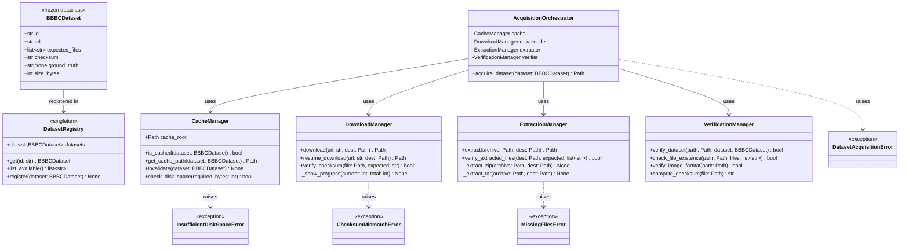

# plan_02_dataset_acquisition.md
## Component: Dataset Acquisition System

### Objective
Implement automatic dataset acquisition that **fails loud** and handles downloads/verification/caching as orthogonal concerns. No manual "download this zip, extract here" — declare what you need, system ensures it exists.

---

## UML Class Diagram



---

## Acquisition Flow Diagram


---

## Sequence Diagram: Successful Acquisition


---

## Plan

1. **Dataset Specification (Declarative)**
   ```python
   @dataclass(frozen=True)
   class BBBCDataset:
       id: str                    # "BBBC021"
       url: str                   # Download URL
       expected_files: list[str]  # Files that must exist after download
       checksum: str              # SHA256 for verification
       ground_truth: str | None   # Path to ground truth if available
       size_bytes: int            # Expected download size
   ```

2. **Download Manager (Orthogonal Concern #1)**
   - Handles HTTP downloads with progress tracking
   - Resumes interrupted downloads
   - Verifies checksums
   - **Fails loud** if download fails (no silent fallbacks)
   - Caches in `~/.cache/openhcs/datasets/`

3. **Extraction Manager (Orthogonal Concern #2)**
   - Handles zip/tar.gz extraction
   - Verifies expected files exist after extraction
   - **Fails loud** if extraction incomplete
   - Idempotent: safe to re-run

4. **Verification Manager (Orthogonal Concern #3)**
   - Checks file existence
   - Validates checksums
   - Verifies image dimensions/formats
   - **Fails loud** if verification fails
   - No silent "maybe it's okay"

5. **Cache Manager (Orthogonal Concern #4)**
   - Checks if dataset already cached
   - Returns cached path if valid
   - Invalidates cache if verification fails
   - Atomic operations (no partial states)

### Findings

**BBBC Dataset Details** (from investigation):

- **BBBC021**: Human MCF7 cells
  - URL: https://bbbc.broadinstitute.org/BBBC021
  - ~600 images, 3 channels
  - Multi-well plate format
  - Good starter dataset

- **BBBC022**: Cell Painting (U2OS)
  - URL: https://bbbc.broadinstitute.org/BBBC022
  - 5-channel Cell Painting
  - 55 compounds, 38 concentrations
  - Complex dimensional structure (perfect for OpenHCS)

- **BBBC038**: Kaggle nuclei segmentation
  - URL: https://bbbc.broadinstitute.org/BBBC038
  - 670 images, diverse cell types
  - Large scale test

- **BBBC039**: Chemical screen
  - URL: https://bbbc.broadinstitute.org/BBBC039
  - 200 images, fluorescent nuclei
  - Standard HCS workflow

**Key Constraint**: BBBC datasets are large (GBs). Must handle:
- Partial downloads (resume capability)
- Disk space checks before download
- Progress feedback (not silent)

### Architecture

```
benchmark/datasets/
├── __init__.py
├── registry.py          # Dataset declarations
├── download.py          # Download manager
├── extract.py           # Extraction manager
├── verify.py            # Verification manager
└── cache.py             # Cache manager

# Usage is declarative:
dataset = acquire_dataset(BBBCDataset.BBBC021)
# Returns Path to dataset, or raises if acquisition fails
```

### Declarative Interface

```python
# User code (declarative)
from benchmark.datasets import BBBCDataset, acquire_dataset

# This handles everything: download, extract, verify, cache
dataset_path = acquire_dataset(BBBCDataset.BBBC021)

# If dataset exists and is valid: instant return
# If dataset missing: download, extract, verify
# If download fails: raise DownloadError (fail loud)
# If verification fails: raise VerificationError (fail loud)
# No silent fallbacks, no "maybe it worked"
```

### Fail-Loud Examples

```python
# Disk space check (before download)
if not has_sufficient_space(dataset.size):
    raise InsufficientDiskSpaceError(
        f"Need {dataset.size} GB, have {available} GB"
    )

# Checksum verification (after download)
if computed_checksum != dataset.checksum:
    raise ChecksumMismatchError(
        f"Expected {dataset.checksum}, got {computed_checksum}"
    )

# File existence check (after extraction)
missing = [f for f in dataset.expected_files if not exists(f)]
if missing:
    raise MissingFilesError(
        f"Expected files not found: {missing}"
    )
```

No try/except swallowing. No "continue anyway". Fail loud, fix the problem.

### Implementation Draft

#### 1. Dataset Registry (datasets/registry.py)

```python
from dataclasses import dataclass
from pathlib import Path

@dataclass(frozen=True)
class BBBCDataset:
    """Immutable dataset specification."""
    id: str
    url: str
    expected_files: list[str]
    checksum: str
    ground_truth: str | None
    size_bytes: int

    @property
    def archive_name(self) -> str:
        """Extract archive filename from URL."""
        return self.url.split('/')[-1]


class DatasetRegistry:
    """Singleton registry of available datasets."""

    # Declarative dataset definitions
    BBBC021 = BBBCDataset(
        id="BBBC021",
        url="https://bbbc.broadinstitute.org/BBBC021/BBBC021_v1_images.zip",
        expected_files=[
            "Week1_22123/Week1_150607_B02_s1_w1.tif",
            "Week1_22123/Week1_150607_B02_s1_w2.tif",
            # ... more files
        ],
        checksum="a1b2c3d4e5f6...",  # SHA256
        ground_truth=None,
        size_bytes=5_000_000_000  # 5GB
    )

    BBBC022 = BBBCDataset(
        id="BBBC022",
        url="https://bbbc.broadinstitute.org/BBBC022/BBBC022_v1_images.zip",
        expected_files=[
            "Week1_22141/Week1_150607_B02_s1_w1.tif",
            # ... more files
        ],
        checksum="f6e5d4c3b2a1...",
        ground_truth="BBBC022_v1_ground_truth.csv",
        size_bytes=8_000_000_000  # 8GB
    )

    @classmethod
    def get(cls, dataset_id: str) -> BBBCDataset:
        """Get dataset by ID. Fail loud if not found."""
        try:
            return getattr(cls, dataset_id)
        except AttributeError:
            raise DatasetNotFoundError(
                f"Dataset '{dataset_id}' not registered. "
                f"Available: {cls.list_available()}"
            )

    @classmethod
    def list_available(cls) -> list[str]:
        """List all registered dataset IDs."""
        return [
            name for name in dir(cls)
            if not name.startswith('_') and isinstance(getattr(cls, name), BBBCDataset)
        ]
```

#### 2. Cache Manager (datasets/cache.py)

```python
from pathlib import Path
import shutil
import json

class CacheManager:
    """Manages dataset cache with atomic operations."""

    def __init__(self, cache_root: Path = None):
        self.cache_root = cache_root or Path.home() / ".cache" / "openhcs" / "datasets"
        self.cache_root.mkdir(parents=True, exist_ok=True)
        self.registry_file = self.cache_root / "registry.json"

    def is_cached(self, dataset: BBBCDataset) -> bool:
        """Check if dataset exists in cache and is valid."""
        cache_path = self.get_cache_path(dataset)
        if not cache_path.exists():
            return False

        # Check registry for validation status
        registry = self._load_registry()
        entry = registry.get(dataset.id)
        return entry is not None and entry.get("validated", False)

    def get_cache_path(self, dataset: BBBCDataset) -> Path:
        """Get path where dataset should be cached."""
        return self.cache_root / dataset.id

    def check_disk_space(self, required_bytes: int) -> bool:
        """Check if sufficient disk space available. Fail loud if not."""
        stat = shutil.disk_usage(self.cache_root)
        available = stat.free

        if available < required_bytes:
            raise InsufficientDiskSpaceError(
                f"Need {required_bytes / 1e9:.2f} GB, "
                f"have {available / 1e9:.2f} GB available"
            )
        return True

    def invalidate(self, dataset: BBBCDataset) -> None:
        """Remove dataset from cache."""
        cache_path = self.get_cache_path(dataset)
        if cache_path.exists():
            shutil.rmtree(cache_path)

        # Update registry
        registry = self._load_registry()
        registry.pop(dataset.id, None)
        self._save_registry(registry)

    def update_registry(self, dataset: BBBCDataset, validated: bool = True) -> None:
        """Mark dataset as validated in registry."""
        registry = self._load_registry()
        registry[dataset.id] = {
            "path": str(self.get_cache_path(dataset)),
            "validated": validated,
            "timestamp": datetime.now().isoformat()
        }
        self._save_registry(registry)

    def _load_registry(self) -> dict:
        """Load cache registry."""
        if not self.registry_file.exists():
            return {}
        return json.loads(self.registry_file.read_text())

    def _save_registry(self, registry: dict) -> None:
        """Save cache registry atomically."""
        # Write to temp file, then atomic rename
        temp_file = self.registry_file.with_suffix('.tmp')
        temp_file.write_text(json.dumps(registry, indent=2))
        temp_file.replace(self.registry_file)
```

#### 3. Download Manager (datasets/download.py)

```python
import hashlib
import requests
from pathlib import Path
from tqdm import tqdm

class DownloadManager:
    """Handles HTTP downloads with progress and resume."""

    def download(self, url: str, dest: Path, expected_checksum: str = None) -> Path:
        """Download file with progress bar. Fail loud on error."""
        dest.parent.mkdir(parents=True, exist_ok=True)

        # Check if partial download exists
        if dest.exists():
            return self.resume_download(url, dest, expected_checksum)

        try:
            response = requests.get(url, stream=True, timeout=30)
            response.raise_for_status()
        except requests.RequestException as e:
            raise DownloadError(f"Failed to download {url}: {e}")

        total_size = int(response.headers.get('content-length', 0))

        # Download with progress bar
        with open(dest, 'wb') as f, tqdm(
            total=total_size,
            unit='B',
            unit_scale=True,
            desc=dest.name
        ) as pbar:
            for chunk in response.iter_content(chunk_size=8192):
                f.write(chunk)
                pbar.update(len(chunk))

        # Verify checksum if provided
        if expected_checksum:
            if not self.verify_checksum(dest, expected_checksum):
                dest.unlink()  # Remove corrupted file
                raise ChecksumMismatchError(
                    f"Checksum mismatch for {dest.name}"
                )

        return dest

    def resume_download(self, url: str, dest: Path, expected_checksum: str = None) -> Path:
        """Resume interrupted download."""
        existing_size = dest.stat().st_size

        headers = {'Range': f'bytes={existing_size}-'}
        try:
            response = requests.get(url, headers=headers, stream=True, timeout=30)
            response.raise_for_status()
        except requests.RequestException as e:
            raise DownloadError(f"Failed to resume download {url}: {e}")

        # Continue download
        with open(dest, 'ab') as f, tqdm(
            initial=existing_size,
            total=existing_size + int(response.headers.get('content-length', 0)),
            unit='B',
            unit_scale=True,
            desc=f"Resuming {dest.name}"
        ) as pbar:
            for chunk in response.iter_content(chunk_size=8192):
                f.write(chunk)
                pbar.update(len(chunk))

        if expected_checksum:
            if not self.verify_checksum(dest, expected_checksum):
                dest.unlink()
                raise ChecksumMismatchError(f"Checksum mismatch for {dest.name}")

        return dest

    def verify_checksum(self, file: Path, expected: str) -> bool:
        """Compute SHA256 and compare to expected."""
        sha256 = hashlib.sha256()
        with open(file, 'rb') as f:
            for chunk in iter(lambda: f.read(8192), b''):
                sha256.update(chunk)

        computed = sha256.hexdigest()
        return computed == expected
```

#### 4. Extraction Manager (datasets/extract.py)

```python
import zipfile
import tarfile
from pathlib import Path

class ExtractionManager:
    """Handles archive extraction with validation."""

    def extract(self, archive: Path, dest: Path) -> Path:
        """
        Extract archive to destination.

        Supports: .zip, .tar.gz, .tar.bz2, .tar.xz
        """
        dest.mkdir(parents=True, exist_ok=True)

        if archive.suffix == '.zip':
            return self._extract_zip(archive, dest)
        elif archive.name.endswith('.tar.gz') or archive.name.endswith('.tgz'):
            return self._extract_tar(archive, dest, 'gz')
        elif archive.name.endswith('.tar.bz2'):
            return self._extract_tar(archive, dest, 'bz2')
        elif archive.name.endswith('.tar.xz'):
            return self._extract_tar(archive, dest, 'xz')
        else:
            raise UnsupportedArchiveError(
                f"Unsupported archive format: {archive.suffix}"
            )

    def verify_extracted_files(
        self,
        dest: Path,
        expected_files: list[str]
    ) -> bool:
        """
        Verify all expected files exist after extraction.
        Fail loud if any missing.
        """
        missing = []

        for expected_file in expected_files:
            file_path = dest / expected_file
            if not file_path.exists():
                missing.append(expected_file)

        if missing:
            raise MissingFilesError(
                f"Missing {len(missing)} files after extraction:\n" +
                "\n".join(f"  - {f}" for f in missing[:10]) +
                (f"\n  ... and {len(missing) - 10} more" if len(missing) > 10 else "")
            )

        return True

    def _extract_zip(self, archive: Path, dest: Path) -> Path:
        """Extract ZIP archive."""
        try:
            with zipfile.ZipFile(archive, 'r') as zf:
                zf.extractall(dest)
        except zipfile.BadZipFile as e:
            raise ExtractionError(f"Corrupted ZIP file: {e}")
        except Exception as e:
            raise ExtractionError(f"Failed to extract ZIP: {e}")

        return dest

    def _extract_tar(self, archive: Path, dest: Path, compression: str) -> Path:
        """Extract TAR archive with specified compression."""
        mode = f'r:{compression}'

        try:
            with tarfile.open(archive, mode) as tf:
                tf.extractall(dest)
        except tarfile.TarError as e:
            raise ExtractionError(f"Corrupted TAR file: {e}")
        except Exception as e:
            raise ExtractionError(f"Failed to extract TAR: {e}")

        return dest
```

#### 5. Verification Manager (datasets/verify.py)

```python
from pathlib import Path
import hashlib
from PIL import Image

class VerificationManager:
    """Verifies dataset integrity."""

    def verify_dataset(
        self,
        path: Path,
        dataset: 'BBBCDataset'
    ) -> bool:
        """
        Complete dataset verification.

        Checks:
        1. All expected files exist
        2. Image files are valid
        3. Ground truth exists (if specified)
        """
        # Check file existence
        self.check_file_existence(path, dataset.expected_files)

        # Verify image formats
        image_files = [f for f in dataset.expected_files if self._is_image(f)]
        for image_file in image_files:
            self.verify_image_format(path / image_file)

        # Verify ground truth if specified
        if dataset.ground_truth:
            gt_path = path / dataset.ground_truth
            if not gt_path.exists():
                raise MissingFilesError(
                    f"Ground truth file missing: {dataset.ground_truth}"
                )

        return True

    def check_file_existence(
        self,
        path: Path,
        expected_files: list[str]
    ) -> bool:
        """Check all expected files exist. Fail loud if not."""
        missing = []

        for expected_file in expected_files:
            file_path = path / expected_file
            if not file_path.exists():
                missing.append(expected_file)

        if missing:
            raise MissingFilesError(
                f"Missing {len(missing)} files:\n" +
                "\n".join(f"  - {f}" for f in missing[:10])
            )

        return True

    def verify_image_format(self, path: Path) -> bool:
        """Verify image file is valid and readable."""
        try:
            with Image.open(path) as img:
                img.verify()  # Verify it's a valid image
        except Exception as e:
            raise ImageFormatError(
                f"Invalid image file {path.name}: {e}"
            )

        return True

    def compute_checksum(self, file: Path) -> str:
        """Compute SHA256 checksum of file."""
        sha256 = hashlib.sha256()

        with open(file, 'rb') as f:
            for chunk in iter(lambda: f.read(8192), b''):
                sha256.update(chunk)

        return sha256.hexdigest()

    def _is_image(self, filename: str) -> bool:
        """Check if filename is an image."""
        image_extensions = {'.tif', '.tiff', '.png', '.jpg', '.jpeg', '.bmp'}
        return Path(filename).suffix.lower() in image_extensions
```

#### 6. Acquisition Orchestrator (datasets/acquire.py)

```python
from pathlib import Path

from benchmark.datasets.registry import BBBCDataset
from benchmark.datasets.cache import CacheManager
from benchmark.datasets.download import DownloadManager
from benchmark.datasets.extract import ExtractionManager
from benchmark.datasets.verify import VerificationManager

class AcquisitionOrchestrator:
    """Orchestrates complete dataset acquisition workflow."""

    def __init__(self, cache_root: Path = None):
        self.cache = CacheManager(cache_root)
        self.downloader = DownloadManager()
        self.extractor = ExtractionManager()
        self.verifier = VerificationManager()

    def acquire(self, dataset: BBBCDataset) -> Path:
        """
        Acquire dataset (download, extract, verify, cache).

        This is the main entry point. Everything else is orchestration.

        Returns:
            Path to dataset directory
        """
        # 1. Check cache
        if self.cache.is_cached(dataset):
            cache_path = self.cache.get_cache_path(dataset)

            # Verify cached dataset is still valid
            try:
                self.verifier.verify_dataset(cache_path, dataset)
                return cache_path
            except Exception:
                # Cache corrupted, invalidate and re-acquire
                self.cache.invalidate(dataset)

        # 2. Check disk space
        self.cache.check_disk_space(dataset.size_bytes)

        # 3. Download
        archive_path = self._download_dataset(dataset)

        # 4. Extract
        extracted_path = self._extract_dataset(dataset, archive_path)

        # 5. Verify
        self._verify_dataset(dataset, extracted_path)

        # 6. Update cache
        self.cache.update_registry(dataset, validated=True)

        return extracted_path

    def _download_dataset(self, dataset: BBBCDataset) -> Path:
        """Download dataset archive."""
        archive_path = self.cache.cache_root / dataset.archive_name

        return self.downloader.download(
            url=dataset.url,
            dest=archive_path,
            expected_checksum=dataset.checksum
        )

    def _extract_dataset(self, dataset: BBBCDataset, archive_path: Path) -> Path:
        """Extract dataset archive."""
        extract_path = self.cache.get_cache_path(dataset)

        self.extractor.extract(archive_path, extract_path)

        # Verify extraction
        self.extractor.verify_extracted_files(
            extract_path,
            dataset.expected_files
        )

        return extract_path

    def _verify_dataset(self, dataset: BBBCDataset, path: Path) -> None:
        """Verify dataset integrity."""
        self.verifier.verify_dataset(path, dataset)

# Convenience function for public API
def acquire_dataset(dataset: BBBCDataset) -> Path:
    """
    Acquire dataset (download, extract, verify, cache).

    This is the public API. Usage:

        from benchmark.datasets import BBBCDataset, acquire_dataset

        dataset_path = acquire_dataset(BBBCDataset.BBBC021)
    """
    orchestrator = AcquisitionOrchestrator()
    return orchestrator.acquire(dataset)
```

#### 7. Error Classes (datasets/errors.py)

```python
class DatasetAcquisitionError(Exception):
    """Base exception for dataset acquisition errors."""
    pass

class DatasetNotFoundError(DatasetAcquisitionError):
    """Dataset not found in registry."""
    pass

class InsufficientDiskSpaceError(DatasetAcquisitionError):
    """Not enough disk space for dataset."""
    pass

class DownloadError(DatasetAcquisitionError):
    """Failed to download dataset."""
    pass

class ChecksumMismatchError(DatasetAcquisitionError):
    """Downloaded file checksum doesn't match expected."""
    pass

class ExtractionError(DatasetAcquisitionError):
    """Failed to extract archive."""
    pass

class UnsupportedArchiveError(ExtractionError):
    """Archive format not supported."""
    pass

class MissingFilesError(DatasetAcquisitionError):
    """Expected files missing from dataset."""
    pass

class ImageFormatError(DatasetAcquisitionError):
    """Image file is corrupted or invalid format."""
    pass
```

### Success Criteria

1. **Declarative**: User declares dataset, system acquires it
2. **Fail-loud**: Every failure raises informative error
3. **Idempotent**: Safe to re-run acquisition
4. **Cached**: Don't re-download if valid copy exists
5. **Verified**: Checksums + file existence always checked

### Revisions (2025-12-19)

- **Path traversal safety**: Replace raw `extractall()` with safe extraction that validates target paths before writing (reject `..` or absolute members).
- **Dataset manifests**: Instead of hardcoding long `expected_files` lists, store per-dataset manifest (relative paths + checksums) generated once and versioned; verification uses manifest and reports first N missing/invalid files.
- **Canonical item enumeration**: Add `DatasetProtocol.items()` yielding deterministic (well,row,field,channel,file) records so adapters can subset consistently and tools can map to their required file layouts.
- **Subsetting and splits**: Support declarative subsets (e.g., `first_k`, `random_seeded_split`, `plate_ids`) to run quick sanity vs full runs; record subset parameters in provenance.
- **Checksum + size**: Persist archive checksum, manifest checksum, and uncompressed size in `RunMetadata` for the benchmark platform.
- **Resume + disk checks**: Keep resume downloads but additionally verify partial file size does not exceed expected; revalidate checksum after resume.

### Integration with Plan 01

```python
# In benchmark infrastructure (plan_01)
@dataclass
class BenchmarkRun:
    dataset: BBBCDataset
    tool: ToolAdapter
    metrics: list[MetricCollector]
    
    def execute(self):
        # Acquisition is automatic, declarative
        dataset_path = acquire_dataset(self.dataset)
        
        # Rest of benchmark execution...
        result = self.tool.run(dataset_path, self.metrics)
        return result
```

Dataset acquisition is orthogonal to benchmark execution. Compose cleanly.
