# plan_03_tool_adapters.md
## Component: Tool Adapter System

### Objective
Create tool adapters that normalize heterogeneous tools (OpenHCS, CellProfiler, ImageJ, Python scripts) into a **uniform interface**. Each tool has different invocation mechanisms, but the benchmark system sees only the protocol.

---

## UML Class Diagram

```mermaid
classDiagram
    class ToolAdapter {
        <<Protocol>>
        +str name
        +str version
        +run(dataset_path, pipeline_config, metrics) BenchmarkResult
        +validate_installation() None
    }

    class BenchmarkResult {
        +str tool_name
        +str dataset_id
        +dict metrics
        +Path output_path
        +float execution_time
        +bool success
        +str|None error_message
    }

    class PipelineConfig {
        +str pipeline_type
        +dict parameters
        +to_openhcs() list~Step~
        +to_cellprofiler() str
        +to_imagej_macro() str
        +to_python_script() str
    }

    class MetricCollector {
        <<Protocol>>
        +str name
        +__enter__() MetricCollector
        +__exit__(exc_type, exc_val, exc_tb) None
        +get_result() Any
    }

    class OpenHCSAdapter {
        +str name = "OpenHCS"
        +str version
        +run(dataset_path, pipeline_config, metrics) BenchmarkResult
        +validate_installation() None
        -_execute_pipeline(dataset, pipeline) Any
    }

    class CellProfilerAdapter {
        +str name = "CellProfiler"
        +str version
        +Path cellprofiler_exe
        +run(dataset_path, pipeline_config, metrics) BenchmarkResult
        +validate_installation() None
        -_generate_pipeline_file(config) Path
        -_execute_subprocess(pipeline_file, dataset) Any
        -_parse_output(output_dir) Any
    }

    class ImageJAdapter {
        +str name = "ImageJ"
        +str version
        +Path imagej_exe
        +run(dataset_path, pipeline_config, metrics) BenchmarkResult
        +validate_installation() None
        -_generate_macro(config) Path
        -_execute_macro(macro_file, dataset) Any
        -_parse_results(output_dir) Any
    }

    class PythonScriptAdapter {
        +str name = "PythonScript"
        +str version
        +Callable script_func
        +run(dataset_path, pipeline_config, metrics) BenchmarkResult
        +validate_installation() None
        -_execute_function(dataset, params) Any
    }

    class SubprocessRunner {
        +run_command(cmd, timeout) subprocess.CompletedProcess
        +run_with_metrics(cmd, metrics) tuple~CompletedProcess, dict~
    }

    class PipelineGenerator {
        +generate_cellprofiler(config) str
        +generate_imagej_macro(config) str
        +generate_python_script(config) str
    }

    class ResultParser {
        +parse_cellprofiler_output(path) dict
        +parse_imagej_output(path) dict
        +normalize_results(raw_results, tool) BenchmarkResult
    }

    ToolAdapter <|.. OpenHCSAdapter : implements
    ToolAdapter <|.. CellProfilerAdapter : implements
    ToolAdapter <|.. ImageJAdapter : implements
    ToolAdapter <|.. PythonScriptAdapter : implements

    ToolAdapter --> BenchmarkResult : returns
    ToolAdapter --> PipelineConfig : uses
    ToolAdapter --> MetricCollector : uses

    CellProfilerAdapter --> SubprocessRunner : uses
    CellProfilerAdapter --> PipelineGenerator : uses
    CellProfilerAdapter --> ResultParser : uses

    ImageJAdapter --> SubprocessRunner : uses
    ImageJAdapter --> PipelineGenerator : uses
    ImageJAdapter --> ResultParser : uses
```



---

## Execution Flow Diagram


---

## Sequence Diagram: Multi-Tool Benchmark


---

## Plan

1. **ToolAdapter Protocol (The Contract)**
   ```python
   class ToolAdapter(Protocol):
       name: str
       version: str

       def run(
           self,
           dataset_path: Path,
           pipeline_config: PipelineConfig,
           metrics: list[MetricCollector]
       ) -> BenchmarkResult:
           """Execute tool on dataset, return structured results."""
           ...

       def validate_installation(self) -> None:
           """Verify tool is installed and functional. Fail loud if not."""
           ...
   ```

2. **OpenHCS Adapter (Native)**
   - Directly invokes OpenHCS pipeline
   - Uses declarative pipeline config (already exists in OpenHCS)
   - Metrics collection via context managers
   - Returns structured results

3. **CellProfiler Adapter (Subprocess)**
   - Generates CellProfiler pipeline file (.cppipe)
   - Invokes `cellprofiler -c -r -p pipeline.cppipe -i input -o output`
   - Parses output for timing/results
   - Converts CellProfiler output to normalized format

4. **ImageJ Adapter (Subprocess + Macro)**
   - Generates ImageJ macro script
   - Invokes `ImageJ --headless --console -macro script.ijm`
   - Parses macro output
   - Converts to normalized format

5. **Python Script Adapter (In-Process)**
   - Executes Python function directly
   - Wraps with metric collectors
   - Returns normalized results

### Findings

**Key Challenge**: Each tool has different:
- Invocation mechanism (subprocess vs in-process)
- Configuration format (Python vs XML vs macro language)
- Output format (CSV vs images vs logs)
- Error reporting (exceptions vs exit codes vs stderr)

**Solution**: Adapter pattern isolates these differences. Benchmark system only sees the protocol.

**Fail-Loud Principle**: 
- If CellProfiler not installed: raise `ToolNotInstalledError`
- If pipeline generation fails: raise `PipelineGenerationError`
- If tool execution fails: raise `ToolExecutionError` with full stderr
- No silent fallbacks, no "skip this tool"

### Architecture

```
benchmark/adapters/
├── __init__.py
├── protocol.py              # ToolAdapter protocol definition
├── openhcs.py              # OpenHCS adapter (native)
├── cellprofiler.py         # CellProfiler adapter (subprocess)
├── imagej.py               # ImageJ adapter (subprocess + macro)
├── python_script.py        # Python script adapter (in-process)
└── utils/
    ├── subprocess_runner.py    # Subprocess execution with metrics
    ├── pipeline_generator.py   # Generate tool-specific configs
    └── result_parser.py        # Parse tool outputs to normalized format
```

### Declarative Pipeline Equivalence

**Critical Requirement**: Same analysis across all tools.

Example: Nuclei segmentation pipeline

```python
# OpenHCS (declarative, already exists)
pipeline = [
    FunctionStep(func=gaussian_filter, sigma=2.0),
    FunctionStep(func=threshold_otsu),
    FunctionStep(func=label_connected_components),
    FunctionStep(func=measure_region_properties),
]

# CellProfiler (generated from above)
# Adapter generates .cppipe XML with equivalent modules:
# - Smooth (Gaussian, sigma=2.0)
# - Threshold (Otsu)
# - IdentifyPrimaryObjects
# - MeasureObjectIntensity

# ImageJ (generated from above)
# Adapter generates .ijm macro:
# run("Gaussian Blur...", "sigma=2.0");
# setAutoThreshold("Otsu");
# run("Analyze Particles...");

# Python script (generated from above)
# Adapter wraps scikit-image calls:
# from skimage.filters import gaussian, threshold_otsu
# from skimage.measure import label, regionprops
```

**Key Insight**: Pipeline is declared once (OpenHCS format), adapters translate to tool-specific formats.

### Fail-Loud Validation

```python
class CellProfilerAdapter(ToolAdapter):
    def validate_installation(self) -> None:
        """Verify CellProfiler is installed and functional."""
        result = subprocess.run(
            ["cellprofiler", "--version"],
            capture_output=True,
            text=True
        )
        
        if result.returncode != 0:
            raise ToolNotInstalledError(
                "CellProfiler not found. Install: pip install cellprofiler"
            )
        
        # Parse version, ensure >= 4.0
        version = parse_version(result.stdout)
        if version < (4, 0):
            raise ToolVersionError(
                f"CellProfiler {version} too old. Need >= 4.0"
            )
```

No silent "maybe it's installed." Validate explicitly, fail loud.

### Metric Collection Integration

```python
class OpenHCSAdapter(ToolAdapter):
    def run(
        self,
        dataset_path: Path,
        pipeline_config: PipelineConfig,
        metrics: list[MetricCollector]
    ) -> BenchmarkResult:
        # Metrics attach via context managers
        with ExitStack() as stack:
            # Each metric collector is a context manager
            for metric in metrics:
                stack.enter_context(metric)
            
            # Execute pipeline (metrics collect automatically)
            output = execute_openhcs_pipeline(
                dataset_path,
                pipeline_config
            )
        
        # Metrics have collected data, return structured result
        return BenchmarkResult(
            tool=self.name,
            dataset=dataset_path.name,
            metrics={m.name: m.result for m in metrics},
            output=output
        )
```

Metrics are orthogonal to execution. Compose via context managers.

### Implementation Draft

#### 1. ToolAdapter Protocol (adapters/protocol.py)

```python
from typing import Protocol, runtime_checkable
from pathlib import Path
from dataclasses import dataclass

@dataclass
class BenchmarkResult:
    """Normalized result from any tool."""
    tool_name: str
    dataset_id: str
    metrics: dict[str, Any]
    output_path: Path
    execution_time: float
    success: bool
    error_message: str | None = None

@runtime_checkable
class ToolAdapter(Protocol):
    """Protocol that all tool adapters must implement."""

    name: str
    version: str

    def run(
        self,
        dataset_path: Path,
        pipeline_config: 'PipelineConfig',
        metrics: list['MetricCollector']
    ) -> BenchmarkResult:
        """Execute tool on dataset with metrics collection."""
        ...

    def validate_installation(self) -> None:
        """Verify tool is installed. Raise if not."""
        ...
```

#### 2. OpenHCS Adapter (adapters/openhcs.py)

```python
from contextlib import ExitStack
from pathlib import Path
import time

class OpenHCSAdapter:
    """Native OpenHCS execution adapter."""

    name = "OpenHCS"

    def __init__(self):
        from openhcs import __version__
        self.version = __version__

    def validate_installation(self) -> None:
        """Verify OpenHCS is importable."""
        try:
            import openhcs
        except ImportError as e:
            raise ToolNotInstalledError(
                f"OpenHCS not installed: {e}"
            )

    def run(
        self,
        dataset_path: Path,
        pipeline_config: PipelineConfig,
        metrics: list[MetricCollector]
    ) -> BenchmarkResult:
        """Execute OpenHCS pipeline with metric collection."""

        # Convert config to OpenHCS pipeline
        pipeline = pipeline_config.to_openhcs()

        # Execute with metrics
        start_time = time.perf_counter()

        with ExitStack() as stack:
            # Enter all metric collectors
            for metric in metrics:
                stack.enter_context(metric)

            try:
                # Execute pipeline
                output = self._execute_pipeline(dataset_path, pipeline)
                success = True
                error_msg = None
            except Exception as e:
                output = None
                success = False
                error_msg = str(e)
                raise  # Re-raise after recording

        execution_time = time.perf_counter() - start_time

        # Collect metric results
        metric_results = {m.name: m.get_result() for m in metrics}

        return BenchmarkResult(
            tool_name=self.name,
            dataset_id=dataset_path.name,
            metrics=metric_results,
            output_path=output,
            execution_time=execution_time,
            success=success,
            error_message=error_msg
        )

    def _execute_pipeline(self, dataset_path: Path, pipeline: list) -> Path:
        """Execute OpenHCS pipeline."""
        from openhcs.pipeline import execute_pipeline

        output_dir = dataset_path.parent / f"{dataset_path.name}_openhcs_output"
        output_dir.mkdir(exist_ok=True)

        execute_pipeline(
            input_path=dataset_path,
            pipeline=pipeline,
            output_path=output_dir
        )

        return output_dir
```

#### 3. CellProfiler Adapter (adapters/cellprofiler.py)

```python
import subprocess
import shutil
from pathlib import Path
import time

class CellProfilerAdapter:
    """CellProfiler subprocess execution adapter."""

    name = "CellProfiler"

    def __init__(self):
        self.cellprofiler_exe = self._find_cellprofiler()
        self.version = self._get_version()

    def _find_cellprofiler(self) -> Path:
        """Locate CellProfiler executable."""
        exe = shutil.which("cellprofiler")
        if exe is None:
            raise ToolNotInstalledError(
                "CellProfiler not found in PATH. "
                "Install: pip install cellprofiler"
            )
        return Path(exe)

    def _get_version(self) -> str:
        """Get CellProfiler version."""
        result = subprocess.run(
            [str(self.cellprofiler_exe), "--version"],
            capture_output=True,
            text=True,
            timeout=10
        )
        if result.returncode != 0:
            raise ToolExecutionError(
                f"Failed to get CellProfiler version: {result.stderr}"
            )
        return result.stdout.strip()

    def validate_installation(self) -> None:
        """Verify CellProfiler is functional."""
        # Already validated in __init__
        version_parts = self.version.split('.')
        major = int(version_parts[0])

        if major < 4:
            raise ToolVersionError(
                f"CellProfiler {self.version} too old. Need >= 4.0"
            )

    def run(
        self,
        dataset_path: Path,
        pipeline_config: PipelineConfig,
        metrics: list[MetricCollector]
    ) -> BenchmarkResult:
        """Execute CellProfiler pipeline."""

        # Generate CellProfiler pipeline file
        pipeline_file = self._generate_pipeline_file(pipeline_config)

        # Setup output directory
        output_dir = dataset_path.parent / f"{dataset_path.name}_cellprofiler_output"
        output_dir.mkdir(exist_ok=True)

        # Build command
        cmd = [
            str(self.cellprofiler_exe),
            "-c",  # Run headless
            "-r",  # Run pipeline
            "-p", str(pipeline_file),
            "-i", str(dataset_path),
            "-o", str(output_dir)
        ]

        # Execute with metrics
        start_time = time.perf_counter()

        with ExitStack() as stack:
            for metric in metrics:
                stack.enter_context(metric)

            try:
                result = subprocess.run(
                    cmd,
                    capture_output=True,
                    text=True,
                    timeout=3600  # 1 hour timeout
                )

                if result.returncode != 0:
                    raise ToolExecutionError(
                        f"CellProfiler failed: {result.stderr}"
                    )

                success = True
                error_msg = None
            except subprocess.TimeoutExpired:
                success = False
                error_msg = "CellProfiler execution timeout (1 hour)"
            except Exception as e:
                success = False
                error_msg = str(e)

        execution_time = time.perf_counter() - start_time

        # Parse output
        parsed_output = self._parse_output(output_dir)

        # Collect metrics
        metric_results = {m.name: m.get_result() for m in metrics}

        return BenchmarkResult(
            tool_name=self.name,
            dataset_id=dataset_path.name,
            metrics=metric_results,
            output_path=output_dir,
            execution_time=execution_time,
            success=success,
            error_message=error_msg
        )

    def _generate_pipeline_file(self, config: PipelineConfig) -> Path:
        """Generate CellProfiler .cppipe file from config."""
        from benchmark.adapters.utils import PipelineGenerator

        pipeline_xml = PipelineGenerator.generate_cellprofiler(config)

        pipeline_file = Path(f"/tmp/cellprofiler_pipeline_{id(config)}.cppipe")
        pipeline_file.write_text(pipeline_xml)

        return pipeline_file

    def _parse_output(self, output_dir: Path) -> dict:
        """Parse CellProfiler output CSV files."""
        from benchmark.adapters.utils import ResultParser

        return ResultParser.parse_cellprofiler_output(output_dir)
```

#### 4. ImageJ Adapter (adapters/imagej.py)

```python
import subprocess
import shutil
from pathlib import Path
import time
from contextlib import ExitStack

class ImageJAdapter:
    """ImageJ/Fiji macro execution adapter."""

    name = "ImageJ"

    def __init__(self):
        self.imagej_exe = self._find_imagej()
        self.version = self._get_version()

    def _find_imagej(self) -> Path:
        """Locate ImageJ/Fiji executable."""
        # Try common names
        for exe_name in ['fiji', 'imagej', 'ImageJ']:
            exe = shutil.which(exe_name)
            if exe:
                return Path(exe)

        raise ToolNotInstalledError(
            "ImageJ/Fiji not found in PATH. "
            "Install from: https://fiji.sc/"
        )

    def _get_version(self) -> str:
        """Get ImageJ version."""
        result = subprocess.run(
            [str(self.imagej_exe), "--version"],
            capture_output=True,
            text=True,
            timeout=10
        )
        return result.stdout.strip() if result.returncode == 0 else "unknown"

    def validate_installation(self) -> None:
        """Verify ImageJ is functional."""
        # Already validated in __init__
        pass

    def run(
        self,
        dataset_path: Path,
        pipeline_config: PipelineConfig,
        metrics: list[MetricCollector]
    ) -> BenchmarkResult:
        """Execute ImageJ macro."""

        # Generate ImageJ macro
        macro_file = self._generate_macro(pipeline_config, dataset_path)

        # Setup output directory
        output_dir = dataset_path.parent / f"{dataset_path.name}_imagej_output"
        output_dir.mkdir(exist_ok=True)

        # Build command
        cmd = [
            str(self.imagej_exe),
            "--headless",
            "--console",
            "-macro", str(macro_file)
        ]

        # Execute with metrics
        start_time = time.perf_counter()

        with ExitStack() as stack:
            for metric in metrics:
                stack.enter_context(metric)

            try:
                result = subprocess.run(
                    cmd,
                    capture_output=True,
                    text=True,
                    timeout=3600
                )

                if result.returncode != 0:
                    raise ToolExecutionError(
                        f"ImageJ failed: {result.stderr}"
                    )

                success = True
                error_msg = None
            except subprocess.TimeoutExpired:
                success = False
                error_msg = "ImageJ execution timeout"
            except Exception as e:
                success = False
                error_msg = str(e)

        execution_time = time.perf_counter() - start_time

        # Parse output
        parsed_output = self._parse_results(output_dir)

        # Collect metrics
        metric_results = {m.name: m.get_result() for m in metrics}

        return BenchmarkResult(
            tool_name=self.name,
            dataset_id=dataset_path.name,
            metrics=metric_results,
            output_path=output_dir,
            execution_time=execution_time,
            success=success,
            error_message=error_msg
        )

    def _generate_macro(
        self,
        config: PipelineConfig,
        dataset_path: Path
    ) -> Path:
        """Generate ImageJ macro from config."""
        from benchmark.adapters.utils import PipelineGenerator

        macro_code = PipelineGenerator.generate_imagej_macro(config, dataset_path)

        macro_file = Path(f"/tmp/imagej_macro_{id(config)}.ijm")
        macro_file.write_text(macro_code)

        return macro_file

    def _parse_results(self, output_dir: Path) -> dict:
        """Parse ImageJ output."""
        from benchmark.adapters.utils import ResultParser

        return ResultParser.parse_imagej_output(output_dir)
```

#### 5. Python Script Adapter (adapters/python_script.py)

```python
from pathlib import Path
import time
from contextlib import ExitStack
from typing import Callable

class PythonScriptAdapter:
    """Python function execution adapter."""

    name = "PythonScript"
    version = "1.0"

    def __init__(self, script_func: Callable):
        """
        Initialize with Python function to execute.

        Args:
            script_func: Function with signature:
                func(dataset_path: Path, output_dir: Path, **params) -> dict
        """
        self.script_func = script_func

    def validate_installation(self) -> None:
        """Verify function is callable."""
        if not callable(self.script_func):
            raise ToolNotInstalledError(
                f"script_func is not callable: {type(self.script_func)}"
            )

    def run(
        self,
        dataset_path: Path,
        pipeline_config: PipelineConfig,
        metrics: list[MetricCollector]
    ) -> BenchmarkResult:
        """Execute Python function."""

        # Setup output directory
        output_dir = dataset_path.parent / f"{dataset_path.name}_python_output"
        output_dir.mkdir(exist_ok=True)

        # Execute with metrics
        start_time = time.perf_counter()

        with ExitStack() as stack:
            for metric in metrics:
                stack.enter_context(metric)

            try:
                # Execute function
                result = self.script_func(
                    dataset_path=dataset_path,
                    output_dir=output_dir,
                    **pipeline_config.parameters
                )

                success = True
                error_msg = None
            except Exception as e:
                result = None
                success = False
                error_msg = str(e)
                raise

        execution_time = time.perf_counter() - start_time

        # Collect metrics
        metric_results = {m.name: m.get_result() for m in metrics}

        return BenchmarkResult(
            tool_name=self.name,
            dataset_id=dataset_path.name,
            metrics=metric_results,
            output_path=output_dir,
            execution_time=execution_time,
            success=success,
            error_message=error_msg
        )
```

#### 6. Pipeline Generator (adapters/utils/pipeline_generator.py)

```python
from pathlib import Path

class PipelineGenerator:
    """Generate tool-specific pipeline configurations."""

    @staticmethod
    def generate_cellprofiler(config: 'PipelineConfig') -> str:
        """
        Generate CellProfiler .cppipe XML from config.

        Example for nuclei segmentation:
        - Smooth (Gaussian)
        - Threshold (Otsu)
        - IdentifyPrimaryObjects
        - MeasureObjectIntensity
        """
        if config.pipeline_type == "nuclei_segmentation":
            return PipelineGenerator._cellprofiler_nuclei_segmentation(
                config.parameters
            )
        else:
            raise ValueError(f"Unknown pipeline type: {config.pipeline_type}")

    @staticmethod
    def _cellprofiler_nuclei_segmentation(params: dict) -> str:
        """Generate CellProfiler nuclei segmentation pipeline."""
        sigma = params.get('gaussian_sigma', 2.0)

        # Simplified CellProfiler XML (real version would be much longer)
        return f"""CellProfiler Pipeline: http://www.cellprofiler.org
Version:5
DateRevision:424

Images:[module_num:1|svn_version:'Unknown'|variable_revision_number:2]

Smooth:[module_num:2|svn_version:'Unknown'|variable_revision_number:2]
    Select the input image:DNA
    Name the output image:SmoothedDNA
    Select smoothing method:Gaussian Filter
    Calculate artifact diameter automatically?:No
    Typical diameter of objects:16.0
    Edge intensity difference:0.1
    Clip intensities to 0 and 1?:Yes
    Gaussian sigma:{sigma}

Threshold:[module_num:3|svn_version:'Unknown'|variable_revision_number:12]
    Select the input image:SmoothedDNA
    Name the output image:ThresholdedDNA
    Threshold strategy:Global
    Thresholding method:Otsu

IdentifyPrimaryObjects:[module_num:4|svn_version:'Unknown'|variable_revision_number:15]
    Select the input image:ThresholdedDNA
    Name the primary objects to be identified:Nuclei
    Typical diameter of objects, in pixel units (Min,Max):10,40

MeasureObjectIntensity:[module_num:5|svn_version:'Unknown'|variable_revision_number:4]
    Select images to measure:DNA
    Select objects to measure:Nuclei
"""

    @staticmethod
    def generate_imagej_macro(config: 'PipelineConfig', dataset_path: Path) -> str:
        """
        Generate ImageJ macro from config.

        Example for nuclei segmentation:
        - Gaussian Blur
        - Auto Threshold (Otsu)
        - Analyze Particles
        """
        if config.pipeline_type == "nuclei_segmentation":
            return PipelineGenerator._imagej_nuclei_segmentation(
                config.parameters,
                dataset_path
            )
        else:
            raise ValueError(f"Unknown pipeline type: {config.pipeline_type}")

    @staticmethod
    def _imagej_nuclei_segmentation(params: dict, dataset_path: Path) -> str:
        """Generate ImageJ nuclei segmentation macro."""
        sigma = params.get('gaussian_sigma', 2.0)

        return f"""
// ImageJ Macro: Nuclei Segmentation
setBatchMode(true);

// Open image
open("{dataset_path}");

// Gaussian blur
run("Gaussian Blur...", "sigma={sigma}");

// Auto threshold
setAutoThreshold("Otsu dark");
run("Convert to Mask");

// Analyze particles
run("Analyze Particles...", "size=50-Infinity show=Outlines display clear");

// Save results
saveAs("Results", "{dataset_path.parent}/imagej_results.csv");

setBatchMode(false);
"""

    @staticmethod
    def generate_python_script(config: 'PipelineConfig') -> str:
        """Generate Python script from config."""
        if config.pipeline_type == "nuclei_segmentation":
            return PipelineGenerator._python_nuclei_segmentation(
                config.parameters
            )
        else:
            raise ValueError(f"Unknown pipeline type: {config.pipeline_type}")

    @staticmethod
    def _python_nuclei_segmentation(params: dict) -> str:
        """Generate Python nuclei segmentation script."""
        sigma = params.get('gaussian_sigma', 2.0)

        return f"""
from skimage import io, filters, measure
from skimage.morphology import label
import pandas as pd

def segment_nuclei(dataset_path, output_dir):
    # Load image
    img = io.imread(dataset_path)

    # Gaussian blur
    blurred = filters.gaussian(img, sigma={sigma})

    # Otsu threshold
    thresh = filters.threshold_otsu(blurred)
    binary = blurred > thresh

    # Label connected components
    labeled = label(binary)

    # Measure properties
    props = measure.regionprops(labeled, intensity_image=img)

    # Extract measurements
    results = []
    for prop in props:
        results.append({{
            'area': prop.area,
            'mean_intensity': prop.mean_intensity,
            'centroid_x': prop.centroid[1],
            'centroid_y': prop.centroid[0]
        }})

    # Save results
    df = pd.DataFrame(results)
    df.to_csv(output_dir / 'results.csv', index=False)

    return {{'num_objects': len(results)}}
"""
```

#### 7. Result Parser (adapters/utils/result_parser.py)

```python
from pathlib import Path
import pandas as pd

class ResultParser:
    """Parse tool outputs to normalized format."""

    @staticmethod
    def parse_cellprofiler_output(output_dir: Path) -> dict:
        """Parse CellProfiler CSV output."""
        # CellProfiler typically outputs multiple CSV files
        csv_files = list(output_dir.glob("*.csv"))

        if not csv_files:
            return {'num_objects': 0}

        # Read primary measurements file
        df = pd.read_csv(csv_files[0])

        return {
            'num_objects': len(df),
            'measurements': df.to_dict('records')
        }

    @staticmethod
    def parse_imagej_output(output_dir: Path) -> dict:
        """Parse ImageJ results CSV."""
        results_file = output_dir / "imagej_results.csv"

        if not results_file.exists():
            return {'num_objects': 0}

        df = pd.read_csv(results_file)

        return {
            'num_objects': len(df),
            'measurements': df.to_dict('records')
        }

    @staticmethod
    def normalize_results(raw_results: dict, tool: str) -> dict:
        """Normalize results from any tool to common format."""
        # Common format: {'num_objects': int, 'measurements': list[dict]}
        return {
            'tool': tool,
            'num_objects': raw_results.get('num_objects', 0),
            'measurements': raw_results.get('measurements', [])
        }
```

#### 8. Pipeline Config (adapters/pipeline_config.py)

```python
from dataclasses import dataclass
from typing import Any

@dataclass
class PipelineConfig:
    """Configuration for analysis pipeline."""
    pipeline_type: str
    parameters: dict[str, Any]

    def to_openhcs(self) -> list:
        """Convert to OpenHCS pipeline steps."""
        from benchmark.pipelines import get_openhcs_pipeline
        return get_openhcs_pipeline(self.pipeline_type, self.parameters)

    def to_cellprofiler(self) -> str:
        """Convert to CellProfiler XML."""
        from benchmark.adapters.utils import PipelineGenerator
        return PipelineGenerator.generate_cellprofiler(self)

    def to_imagej_macro(self) -> str:
        """Convert to ImageJ macro."""
        from benchmark.adapters.utils import PipelineGenerator
        return PipelineGenerator.generate_imagej_macro(self, Path())

    def to_python_script(self) -> str:
        """Convert to Python script."""
        from benchmark.adapters.utils import PipelineGenerator
        return PipelineGenerator.generate_python_script(self)
```

#### 9. Error Classes (adapters/errors.py)

```python
class ToolAdapterError(Exception):
    """Base exception for tool adapter errors."""
    pass

class ToolNotInstalledError(ToolAdapterError):
    """Tool not installed or not found."""
    pass

class ToolVersionError(ToolAdapterError):
    """Tool version incompatible."""
    pass

class ToolExecutionError(ToolAdapterError):
    """Tool execution failed."""
    pass

class PipelineGenerationError(ToolAdapterError):
    """Failed to generate tool-specific pipeline."""
    pass

class ResultParsingError(ToolAdapterError):
    """Failed to parse tool output."""
    pass
```

### Success Criteria

1. **Protocol Compliance**: All adapters implement ToolAdapter protocol
2. **Fail-Loud**: Installation validation, execution errors raise explicitly
3. **Equivalent Pipelines**: Same analysis across all tools (verified by correctness metric)
4. **Metric Integration**: Metrics collect automatically via context managers
5. **Normalized Output**: All tools return BenchmarkResult with same structure

### Revisions (2025-12-19)

- **Pipeline templates**: Use parameterized templates for CellProfiler/ImageJ instead of ad‑hoc generation; map a small, vetted set of benchmark pipelines (e.g., nuclei segmentation, Cell Painting feature set) with explicit option contracts and unit tests for round-trip equivalence.
- **Dataset path handling**: `PipelineConfig.to_imagej_macro()` must receive the actual dataset item path(s), not `Path()` placeholders; adapters build macros/scripts per item or per batch using the canonical item enumeration from Plan 02.
- **Correctness metric**: Define tolerance envelopes per pipeline (e.g., object count Δ≤2%, IoU≥0.9, feature Pearson r≥0.98). Adapters must emit raw outputs needed for this metric (masks, measurement tables) and stash them alongside `BenchmarkResult`.
- **Per-run metrics**: Metrics are instantiated per run; adapters do not reuse collector instances across dataset items/tools.
- **Provenance**: Each adapter records tool binary path, version, invocation command, pipeline template hash, and temp output dirs into the `BenchmarkResult` metadata so Plan 01 can persist it.
- **Failure surfacing**: Subprocess adapters capture stdout/stderr and include first/last N lines in `ToolExecutionError` to satisfy the “fail loud” invariant without swallowing context.

### Integration with Plans 01 & 02

```python
# Complete benchmark flow (declarative)
from benchmark import run_benchmark
from benchmark.datasets import BBBCDataset
from benchmark.adapters import OpenHCSAdapter, CellProfilerAdapter
from benchmark.metrics import Time, Memory

results = run_benchmark(
    datasets=[BBBCDataset.BBBC021],  # Plan 02: auto-acquired
    tools=[                           # Plan 03: adapters
        OpenHCSAdapter(pipeline="nuclei_seg"),
        CellProfilerAdapter(pipeline="nuclei_seg"),
    ],
    metrics=[Time(), Memory()],       # Plan 01: metric collectors
)

# All orthogonal concerns compose cleanly
```

Each plan solves one problem completely. They compose without coupling.
