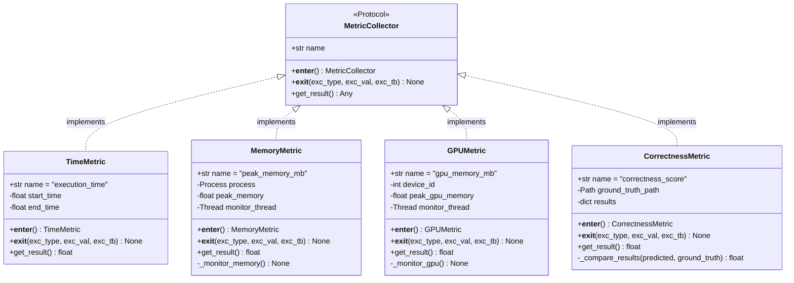
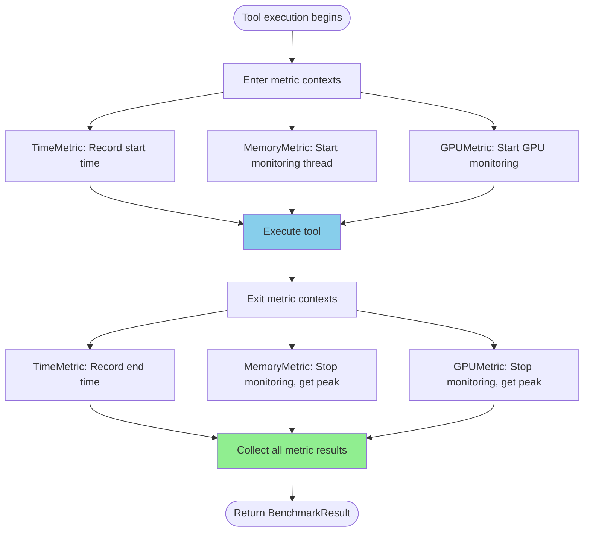

# plan_04_metric_collectors.md
## Component: Metric Collectors

### Objective
Implement metric collectors as **context managers** that automatically collect performance data during tool execution. Orthogonal to tool execution — metrics attach via `with` statements, collect transparently, return results.

---

## UML Class Diagram



---

## Metric Collection Flow



---

## Plan

1. **MetricCollector Protocol**
   - Defines interface all metrics must implement
   - Context manager protocol (`__enter__`, `__exit__`)
   - `get_result()` returns metric value

2. **TimeMetric**
   - Simplest metric: record start/end time
   - Uses `time.perf_counter()` for high precision
   - Returns elapsed time in seconds

3. **MemoryMetric**
   - Monitors peak RAM usage during execution
   - Uses `psutil` to track process memory
   - Background thread samples memory every 100ms
   - Returns peak memory in MB

4. **GPUMetric**
   - Monitors peak GPU memory usage
   - Uses `pynvml` (NVIDIA Management Library)
   - Background thread samples GPU memory every 100ms
   - Returns peak GPU memory in MB
   - Gracefully handles no GPU (returns 0)

5. **CorrectnessMetric**
   - Compares tool output to ground truth
   - Calculates overlap/similarity score
   - Returns correctness score (0.0 to 1.0)

### Findings

**Key Design Decision**: Context managers make metrics **orthogonal** to execution.

Tool adapters don't need to know about metrics. They just do:
```python
with ExitStack() as stack:
    for metric in metrics:
        stack.enter_context(metric)
    
    # Execute tool (metrics collect automatically)
    result = execute_tool()
```

Metrics are **composable** — add new metrics without changing tool code.

---

## Architecture

```
benchmark/metrics/
├── __init__.py
├── protocol.py          # MetricCollector protocol
├── time.py             # TimeMetric
├── memory.py           # MemoryMetric
├── gpu.py              # GPUMetric
└── correctness.py      # CorrectnessMetric
```

---

## Implementation Draft

#### 1. MetricCollector Protocol (metrics/protocol.py)

```python
from typing import Protocol, runtime_checkable, Any

@runtime_checkable
class MetricCollector(Protocol):
    """Protocol for metric collectors."""

    name: str

    def __enter__(self) -> 'MetricCollector':
        """Start metric collection."""
        ...

    def __exit__(self, exc_type, exc_val, exc_tb) -> None:
        """Stop metric collection."""
        ...

    def get_result(self) -> Any:
        """Get collected metric value."""
        ...
```

#### 2. Time Metric (metrics/time.py)

```python
import time

class TimeMetric:
    """Measures execution time."""

    name = "execution_time"

    def __init__(self):
        self.start_time = None
        self.end_time = None

    def __enter__(self) -> 'TimeMetric':
        """Record start time."""
        self.start_time = time.perf_counter()
        return self

    def __exit__(self, exc_type, exc_val, exc_tb) -> None:
        """Record end time."""
        self.end_time = time.perf_counter()

    def get_result(self) -> float:
        """Get elapsed time in seconds."""
        if self.start_time is None or self.end_time is None:
            raise RuntimeError("TimeMetric not properly used as context manager")

        return self.end_time - self.start_time
```

#### 3. Memory Metric (metrics/memory.py)

```python
import psutil
import threading
import time

class MemoryMetric:
    """Monitors peak memory usage during execution."""

    name = "peak_memory_mb"

    def __init__(self, sample_interval: float = 0.1):
        """
        Args:
            sample_interval: How often to sample memory (seconds)
        """
        self.sample_interval = sample_interval
        self.process = psutil.Process()
        self.peak_memory = 0.0
        self._monitoring = False
        self._monitor_thread = None

    def __enter__(self) -> 'MemoryMetric':
        """Start memory monitoring."""
        self.peak_memory = 0.0
        self._monitoring = True

        # Start monitoring thread
        self._monitor_thread = threading.Thread(
            target=self._monitor_memory,
            daemon=True
        )
        self._monitor_thread.start()

        return self

    def __exit__(self, exc_type, exc_val, exc_tb) -> None:
        """Stop memory monitoring."""
        self._monitoring = False

        # Wait for monitoring thread to finish
        if self._monitor_thread:
            self._monitor_thread.join(timeout=1.0)

    def get_result(self) -> float:
        """Get peak memory usage in MB."""
        return self.peak_memory

    def _monitor_memory(self) -> None:
        """Background thread that monitors memory usage."""
        while self._monitoring:
            try:
                # Get current memory usage (RSS = Resident Set Size)
                mem_info = self.process.memory_info()
                current_memory_mb = mem_info.rss / (1024 * 1024)

                # Update peak
                if current_memory_mb > self.peak_memory:
                    self.peak_memory = current_memory_mb

            except (psutil.NoSuchProcess, psutil.AccessDenied):
                break

            time.sleep(self.sample_interval)
```

#### 4. GPU Metric (metrics/gpu.py)

```python
import threading
import time

try:
    import pynvml
    PYNVML_AVAILABLE = True
except ImportError:
    PYNVML_AVAILABLE = False

class GPUMetric:
    """Monitors peak GPU memory usage during execution."""

    name = "gpu_memory_mb"

    def __init__(self, device_id: int = 0, sample_interval: float = 0.1):
        """
        Args:
            device_id: GPU device ID to monitor
            sample_interval: How often to sample GPU memory (seconds)
        """
        self.device_id = device_id
        self.sample_interval = sample_interval
        self.peak_gpu_memory = 0.0
        self._monitoring = False
        self._monitor_thread = None
        self._handle = None

        if not PYNVML_AVAILABLE:
            # Gracefully handle no pynvml
            self._gpu_available = False
        else:
            try:
                pynvml.nvmlInit()
                self._handle = pynvml.nvmlDeviceGetHandleByIndex(device_id)
                self._gpu_available = True
            except pynvml.NVMLError:
                self._gpu_available = False

    def __enter__(self) -> 'GPUMetric':
        """Start GPU monitoring."""
        if not self._gpu_available:
            return self

        self.peak_gpu_memory = 0.0
        self._monitoring = True

        # Start monitoring thread
        self._monitor_thread = threading.Thread(
            target=self._monitor_gpu,
            daemon=True
        )
        self._monitor_thread.start()

        return self

    def __exit__(self, exc_type, exc_val, exc_tb) -> None:
        """Stop GPU monitoring."""
        self._monitoring = False

        # Wait for monitoring thread
        if self._monitor_thread:
            self._monitor_thread.join(timeout=1.0)

    def get_result(self) -> float:
        """Get peak GPU memory usage in MB."""
        return self.peak_gpu_memory

    def _monitor_gpu(self) -> None:
        """Background thread that monitors GPU memory."""
        while self._monitoring:
            try:
                # Get GPU memory info
                mem_info = pynvml.nvmlDeviceGetMemoryInfo(self._handle)
                current_gpu_mb = mem_info.used / (1024 * 1024)

                # Update peak
                if current_gpu_mb > self.peak_gpu_memory:
                    self.peak_gpu_memory = current_gpu_mb

            except pynvml.NVMLError:
                break

            time.sleep(self.sample_interval)

    def __del__(self):
        """Cleanup NVML."""
        if self._gpu_available and PYNVML_AVAILABLE:
            try:
                pynvml.nvmlShutdown()
            except:
                pass
```

#### 5. Correctness Metric (metrics/correctness.py)

```python
from pathlib import Path
import pandas as pd
import numpy as np

class CorrectnessMetric:
    """Compares tool output to ground truth."""

    name = "correctness_score"

    def __init__(self, ground_truth_path: Path):
        """
        Args:
            ground_truth_path: Path to ground truth data
        """
        self.ground_truth_path = ground_truth_path
        self.predicted_results = None

    def __enter__(self) -> 'CorrectnessMetric':
        """Start correctness tracking."""
        return self

    def __exit__(self, exc_type, exc_val, exc_tb) -> None:
        """Correctness is computed after execution."""
        pass

    def set_predicted_results(self, results: dict) -> None:
        """Set predicted results from tool execution."""
        self.predicted_results = results

    def get_result(self) -> float:
        """
        Calculate correctness score.

        Returns:
            Score from 0.0 (completely wrong) to 1.0 (perfect match)
        """
        if self.predicted_results is None:
            return 0.0

        if not self.ground_truth_path.exists():
            # No ground truth available
            return -1.0  # Sentinel value

        # Load ground truth
        ground_truth = self._load_ground_truth()

        # Compare
        return self._compare_results(self.predicted_results, ground_truth)

    def _load_ground_truth(self) -> dict:
        """Load ground truth data."""
        if self.ground_truth_path.suffix == '.csv':
            df = pd.read_csv(self.ground_truth_path)
            return {'measurements': df.to_dict('records')}
        else:
            raise ValueError(
                f"Unsupported ground truth format: {self.ground_truth_path.suffix}"
            )

    def _compare_results(self, predicted: dict, ground_truth: dict) -> float:
        """
        Compare predicted results to ground truth.

        For object detection/segmentation:
        - Compare number of objects
        - Compare object properties (area, intensity, etc.)
        - Return overlap score
        """
        pred_count = predicted.get('num_objects', 0)
        gt_count = ground_truth.get('num_objects', len(ground_truth.get('measurements', [])))

        # Simple metric: ratio of counts
        if gt_count == 0:
            return 1.0 if pred_count == 0 else 0.0

        count_score = min(pred_count, gt_count) / max(pred_count, gt_count)

        # Could add more sophisticated comparison (IoU, etc.)
        # For now, just use count similarity

        return count_score
```

#### 6. Public API (metrics/__init__.py)

```python
"""
Metric collectors for benchmark measurements.

Usage:
    from benchmark.metrics import Time, Memory, GPU, Correctness

    metrics = [Time(), Memory(), GPU()]

    with ExitStack() as stack:
        for metric in metrics:
            stack.enter_context(metric)

        # Execute code (metrics collect automatically)
        result = execute_tool()

    # Get results
    for metric in metrics:
        print(f"{metric.name}: {metric.get_result()}")
"""

from benchmark.metrics.protocol import MetricCollector
from benchmark.metrics.time import TimeMetric as Time
from benchmark.metrics.memory import MemoryMetric as Memory
from benchmark.metrics.gpu import GPUMetric as GPU
from benchmark.metrics.correctness import CorrectnessMetric as Correctness

__all__ = [
    'MetricCollector',
    'Time',
    'Memory',
    'GPU',
    'Correctness',
]
```

---

### Success Criteria

1. **Protocol Compliance**: All metrics implement MetricCollector protocol
2. **Context Manager**: All metrics work as context managers
3. **Orthogonality**: Metrics don't depend on tool implementation
4. **Composability**: Can use any combination of metrics
5. **Fail Gracefully**: GPU metric returns 0 if no GPU available
6. **Accurate**: Time/memory measurements match external tools (within 5%)

### Integration Example

```python
from benchmark import run_benchmark, BBBCDataset, OpenHCSAdapter
from benchmark.metrics import Time, Memory, GPU

results = run_benchmark(
    datasets=[BBBCDataset.BBBC021],
    tools=[OpenHCSAdapter()],
    metrics=[Time(), Memory(), GPU()],  # Compose any metrics
)

# Results automatically include all metric values
print(results.comparison_table)
```

