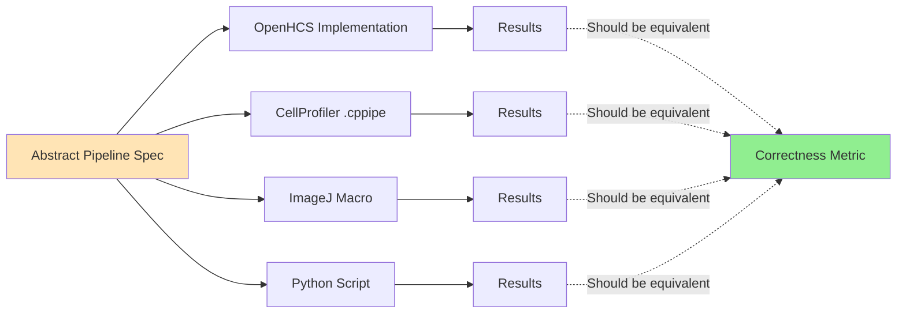

# plan_05_pipeline_equivalence.md
## Component: Pipeline Equivalence System

### Objective
Define **equivalent analysis pipelines** across all tools (OpenHCS, CellProfiler, ImageJ, Python). Same analysis, different implementations. This is critical for fair benchmarking — we're comparing tools, not algorithms.

---

## Pipeline Equivalence Concept



---

## Plan

1. **Abstract Pipeline Specification**
   - Define pipelines as declarative configs
   - Parameters that work across all tools
   - Example: nuclei segmentation, cell painting

2. **OpenHCS Implementation**
   - Native OpenHCS steps
   - Uses pyclesperanto for GPU acceleration
   - Declarative pipeline definition

3. **CellProfiler Translation**
   - Generate .cppipe XML from abstract spec
   - Map operations to CellProfiler modules
   - Ensure parameter equivalence

4. **ImageJ Translation**
   - Generate .ijm macro from abstract spec
   - Map operations to ImageJ commands
   - Ensure parameter equivalence

5. **Python Script Translation**
   - Generate scikit-image script from abstract spec
   - Direct algorithm implementation
   - Baseline for comparison

### Key Pipelines to Implement

1. **Nuclei Segmentation**
   - Gaussian blur → Otsu threshold → Connected components → Measure properties
   - Most common HCS operation
   - Good baseline benchmark

2. **Cell Painting Analysis** (if time permits)
   - Multi-channel processing
   - Feature extraction
   - More complex, shows dimensional reasoning benefits

---

## Architecture

```
benchmark/pipelines/
├── __init__.py
├── registry.py              # Pipeline registry
├── nuclei_segmentation.py   # Nuclei segmentation pipeline
├── cell_painting.py         # Cell painting pipeline (future)
└── utils.py                 # Shared utilities
```

---

## Implementation Draft

#### 1. Pipeline Registry (pipelines/registry.py)

```python
from dataclasses import dataclass
from typing import Any

@dataclass
class PipelineSpec:
    """Abstract pipeline specification."""
    name: str
    description: str
    parameters: dict[str, Any]

    def to_openhcs(self) -> list:
        """Convert to OpenHCS pipeline."""
        from benchmark.pipelines import get_openhcs_pipeline
        return get_openhcs_pipeline(self.name, self.parameters)

    def to_cellprofiler(self) -> str:
        """Convert to CellProfiler XML."""
        from benchmark.adapters.utils import PipelineGenerator
        from benchmark.adapters.pipeline_config import PipelineConfig
        config = PipelineConfig(self.name, self.parameters)
        return PipelineGenerator.generate_cellprofiler(config)

    def to_imagej_macro(self, dataset_path) -> str:
        """Convert to ImageJ macro."""
        from benchmark.adapters.utils import PipelineGenerator
        from benchmark.adapters.pipeline_config import PipelineConfig
        config = PipelineConfig(self.name, self.parameters)
        return PipelineGenerator.generate_imagej_macro(config, dataset_path)

    def to_python_script(self) -> str:
        """Convert to Python script."""
        from benchmark.adapters.utils import PipelineGenerator
        from benchmark.adapters.pipeline_config import PipelineConfig
        config = PipelineConfig(self.name, self.parameters)
        return PipelineGenerator.generate_python_script(config)

class PipelineRegistry:
    """Registry of available pipelines."""

    NUCLEI_SEGMENTATION = PipelineSpec(
        name="nuclei_segmentation",
        description="Segment nuclei using Gaussian blur + Otsu threshold",
        parameters={
            'gaussian_sigma': 2.0,
            'min_object_size': 50,
            'max_object_size': 1000,
        }
    )

    CELL_PAINTING = PipelineSpec(
        name="cell_painting",
        description="Multi-channel Cell Painting analysis",
        parameters={
            'channels': ['DNA', 'ER', 'RNA', 'AGP', 'Mito'],
            'gaussian_sigma': 1.5,
        }
    )

    @classmethod
    def get(cls, name: str) -> PipelineSpec:
        """Get pipeline by name."""
        for attr_name in dir(cls):
            attr = getattr(cls, attr_name)
            if isinstance(attr, PipelineSpec) and attr.name == name:
                return attr

        raise ValueError(f"Pipeline '{name}' not found")

def get_pipeline_config(pipeline_type: str) -> 'PipelineConfig':
    """Get pipeline configuration by type."""
    from benchmark.adapters.pipeline_config import PipelineConfig

    spec = PipelineRegistry.get(pipeline_type)
    return PipelineConfig(
        pipeline_type=spec.name,
        parameters=spec.parameters
    )
```

#### 2. Nuclei Segmentation Pipeline (pipelines/nuclei_segmentation.py)

```python
from pathlib import Path

def get_openhcs_pipeline(parameters: dict) -> list:
    """
    Generate OpenHCS nuclei segmentation pipeline.

    Steps:
    1. Gaussian blur (sigma=2.0)
    2. Otsu threshold
    3. Connected components labeling
    4. Measure region properties
    5. Filter by size
    """
    from openhcs.steps import FunctionStep
    from openhcs.functions import (
        gaussian_filter,
        threshold_otsu,
        label_connected_components,
        measure_region_properties,
        filter_by_size
    )

    sigma = parameters.get('gaussian_sigma', 2.0)
    min_size = parameters.get('min_object_size', 50)
    max_size = parameters.get('max_object_size', 1000)

    return [
        FunctionStep(
            func=gaussian_filter,
            sigma=sigma
        ),
        FunctionStep(
            func=threshold_otsu
        ),
        FunctionStep(
            func=label_connected_components
        ),
        FunctionStep(
            func=measure_region_properties
        ),
        FunctionStep(
            func=filter_by_size,
            min_size=min_size,
            max_size=max_size
        ),
    ]

def get_cellprofiler_pipeline(parameters: dict) -> str:
    """
    Generate CellProfiler nuclei segmentation pipeline.

    Equivalent modules:
    1. Smooth (Gaussian)
    2. Threshold (Otsu)
    3. IdentifyPrimaryObjects
    4. MeasureObjectSizeShape
    5. FilterObjects (by size)
    """
    sigma = parameters.get('gaussian_sigma', 2.0)
    min_size = parameters.get('min_object_size', 50)
    max_size = parameters.get('max_object_size', 1000)

    # This would be full CellProfiler XML
    # Simplified for clarity
    return f"""
CellProfiler Pipeline: http://www.cellprofiler.org
Version:5

Smooth:[module_num:1]
    Gaussian sigma:{sigma}

Threshold:[module_num:2]
    Method:Otsu

IdentifyPrimaryObjects:[module_num:3]
    Diameter:{min_size},{max_size}

MeasureObjectSizeShape:[module_num:4]
"""

def get_imagej_macro(parameters: dict, dataset_path: Path) -> str:
    """
    Generate ImageJ nuclei segmentation macro.

    Equivalent commands:
    1. Gaussian Blur
    2. Auto Threshold (Otsu)
    3. Analyze Particles (with size filter)
    """
    sigma = parameters.get('gaussian_sigma', 2.0)
    min_size = parameters.get('min_object_size', 50)
    max_size = parameters.get('max_object_size', 1000)

    return f"""
// Nuclei Segmentation
setBatchMode(true);

open("{dataset_path}");

// Gaussian blur
run("Gaussian Blur...", "sigma={sigma}");

// Otsu threshold
setAutoThreshold("Otsu dark");
run("Convert to Mask");

// Analyze particles with size filter
run("Analyze Particles...", "size={min_size}-{max_size} show=Outlines display clear");

// Save results
saveAs("Results", "{dataset_path.parent}/results.csv");

setBatchMode(false);
"""

def get_python_script(parameters: dict) -> str:
    """
    Generate Python nuclei segmentation script.

    Uses scikit-image for equivalent operations.
    """
    sigma = parameters.get('gaussian_sigma', 2.0)
    min_size = parameters.get('min_object_size', 50)
    max_size = parameters.get('max_object_size', 1000)

    return f"""
from skimage import io, filters, measure
from skimage.morphology import label, remove_small_objects
import pandas as pd

def segment_nuclei(dataset_path, output_dir):
    # Load image
    img = io.imread(dataset_path)

    # Gaussian blur
    blurred = filters.gaussian(img, sigma={sigma})

    # Otsu threshold
    thresh = filters.threshold_otsu(blurred)
    binary = blurred > thresh

    # Remove small objects
    cleaned = remove_small_objects(binary, min_size={min_size})

    # Label connected components
    labeled = label(cleaned)

    # Measure properties
    props = measure.regionprops(labeled, intensity_image=img)

    # Filter by size
    results = []
    for prop in props:
        if {min_size} <= prop.area <= {max_size}:
            results.append({{
                'area': prop.area,
                'mean_intensity': prop.mean_intensity,
                'centroid_x': prop.centroid[1],
                'centroid_y': prop.centroid[0]
            }})

    # Save results
    df = pd.DataFrame(results)
    df.to_csv(output_dir / 'results.csv', index=False)

    return {{'num_objects': len(results)}}
"""

def get_openhcs_pipeline_wrapper(pipeline_type: str, parameters: dict) -> list:
    """Wrapper to get OpenHCS pipeline by type."""
    if pipeline_type == "nuclei_segmentation":
        return get_openhcs_pipeline(parameters)
    else:
        raise ValueError(f"Unknown pipeline type: {pipeline_type}")
```

#### 3. Public API (pipelines/__init__.py)

```python
"""
Pipeline equivalence system.

Defines abstract pipelines that can be translated to any tool.

Usage:
    from benchmark.pipelines import PipelineRegistry, get_pipeline_config

    # Get pipeline spec
    spec = PipelineRegistry.NUCLEI_SEGMENTATION

    # Convert to different tools
    openhcs_pipeline = spec.to_openhcs()
    cellprofiler_xml = spec.to_cellprofiler()
    imagej_macro = spec.to_imagej_macro(dataset_path)
    python_script = spec.to_python_script()
"""

from benchmark.pipelines.registry import PipelineRegistry, PipelineSpec, get_pipeline_config
from benchmark.pipelines.nuclei_segmentation import get_openhcs_pipeline as get_openhcs_pipeline

__all__ = [
    'PipelineRegistry',
    'PipelineSpec',
    'get_pipeline_config',
    'get_openhcs_pipeline',
]
```

---

### Success Criteria

1. **Equivalence**: All tool implementations produce similar results (verified by CorrectnessMetric)
2. **Parameterization**: Same parameters work across all tools
3. **Declarative**: Pipelines defined once, translated automatically
4. **Extensible**: Adding new pipeline = one new file
5. **Fair Comparison**: Benchmarks compare tools, not algorithms

### Validation Strategy

```python
# Run same pipeline on all tools
results = run_benchmark(
    datasets=[BBBCDataset.BBBC021],
    tools=[
        OpenHCSAdapter(),
        CellProfilerAdapter(),
        ImageJAdapter(),
        PythonScriptAdapter()
    ],
    metrics=[Time(), Correctness(ground_truth_path)]
)

# Verify equivalence
for result in results:
    assert result.metrics['correctness_score'] > 0.95  # 95% agreement
```

This ensures we're comparing **tool performance**, not **algorithm differences**.

