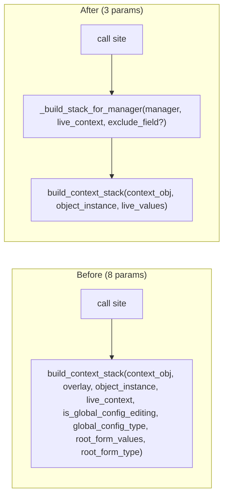

# Plan: Simplify context stack builder call

## Goal
Reduce `build_context_stack` from 8 params to 3 by:
1. Merging live_context + overlay into unified `live_values` dict
2. Inferring `is_global_config_editing` from `isinstance(object_instance, GlobalConfigBase)`
3. Removing UI-specific concepts from the framework layer

## Files to touch
- `openhcs/config_framework/context_manager.py`
- `openhcs/pyqt_gui/widgets/shared/services/parameter_ops_service.py`

## New signature
```python
def build_context_stack(
    context_obj: object | None,    # parent context (e.g., PipelineConfig for Step)
    object_instance: object,       # current object being edited
    live_values: dict[type, dict], # all live values keyed by type
) -> ExitStack:
    """
    Build context stack for placeholder resolution.
    
    Args:
        context_obj: Parent context object, or None for root-level editing
        object_instance: The object being edited (type used to infer global editing mode)
        live_values: Dict mapping types to their current field values
                     (merges cross-window live context + current form overlay)
    """
    from openhcs.config_framework.lazy_factory import GlobalConfigBase
    
    is_global_editing = isinstance(object_instance, GlobalConfigBase)
    global_config_type = type(object_instance) if is_global_editing else None
    # ... rest derives from these 3 inputs
```

## Approach
1) Change `build_context_stack` signature to 3 params (context_obj, object_instance, live_values)
2) Infer `is_global_config_editing` via `isinstance(object_instance, GlobalConfigBase)` - no flag needed
3) Derive `global_config_type` from `type(object_instance)` when in global editing mode - no param needed
4) Caller merges live_context + overlay into `live_values` before calling - single source of truth
5) Add `_build_stack_for_manager` helper in `parameter_ops_service.py` to handle the merge
6) Remove dead code: `use_user_modified_only` parameter (always False, never overridden)

## Helper in parameter_ops_service.py
```python
def _build_stack_for_manager(
    manager: ParameterFormManager,
    live_context: dict[type, dict] | None,
    exclude_field: str | None = None,
) -> ExitStack:
    """
    Build context stack for a manager, merging live_context + current overlay.
    
    Args:
        manager: The form manager
        live_context: Cross-window live values (other forms)
        exclude_field: Field to exclude from overlay (for targeted refresh)
    """
    overlay = _compute_overlay(manager, exclude_field=exclude_field)
    
    # Merge live_context + current overlay into live_values
    live_values = dict(live_context or {})
    mgr_type = type(manager.object_instance)
    live_values[mgr_type] = overlay or {}
    
    return build_context_stack(
        context_obj=manager.context_obj,
        object_instance=manager.object_instance,
        live_values=live_values,
    )
```

## Call sites (after)
```python
# Targeted refresh
stack = _build_stack_for_manager(manager, live_context, exclude_field=field_name)

# Bulk refresh  
stack = _build_stack_for_manager(manager, live_context)
```

## Dead code/params removal
- `use_user_modified_only` in `_compute_overlay`, `refresh_with_live_context`, `refresh_all_placeholders` - always False
- `overlay` param - absorbed into `live_values[type(object_instance)]`
- `root_form_values` / `root_form_type` - absorbed into `live_values[root_type]`
- `is_global_config_editing` - inferred from `isinstance(object_instance, GlobalConfigBase)`
- `global_config_type` - derived from `type(object_instance)` when global editing

## Architectural insight
The current 8-param signature encodes *collection* concerns (where did overlay come from? root form? live context?).
The new 3-param signature expresses *resolution* concerns (what context? what object? what values?).
The caller handles collection; the framework handles resolution. Clean separation.

## In-scope / Out-of-scope
- In scope: refactor signature + add helper; no behavior changes
- Out of scope: altering stack composition or live context collection logic

## Validation
- Type check with pyright/mypy
- Manual test: open config window, verify placeholders still resolve

## Mermaid: Before/After


