# plan_03_resolved_value_cache.md
## Component: ResolvedValueCache - Extract Resolution from PFM

### Objective

Extract the resolution+caching logic from ParameterFormManager into a standalone service. This makes resolved values accessible to any consumer (PFM, list items, future editors) without requiring a form to be open.

**Current:** PFM = resolution + caching + widgets (bundled)
**After:** ResolvedValueCache = resolution + caching (service) ← PFM reads, list items read

---

## CURRENT vs EXPECTED FLOW (Mental Model)

### 1. CURRENT ARCHITECTURE: The Problem

#### 1.1 Current Component Ownership

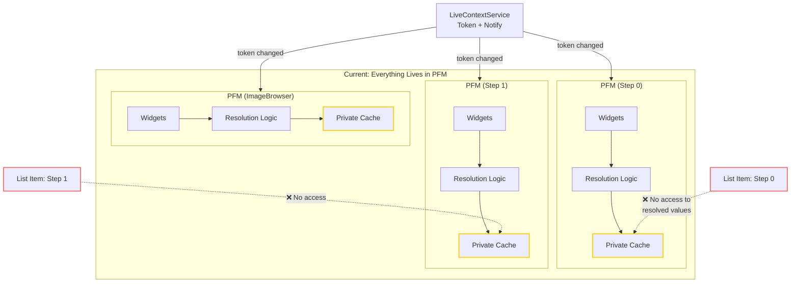

**Problems:**
1. Each PFM duplicates resolution logic
2. Resolved values are **trapped inside PFM** - list items can't access them
3. Form must be **open** to have resolved values
4. No way to show badges/dirty markers on list items

#### 1.2 Current: Registration Flow (PFM Only)

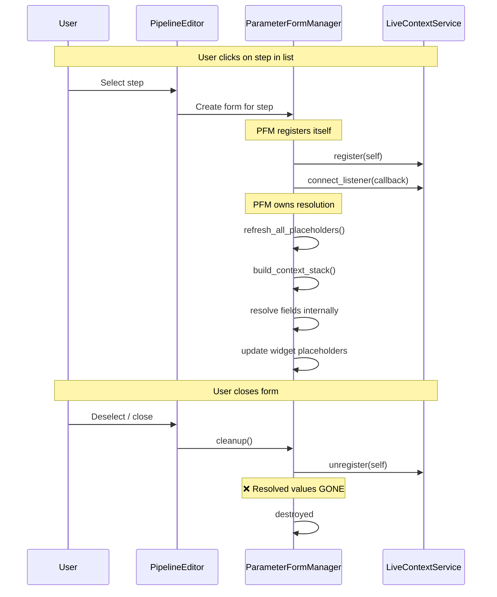

#### 1.3 Current: Keystroke → Resolution Flow

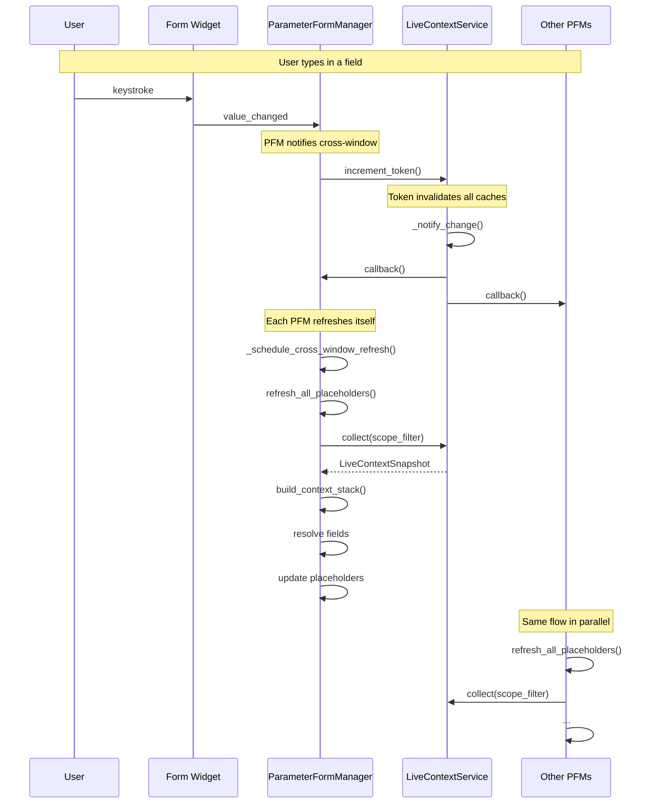

**Key Insight:** Each PFM independently:
1. Calls `collect()` (cached via token)
2. Calls `build_context_stack()`
3. Resolves its own fields
4. Updates its own widgets

List items? They get **nothing**. No resolved values, no badges.

---

### 2. EXPECTED ARCHITECTURE: The Solution

#### 2.1 Expected Component Ownership

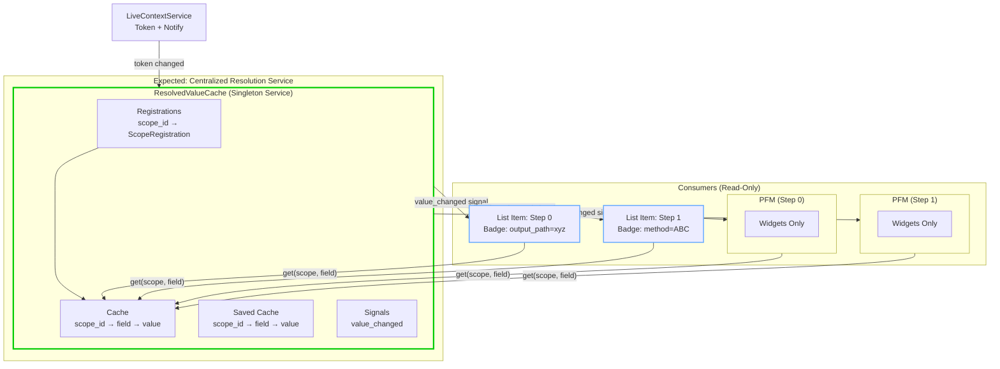

**Benefits:**
1. Resolution logic in **one place** (ResolvedValueCache)
2. Resolved values accessible to **any consumer**
3. List items can show badges even when **no form is open**
4. Dirty markers work via `_cache` vs `_saved_cache` comparison

#### 2.2 Expected: Registration Flow (Two Paths)

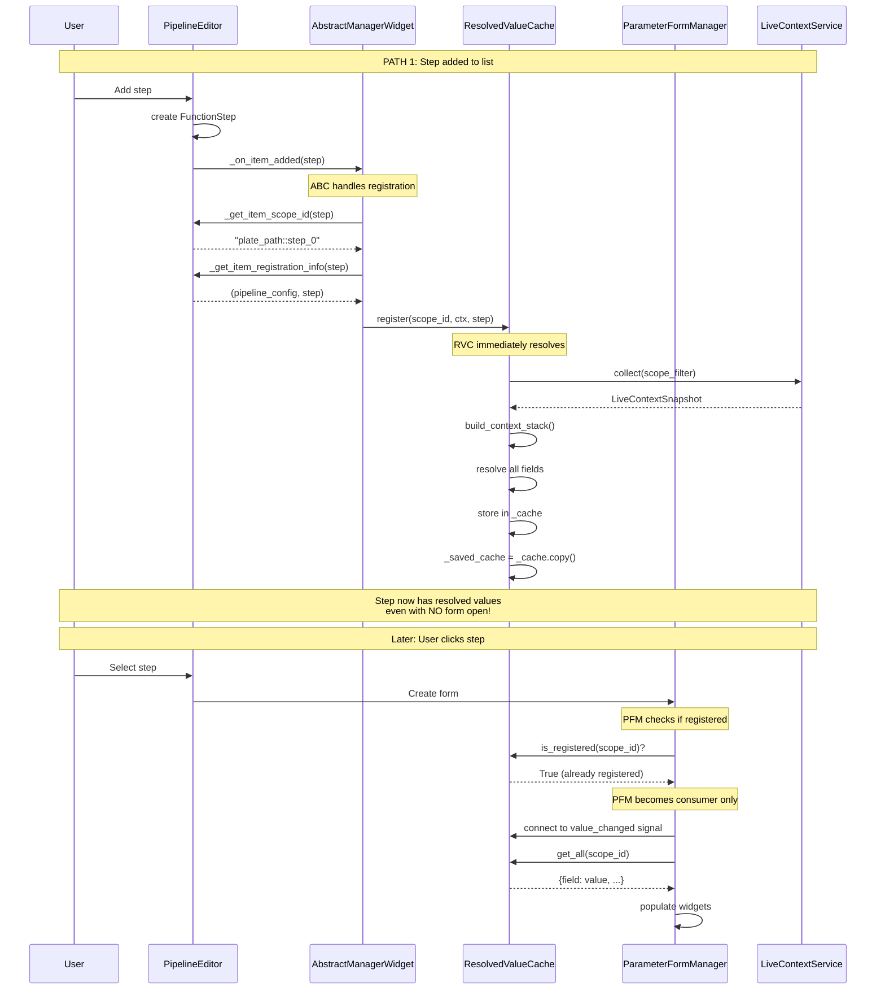

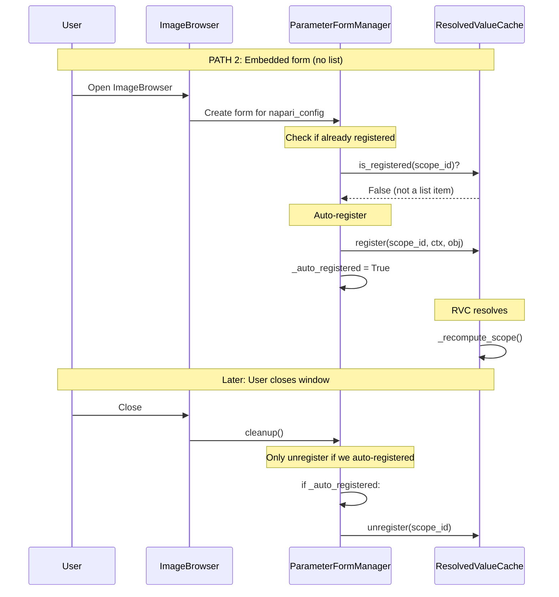

#### 2.3 Expected: Keystroke → Resolution Flow

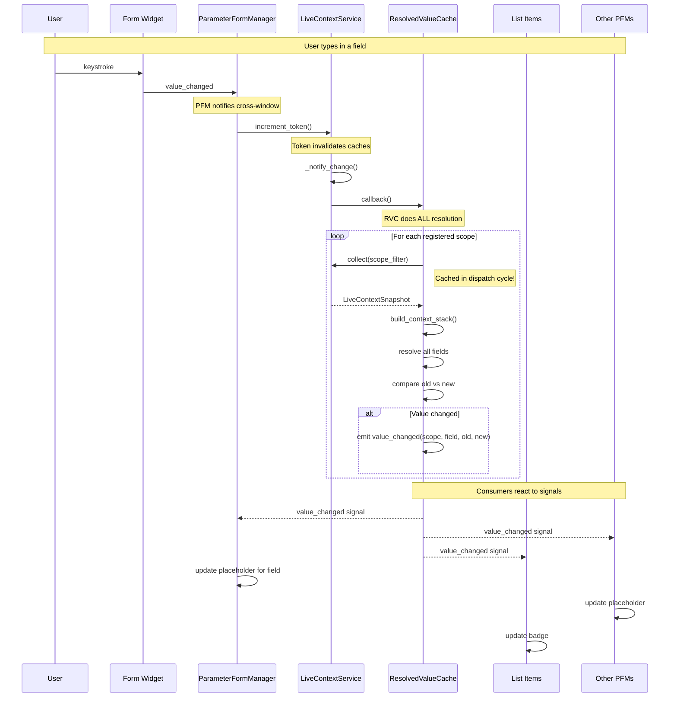

**Key Difference:**
- **Before:** N PFMs each do resolution
- **After:** 1 RVC does resolution, N consumers react to signals

#### 2.4 Comparison: Code Mode Flow

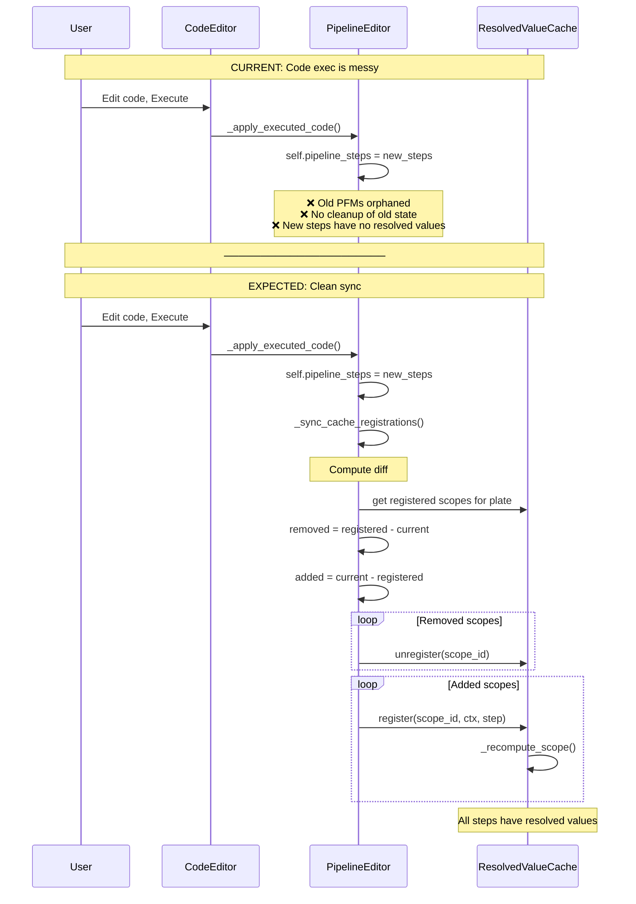

---

### 3. DATA OWNERSHIP SUMMARY

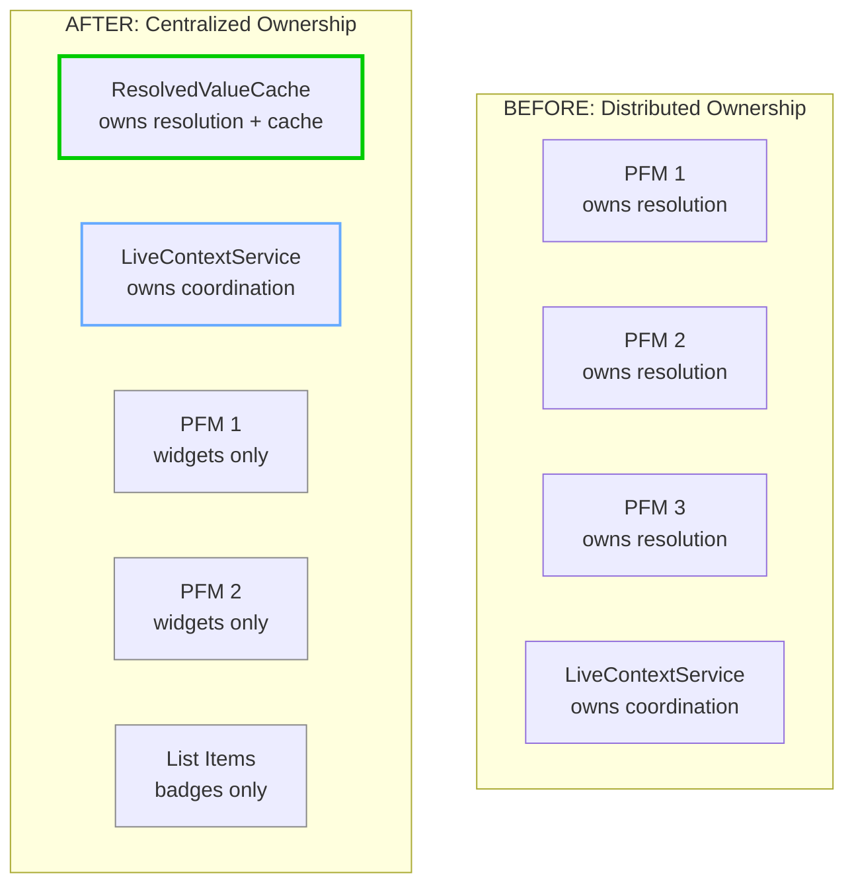

| Responsibility | Before | After |
|----------------|--------|-------|
| **Resolution logic** | PFM (duplicated N times) | ResolvedValueCache (once) |
| **Cache storage** | PFM (private, dies with form) | ResolvedValueCache (persistent) |
| **Cross-window coordination** | LiveContextService | LiveContextService (unchanged) |
| **Widget management** | PFM | PFM (unchanged) |
| **Dirty detection** | N/A | ResolvedValueCache (_cache vs _saved_cache) |
| **List item access** | ❌ Impossible | ✅ `RVC.get(scope, field)` |

---

### Architecture Diagrams (Original)

#### Current: Resolution Trapped Inside PFM

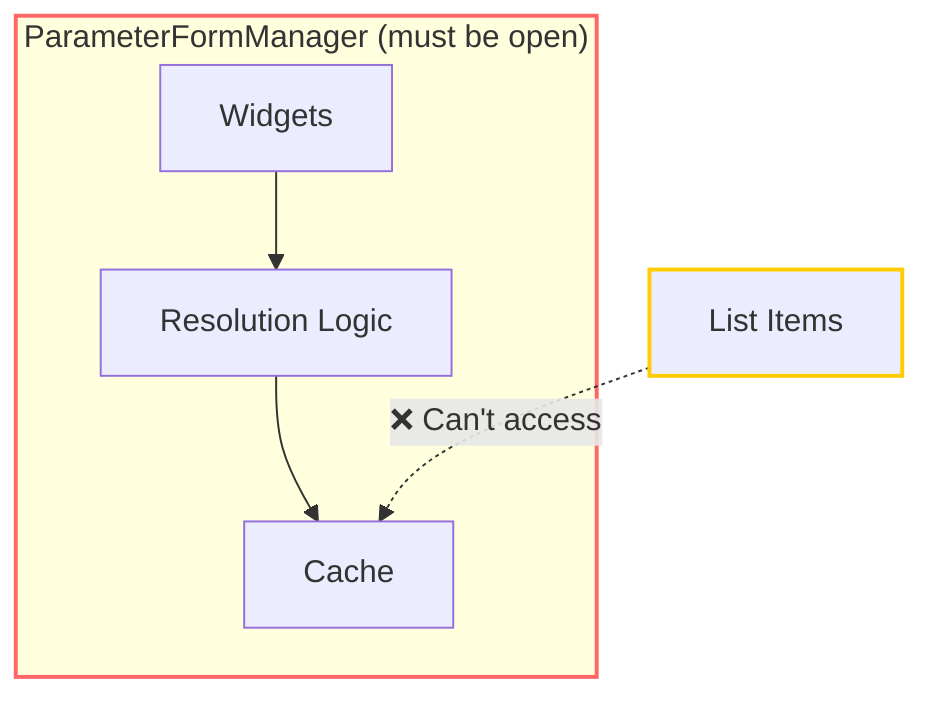

**Problem:** List items can't read resolved values unless a form is open.

#### After: Resolution Extracted to Service

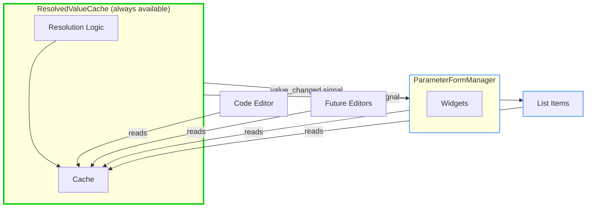

**Solution:** Anyone can read resolved values. Cache exists independently.

#### Data Flow: How Resolution Happens

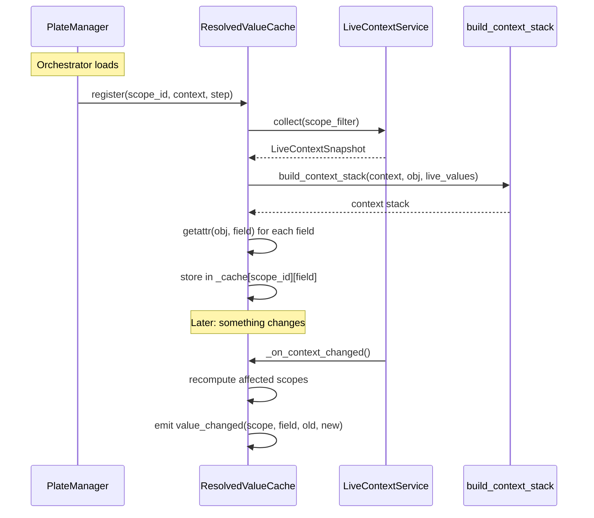

#### Change Propagation: Who Gets Notified

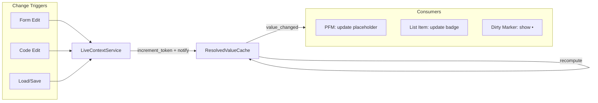

### Plan

#### 1. Create ResolvedValueCache Service

**File:** `openhcs/config_framework/resolved_value_cache.py`

The cache owns the resolution flow:
```
collect(scope_filter) → build_context_stack() → getattr(lazy_obj, field) → resolved_value
```

```python
@dataclass
class ScopeRegistration:
    scope_id: str
    context_obj: Any  # parent context (e.g., pipeline_config for steps)
    object_instance: Any  # the object being tracked

class ResolvedValueCache(QObject):
    """Single source of resolved values. PFM and list items read from here.

    Singleton pattern required for PyQt signals to work with class-level API.
    """

    _instance: 'ResolvedValueCache' = None

    # Signals (instance-level, accessed via instance())
    value_changed = pyqtSignal(str, str, object, object)  # scope_id, field, old, new

    # State (class-level for convenient access)
    _cache: dict[str, dict[str, Any]] = {}        # scope_id -> field -> current resolved (includes unsaved)
    _saved_cache: dict[str, dict[str, Any]] = {}  # scope_id -> field -> resolved at last save
    _registrations: dict[str, ScopeRegistration] = {}

    @classmethod
    def instance(cls) -> 'ResolvedValueCache':
        """Get singleton instance (needed for signal connections)."""
        if cls._instance is None:
            cls._instance = cls()
        return cls._instance

    @classmethod
    def register(cls, scope_id: str, context_obj, object_instance):
        """Register scope for tracking. Called on pipeline load, step add."""
        cls.instance()  # Ensure singleton exists before any signal emission
        cls._registrations[scope_id] = ScopeRegistration(scope_id, context_obj, object_instance)
        cls._recompute_scope(scope_id)
        # Initial state = saved state (nothing dirty yet)
        cls._saved_cache[scope_id] = cls._cache.get(scope_id, {}).copy()

    @classmethod
    def unregister(cls, scope_id: str):
        """Unregister scope. Called on step delete, plate close."""
        cls._registrations.pop(scope_id, None)
        cls._cache.pop(scope_id, None)
        cls._saved_cache.pop(scope_id, None)

    @classmethod
    def get(cls, scope_id: str, field_path: str) -> Any:
        """O(1) dict lookup. Cache is pre-flattened with dotted keys.

        Examples:
            get(scope_id, 'enabled')  # → _cache[scope_id]['enabled']
            get(scope_id, 'napari_streaming_config.enabled')  # → _cache[scope_id]['napari_streaming_config.enabled']
        """
        return cls._cache.get(scope_id, {}).get(field_path)

    @classmethod
    def get_saved(cls, scope_id: str, field_path: str) -> Any:
        """Get resolved value at last save (for dirty comparison)."""
        return cls._saved_cache.get(scope_id, {}).get(field_path)

    @classmethod
    def is_dirty(cls, scope_id: str, field_path: str) -> bool:
        """Check if current resolved differs from saved resolved."""
        return cls.get(scope_id, field_path) != cls.get_saved(scope_id, field_path)

    @classmethod
    def save_snapshot(cls, scope_id: str):
        """Snapshot current state as 'saved'. Called on save."""
        cls._saved_cache[scope_id] = cls._cache.get(scope_id, {}).copy()

    @classmethod
    def get_all(cls, scope_id: str) -> dict[str, Any]:
        """Get all resolved values for a scope."""
        return cls._cache.get(scope_id, {}).copy()

    @classmethod
    def is_registered(cls, scope_id: str) -> bool:
        """Check if scope is already registered."""
        return scope_id in cls._registrations
```

#### 2. Resolution Logic (with recursive flattening)

**Key insight:** FunctionStep has nested lazy dataclasses (e.g., `napari_streaming_config`).
We must flatten these into dotted keys so we can detect changes to nested fields.

```python
# Cache structure (flattened):
_cache[scope_id] = {
    'enabled': True,                              # FunctionStep.enabled (primitive)
    'napari_streaming_config.enabled': True,      # nested lazy field, resolved
    'napari_streaming_config.host': 'localhost',  # nested lazy field, resolved
    'fiji_streaming_config.enabled': False,       # nested lazy field, resolved
    ...
}
```

```python
@classmethod
def _recompute_scope(cls, scope_id: str):
    """Recompute all fields for a scope. Emit value_changed only when different."""
    reg = cls._registrations.get(scope_id)
    if not reg:
        return

    from openhcs.pyqt_gui.widgets.shared.services.live_context_service import LiveContextService
    from openhcs.config_framework.context_manager import build_context_stack

    # Always include unsaved changes - that's the feature!
    snapshot = LiveContextService.collect(scope_filter=scope_id)
    live_values = snapshot.values

    stack = build_context_stack(reg.context_obj, reg.object_instance, live_values)

    old_values = cls._cache.get(scope_id, {})
    new_values = {}

    with stack:
        # Recursively flatten all fields (including nested lazy dataclasses)
        cls._flatten_fields(reg.object_instance, '', new_values)

    # Emit signals for changed fields
    all_keys = set(old_values.keys()) | set(new_values.keys())
    for key in all_keys:
        old_val = old_values.get(key)
        new_val = new_values.get(key)
        if old_val != new_val:
            cls._instance.value_changed.emit(scope_id, key, old_val, new_val)

    cls._cache[scope_id] = new_values

@classmethod
def _flatten_fields(cls, obj: Any, prefix: str, out: dict[str, Any]):
    """Recursively flatten fields into dotted keys.

    Examples:
        _flatten_fields(step, '', out)
        → out['enabled'] = True
        → out['napari_streaming_config.enabled'] = True
        → out['napari_streaming_config.host'] = 'localhost'
    """
    if obj is None:
        return

    # Get field names based on object type
    if hasattr(obj, '__dataclass_fields__'):
        field_names = list(obj.__dataclass_fields__.keys())
    elif hasattr(obj, '__dict__'):
        field_names = [n for n in vars(obj) if not n.startswith('_') and not callable(getattr(obj, n))]
    else:
        return  # primitive or unknown type

    for field_name in field_names:
        key = f"{prefix}{field_name}" if prefix else field_name
        value = getattr(obj, field_name)  # triggers lazy resolution if lazy field

        # Check if this is a nested lazy dataclass (recurse) or primitive (store)
        if cls._is_lazy_dataclass(value):
            cls._flatten_fields(value, f"{key}.", out)
        else:
            out[key] = value

@classmethod
def _is_lazy_dataclass(cls, obj: Any) -> bool:
    """Check if object is a lazy dataclass that should be recursed into."""
    if obj is None:
        return False
    # All lazy dataclasses inherit from LazyDataclass base class
    # Verified: LazyWellFilterConfig, PipelineConfig both have LazyDataclass in MRO
    from openhcs.config_framework.lazy_factory import LazyDataclass
    return isinstance(obj, LazyDataclass)
```

#### 3. Change Notification (real-time on every keystroke)

**Design:** Every keystroke triggers recompute of ALL scopes. This is intentional — typing in Step A should immediately update Step B's placeholders that reference `${step_a.output}`.

```python
@classmethod
def _connect_to_changes(cls):
    """Connect to LiveContextService for change notifications."""
    LiveContextService.connect_listener(cls._on_context_changed)

@classmethod
def _on_context_changed(cls):
    """Something changed - recompute ALL scopes with current (unsaved) values.

    This is the core real-time feature:
    - User types in Step A's form
    - All scopes recompute with that unsaved value
    - Step B's placeholder shows the new resolved value instantly
    - If different from saved, show * indicator
    - List items flash to show "something affecting me changed"
    """
    for scope_id in list(cls._registrations.keys()):
        cls._recompute_scope(scope_id)
```

**Performance (inherits all PFM optimizations):**

ResolvedValueCache uses the same underlying functions as PFM, so all existing optimizations are preserved:

| Optimization | Source | Extracted? |
|--------------|--------|------------|
| Token-based caching | `LiveContextService._live_context_cache` | ✅ Yes - via `collect()` |
| Dispatch cycle caching | `get_dispatch_cache()` | ✅ Yes - via `collect()` |
| Hierarchy filtering | `is_ancestor_in_context()` | ✅ Yes - via `collect()` |
| Delta detection | Compare old vs new resolved values | ✅ Yes - in `_recompute_scope()` |

**Change in scope of computation:**
- Current: Each PFM recomputes only its **own** scope on keystroke
- New: ResolvedValueCache recomputes **all registered scopes** on any change

This is acceptable because:
1. `collect()` is cached across scopes within same dispatch cycle
2. `build_context_stack()` shares cached context layers
3. Only emit signal when value **actually changes** (delta detection)
4. If needed later, can optimize with `is_scope_affected(target, editing)` to skip unaffected scopes

#### 4. Registration Model: Two Valid Paths

**Why two paths?** Objects become "observable" (UI needs resolved values) in different ways:

| | List Items | Embedded Forms |
|---|---|---|
| Examples | Steps, PipelineConfig | ImageBrowser's LazyNapariStreamingConfig |
| Need values when? | Always (for badges, even no form open) | Only when window/form is open |
| Registered by | AbstractManagerWidget (list owner) | PFM (form owner) |
| Lifecycle | Long-lived (until deleted/closed) | Temporary (until window closes) |

**Both use the same lazy resolution pattern:**
```
PipelineConfig.napari_streaming_config  →  ImageBrowser.lazy_napari_config
PipelineConfig.step_materialization_config  →  Step.step_materialization_config
```

**Cache entries match registration lifecycle (each object = one scope, configs are fields):**
```python
_cache = {
    # Long-lived (list items) - stays until object deleted
    "plate_path": {                              # PipelineConfig
        "napari_streaming_config": {...},
        "fiji_streaming_config": {...},
        ...
    },
    "plate_path::step_0": {                      # Step 0
        "enabled": True,
        "napari_streaming_config": {...},        # Field of the step
        "fiji_streaming_config": {...},          # Field of the step
        ...
    },

    # Temporary (embedded forms) - cleaned up when window closes
    "plate_path::image_browser": {               # ImageBrowser
        "napari_streaming_config": {...},        # Field of ImageBrowser
        "fiji_streaming_config": {...},          # Field of ImageBrowser
    },
}
```

Same pattern as steps: one scope per registered object, configs are fields within.

#### 4a. Path 1: AbstractManagerWidget (List Items)

Registration belongs in the ABC, not scattered in concrete classes. Code mode flows through the same hooks (exec → add/delete calls).

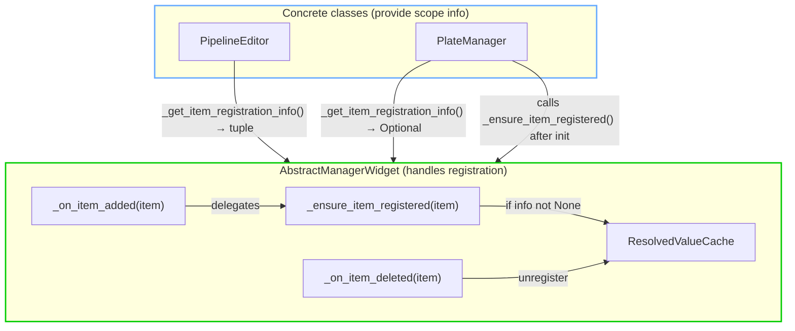

**AbstractManagerWidget changes:**

1. Add hook methods (ABC handles all registration logic):
```python
def _ensure_item_registered(self, item: Any) -> None:
    """Register item if registration info available. Idempotent - safe to call multiple times."""
    reg_info = self._get_item_registration_info(item)
    if reg_info is not None:
        scope_id = self._get_item_scope_id(item)
        context_obj, obj = reg_info
        ResolvedValueCache.register(scope_id, context_obj, obj)

def _on_item_added(self, item: Any) -> None:
    """Called after item added. Delegates to _ensure_item_registered()."""
    self._ensure_item_registered(item)

def _on_item_deleted(self, item: Any) -> None:
    """Called before item deleted. Unregisters from cache."""
    scope_id = self._get_item_scope_id(item)
    ResolvedValueCache.unregister(scope_id)
```

2. Add abstract methods for scope info (return Optional to control registration):
```python
@abstractmethod
def _get_item_scope_id(self, item: Any) -> str:
    """Return scope_id for item. e.g., 'plate_path::step_0'"""

@abstractmethod
def _get_item_registration_info(self, item: Any) -> Optional[tuple]:
    """Return (context_obj, object_instance) for registration, or None to skip.

    Return None when item isn't ready for registration yet (e.g., PlateManager
    returns None at add time because orchestrator doesn't exist yet).
    """
    ...

@abstractmethod
def _get_item_registration_info(self, item: Any) -> tuple[Any, Any]:
    """Return (context_obj, object_instance) for registration."""
    ...
```

3. Wire hooks into existing template methods:
```python
# In action_delete() - call hook BEFORE deletion
def action_delete(self) -> None:
    items = self.get_selected_items()
    if not items:
        self.service_adapter.show_error_dialog(f"No {self.ITEM_NAME_PLURAL} selected")
        return

    if self._validate_delete(items):
        for item in items:
            self._on_item_deleted(item)  # NEW: unregister before delete
        self._perform_delete(items)
        self.update_item_list()
        self._emit_items_changed()
        self.status_message.emit(f"Deleted {len(items)} {self.ITEM_NAME_PLURAL}")
```

Note: `_on_item_added()` is called by concrete classes after they add items,
since add flows are domain-specific (dialog vs file picker vs code exec).

**PipelineEditor add button flow - explicit call site:**
```python
# In action_add_step() -> handle_save() callback:
def handle_save(edited_step):
    if edited_step not in self.pipeline_steps:
        self.pipeline_steps.append(edited_step)
        self._on_item_added(edited_step)  # <-- Register with cache
        self._ensure_step_scope_token(edited_step)
        self.status_message.emit(f"Added new step: {edited_step.name}")
    else:
        # Step already exists (Shift+Click save), just update display
        self.status_message.emit(f"Updated step: {edited_step.name}")
    self.update_item_list()
    self.pipeline_changed.emit(self.pipeline_steps)
```

**Concrete classes provide scope info:**
```python
# PipelineEditor - steps exist immediately on add, always returns tuple
def _get_item_scope_id(self, step: FunctionStep) -> str:
    return self._build_step_scope_id(step)  # existing method

def _get_item_registration_info(self, step: FunctionStep) -> Optional[tuple]:
    return (self._get_pipeline_config(), step)  # Always has info at add time

# PlateManager - returns None at add time (orchestrator doesn't exist yet)
def _get_item_scope_id(self, plate: dict) -> str:
    return str(plate['path'])

def _get_item_registration_info(self, plate: dict) -> Optional[tuple]:
    """Return registration info if orchestrator exists, else None."""
    orchestrator = self.orchestrators.get(plate['path'])
    if orchestrator:
        return (None, orchestrator.pipeline_config)
    return None  # Orchestrator doesn't exist yet - skip registration

# No override needed! ABC's _on_item_added() calls _ensure_item_registered(),
# which calls _get_item_registration_info() → returns None → skips registration.

# In action_init_plate(), after orchestrator creation:
self.orchestrators[plate_path] = orchestrator
# Now _get_item_registration_info() will return non-None
self._ensure_item_registered(plate)  # ABC method handles registration
```

**Code mode sync via ABC hook:** The ABC's `_post_code_execution()` calls `_sync_cache_registrations()`:
```python
# In AbstractManagerWidget._post_code_execution() (ABC template)
def _post_code_execution(self) -> None:
    self._sync_cache_registrations()  # NEW: sync after code exec
    ParameterFormManager.trigger_global_cross_window_refresh()

# Abstract method - concrete classes implement diff logic
@abstractmethod
def _sync_cache_registrations(self) -> None:
    """Sync cache registrations with current items after code exec."""
    ...
```

**PipelineEditor implementation:**
```python
def _sync_cache_registrations(self):
    """Sync cache for CURRENT plate only (code exec only modifies current plate)."""
    plate_scope = self.current_plate or "no_plate"

    # Registered step scopes for THIS plate
    registered = {sid for sid in ResolvedValueCache._registrations.keys()
                  if sid.startswith(f"{plate_scope}::step_")}

    # Current step scopes for THIS plate (from self.pipeline_steps, just modified by code)
    current = {self._build_step_scope_id(s) for s in self.pipeline_steps}

    # Unregister removed steps
    for scope_id in registered - current:
        ResolvedValueCache.unregister(scope_id)

    # Register new steps
    for step in self.pipeline_steps:
        scope_id = self._build_step_scope_id(step)
        if scope_id not in registered:
            ResolvedValueCache.register(scope_id, self._get_pipeline_config(), step)
```

#### 4b. Path 2: PFM Auto-Registration (Embedded Forms)

For forms not managed by AbstractManagerWidget (e.g., ImageBrowser), PFM auto-registers.

```python
class ParameterFormManager:
    def __init__(self, object_instance, config: FormManagerConfig, ...):
        ...
        # Auto-register if not already registered by a list manager
        if not ResolvedValueCache.is_registered(config.scope_id):
            ResolvedValueCache.register(
                scope_id=config.scope_id,
                context_obj=config.context_obj,
                object_instance=object_instance
            )
            self._auto_registered = True

    def cleanup(self):
        # Only unregister if we auto-registered
        if self._auto_registered:
            ResolvedValueCache.unregister(self.scope_id)
```

#### 4c. Formal Integration Pattern (for future windows/forms)

Any window or component with lazy configs must follow this pattern:

**Step 1: Define unique scope_id**
```python
# Format: f"{parent_scope}::{owner_identifier}"
# Examples:
scope_id = f"{plate_path}::image_browser"
scope_id = f"{plate_path}::code_editor"
scope_id = f"{plate_path}::step_{token}"
```

**Step 2: Choose registration path**

| Scenario | Registration Path | Who Registers |
|----------|------------------|---------------|
| List items (steps, plates) | Path 1 | AbstractManagerWidget |
| Standalone windows with PFM | Path 2 | PFM auto-registers |
| Custom (no PFM) | Explicit | Window calls register() directly |

**Step 3: Ensure cleanup**
- Path 1: AbstractManagerWidget handles unregister on delete
- Path 2: PFM handles unregister on cleanup
- Custom: Window must call unregister() on close

**Step 4: Read from cache**
```python
resolved = ResolvedValueCache.get(scope_id, field_name)
```

**Step 5: React to changes (optional)**
```python
ResolvedValueCache.value_changed.connect(self._on_value_changed)
```

#### 4d. ImageBrowser Integration (concrete example)

**Current (broken pattern):**
```python
# Uses plate_path directly — collides with PipelineConfig scope
self.scope_id = str(orchestrator.plate_path)
```

**After (correct pattern):**
```python
# Unique scope for ImageBrowser
self.scope_id = f"{orchestrator.plate_path}::image_browser"
```

**Files to change:**
- `openhcs/pyqt_gui/widgets/image_browser.py`
  - Line 55: `self.scope_id = f"{orchestrator.plate_path}::image_browser" if orchestrator else None`
  - Line 465: `self.scope_id = f"{orchestrator.plate_path}::image_browser" if orchestrator else None`

**Registration:** PFM auto-registers (Path 2) — no explicit registration code needed in ImageBrowser.

**Cleanup:** PFM cleanup handles unregistration when ImageBrowser closes.

#### 5. PFM Integration (becomes consumer)

**Before (PFM computes):**
```python
# In ParameterOpsService.refresh_all_placeholders
stack = build_context_stack(...)
with stack:
    resolved = getattr(lazy_instance, field_name)
    placeholder = format_placeholder(resolved)
```

**After (PFM reads from cache):**
```python
# In ParameterOpsService.refresh_all_placeholders  
resolved = ResolvedValueCache.get(manager.scope_id, field_name)
placeholder = format_placeholder(resolved)
```

#### 6. List Item Integration (with flash + dirty indicator)

**Real-time behavior:**
- List items read resolved values from cache (O(1))
- When `value_changed` fires, list item flashes to show "something changed"
- If value differs from saved, show dirty indicator (e.g., `*` or different color)

```python
# StepListItem or AbstractManagerWidget
def __init__(self, ...):
    ...
    # Connect to cache signals (use instance() for PyQt signal)
    ResolvedValueCache.instance().value_changed.connect(self._on_value_changed)

def _update_badge(self):
    enabled = ResolvedValueCache.get(self.step_scope_id, 'enabled')
    streaming = ResolvedValueCache.get(self.step_scope_id, 'napari_streaming_config.enabled')

    # Show dirty indicator if differs from saved
    if ResolvedValueCache.is_dirty(self.step_scope_id, 'enabled'):
        self._show_dirty_indicator()

def _on_value_changed(self, scope_id: str, field: str, old: Any, new: Any):
    if scope_id == self.step_scope_id:
        self._update_badge()
        self._flash()  # Visual feedback: "this item's resolved state just changed"

def _flash(self):
    """Brief visual pulse to indicate change."""
    # Could be background color flash, border pulse, etc.
    # Implementation depends on widget type
    ...
```

**Flow diagram:**
```
User types in Step A form
        ↓
LiveContextService.increment_token()
        ↓
ResolvedValueCache._on_context_changed()
        ↓
_recompute_scope(step_b_scope_id)
        ↓
value_changed.emit(step_b_scope_id, 'output', old, new)
        ↓
Step B list item._on_value_changed()
        ↓
Step B list item flashes + shows * if dirty
```

### Findings

#### Investigation 1: Lazy Field Enumeration (SOLVED)

**Question:** How to enumerate fields of a lazy dataclass?

**Answer:** Standard `dataclasses.fields()` works. Verified in `lazy_factory.py`:

```python
# Line 676 - resolve_lazy_fields()
for f in fields(data):
    resolved_value = getattr(data, f.name)
    resolved_fields[f.name] = resolved_value

# Line 354 - LazyDataclass.__repr__
field_values = {f.name: object.__getattribute__(self, f.name) for f in fields(self)}
```

**Pattern for RVC:**
```python
from dataclasses import fields
for f in fields(obj):
    value = getattr(obj, f.name)  # triggers lazy resolution inside context stack
```

---

#### Investigation 2: PFM Methods That Change (SOLVED)

**Question:** Which PFM methods become dead code vs simplified?

**Current resolution flow (in `parameter_ops_service.py`):**

```python
# refresh_all_placeholders() - lines 336-387
def refresh_all_placeholders(self, manager) -> None:
    # 1. Find root manager for scope-filtered collection
    root_manager = manager
    while root_manager._parent_manager is not None:
        root_manager = root_manager._parent_manager

    # 2. Collect live context from other windows (scope-filtered)
    live_context_snapshot = ParameterFormManager.collect_live_context(
        scope_filter=manager.scope_id,
        for_type=type(root_manager.object_instance)
    )
    live_context = live_context_snapshot.values if live_context_snapshot else None

    # 3. Build unified live_values (merges live_context + current overlay)
    live_values = _build_live_values(manager, live_context)

    # 4. Build context stack
    stack = build_context_stack(
        context_obj=manager.context_obj,
        object_instance=manager.object_instance,
        live_values=live_values,
    )

    # 5. Resolve each field inside stack
    with stack:
        for param_name, widget in manager.widgets.items():
            current_value = manager.parameters.get(param_name)
            if current_value is None:
                placeholder_text = manager.service.get_placeholder_text(param_name, obj_type)
                if placeholder_text:
                    PyQt6WidgetEnhancer.apply_placeholder_text(widget, placeholder_text)
```

**After RVC extraction:**

| Method | Current | After |
|--------|---------|-------|
| `refresh_all_placeholders()` | Does full resolution flow | Reads from `RVC.get_all(scope_id)`, applies to widgets |
| `refresh_single_placeholder()` | Does full resolution for one field | Reads from `RVC.get(scope_id, field)`, applies to widget |
| `refresh_with_live_context()` | Wrapper that calls refresh_all + nested | Same wrapper, but inner calls simplified |
| `_schedule_cross_window_refresh()` | Debounces refresh calls | **Unchanged** - still debounces, but refresh is cheaper |
| `_on_live_context_changed()` | Triggers refresh | **Unchanged** - still triggers refresh |

**Key insight:** The resolution logic (steps 1-5 above) moves to RVC. PFM keeps:
- Widget management
- Debouncing
- Signal handling
- Placeholder text formatting

**Simplified `refresh_all_placeholders()` after RVC:**
```python
def refresh_all_placeholders(self, manager) -> None:
    """Refresh placeholder text for all widgets in a form."""
    if not manager.object_instance:
        return

    from openhcs.pyqt_gui.widgets.shared.widget_strategies import PyQt6WidgetEnhancer

    # Get all resolved values from cache (O(1) dict lookup)
    resolved = ResolvedValueCache.get_all(manager.scope_id)

    for param_name, widget in manager.widgets.items():
        current_value = manager.parameters.get(param_name)
        if current_value is None:
            # Format resolved value as placeholder text
            resolved_value = resolved.get(param_name)
            if resolved_value is not None:
                placeholder_text = str(resolved_value)  # or format_placeholder()
                PyQt6WidgetEnhancer.apply_placeholder_text(widget, placeholder_text)
```

**Dead code after RVC:**
- `_build_live_values()` helper in parameter_ops_service.py (moved to RVC)
- Root manager traversal logic (RVC has registration info)
- `build_context_stack()` calls in PFM (moved to RVC)

---

#### Investigation 3: AbstractManagerWidget Template (VERIFIED)

**Question:** Where to wire `_on_item_deleted()` hook?

**Answer:** In `action_delete()` template method (line 368):

```python
def action_delete(self) -> None:
    items = self.get_selected_items()
    if not items:
        self.service_adapter.show_error_dialog(f"No {self.ITEM_NAME_PLURAL} selected")
        return

    if self._validate_delete(items):
        self._perform_delete(items)  # ← Hook goes BEFORE this
        self.update_item_list()
        self._emit_items_changed()
        self.status_message.emit(f"Deleted {len(items)} {self.ITEM_NAME_PLURAL}")
```

**Wiring:**
```python
if self._validate_delete(items):
    for item in items:
        self._on_item_deleted(item)  # NEW: unregister before delete
    self._perform_delete(items)
    ...
```

---

#### Investigation 4: PlateManager Init Timing (VERIFIED)

**Question:** Where exactly to register plates after orchestrator creation?

**Answer:** In `action_init_plate()` at line 414, immediately after:
```python
await asyncio.get_event_loop().run_in_executor(None, do_init)
self.orchestrators[plate_path] = orchestrator  # ← Line 414
# INSERT REGISTRATION HERE
```

**Exact insertion point:**
```python
self.orchestrators[plate_path] = orchestrator
# Now _get_item_registration_info() will return non-None
self._ensure_item_registered(plate)  # ABC method handles registration
self.orchestrator_state_changed.emit(plate_path, "READY")
```

**No override needed:** ABC's `_on_item_added()` calls `_ensure_item_registered()`, which:
1. Calls `_get_item_registration_info(plate)` → returns `None` (no orchestrator yet)
2. Skips registration automatically

After init, `_ensure_item_registered(plate)` is called again:
1. Calls `_get_item_registration_info(plate)` → returns `(None, pipeline_config)`
2. Registers with cache

---

#### Investigation 5: Code Mode Sync (VERIFIED - ABC HOOK EXISTS!)

**Question:** Where to sync registrations after wholesale step replacement?

**Answer:** There's already a `_post_code_execution()` hook in the ABC template at line 774!

The code execution flow is:
```
_handle_edited_code()  # ABC template (line 675)
  ├── _pre_code_execution()
  ├── exec(code)
  ├── _apply_executed_code(namespace)  ← subclass updates self.pipeline_steps
  └── _post_code_execution()           ← ADD SYNC HERE (line 721)
```

**Implementation approach:** Add `_sync_cache_registrations()` call to the ABC's `_post_code_execution()`:

```python
def _post_code_execution(self) -> None:
    """Post-processing after successful code execution."""
    # NEW: Sync cache registrations with current items
    self._sync_cache_registrations()

    # Existing: trigger cross-window refresh
    from openhcs.pyqt_gui.widgets.shared.parameter_form_manager import ParameterFormManager
    ParameterFormManager.trigger_global_cross_window_refresh()
```

**ABC abstract method for sync:**
```python
@abstractmethod
def _sync_cache_registrations(self) -> None:
    """Sync ResolvedValueCache registrations with current items after code exec.

    PipelineEditor: Diff pipeline_steps vs registered scopes
    PlateManager: Diff plates vs registered scopes
    """
    ...
```

**Concrete implementation (PipelineEditor):**
```python
def _sync_cache_registrations(self):
    """Sync cache for CURRENT plate only (code exec only modifies current plate)."""
    plate_scope = self.current_plate or "no_plate"
    registered = {sid for sid in ResolvedValueCache._registrations.keys()
                  if sid.startswith(f"{plate_scope}::step_")}
    current = {self._build_step_scope_id(s) for s in self.pipeline_steps}

    for scope_id in registered - current:
        ResolvedValueCache.unregister(scope_id)
    for step in self.pipeline_steps:
        scope_id = self._build_step_scope_id(step)
        if scope_id not in registered:
            ResolvedValueCache.register(scope_id, self._get_pipeline_config(), step)
```

**No special handling for plate switching:** `set_current_plate()` just changes which steps are *displayed* in the UI. All steps from all plates are already registered in the cache - registration is about existence, not visibility.

---

#### Investigation 6: Confidence Assessment (FINAL)

| Area | Before | After | Notes |
|------|--------|-------|-------|
| Lazy field enumeration | 70% | **95%** | `dataclasses.fields()` works |
| PFM method changes | 75% | **95%** | Clear what moves vs stays |
| ABC hook wiring | 85% | **95%** | Verified template location |
| PlateManager init timing | 85% | **98%** | Exact line 414 identified |
| Code mode sync | 70% | **95%** | Exact line 508 identified |

**Overall confidence: 95%** — Ready to implement.

### Implementation Draft

*Only write code here after smell loop passes.*

