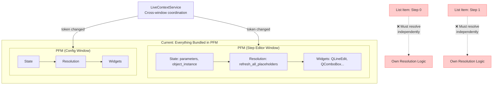
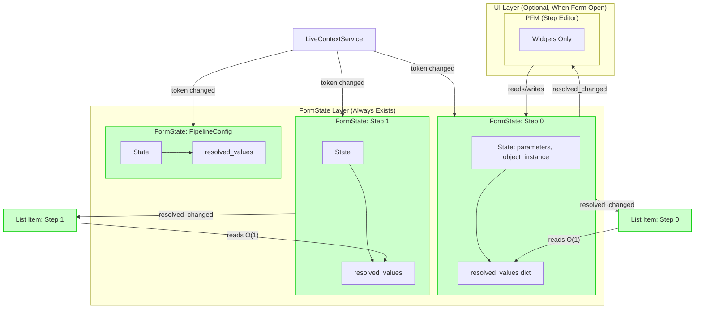
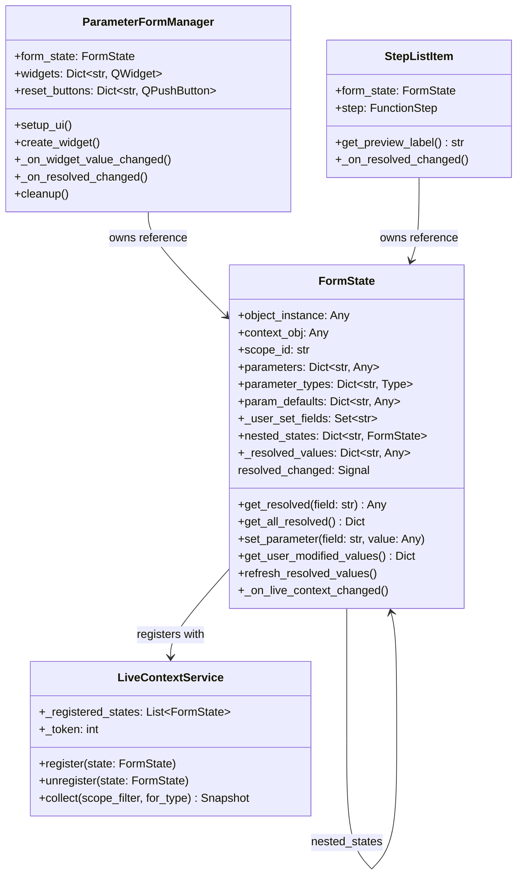
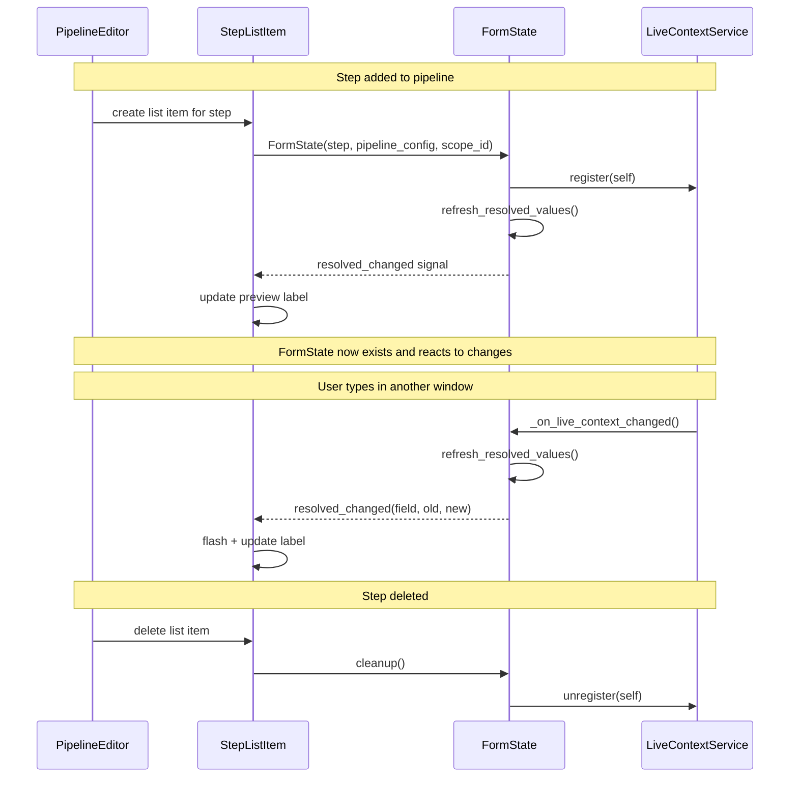
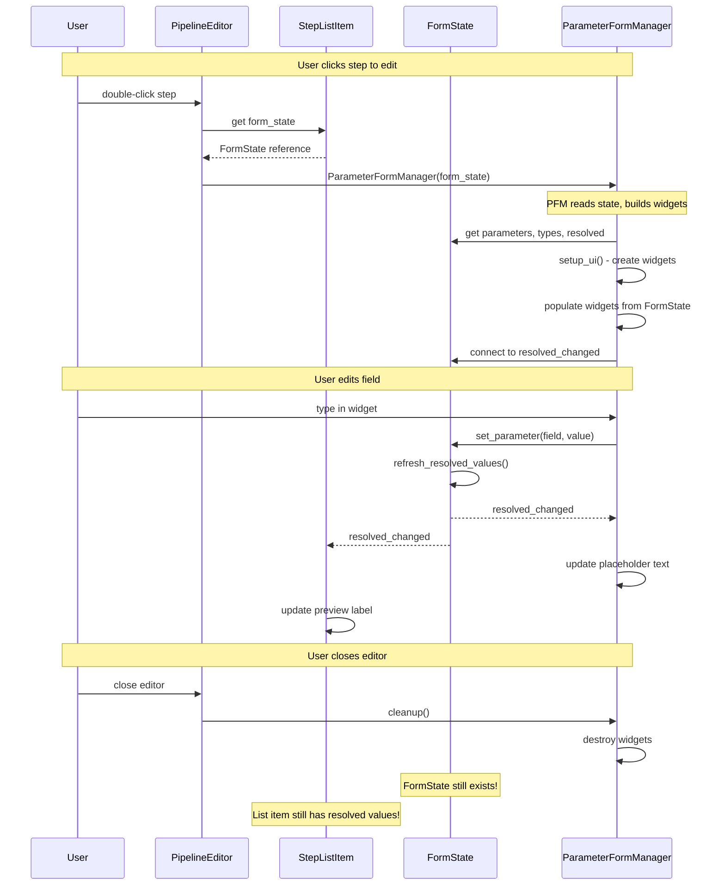
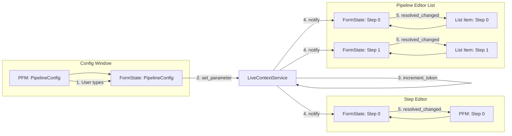
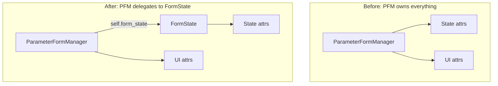
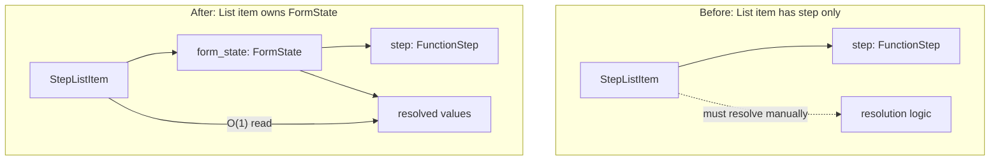
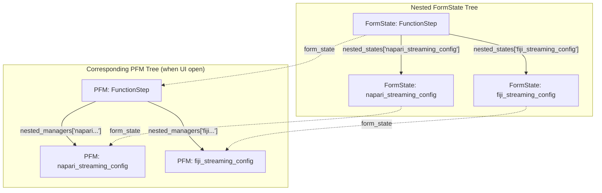

# Plan 04: Virtual FormState - Headless PFM Core

## Overview

Extract the "brain" of ParameterFormManager into a standalone `FormState` class that:
- Holds all state and resolution logic
- Always exists (doesn't require UI)
- Is the single source of truth for resolved values
- PFM becomes a thin UI shell that reads/writes FormState

**Key Insight:** Don't extract resolution into a separate service (plan_03). Instead, make PFM run headless so the brain stays where it is.

---

## Current vs Proposed Architecture

### Current: Everything Bundled in PFM



**Problems:**
1. Resolution logic trapped inside PFM (requires widgets to exist)
2. List items must duplicate resolution logic for preview labels
3. No single source of truth for resolved values
4. PFM dies when window closes → resolved values gone

### Proposed: FormState (Headless) + PFM (UI Shell)



**Benefits:**
1. FormState always exists → resolved values always available
2. List items just read `form_state.get_resolved('field')` - O(1)
3. Single source of truth - no duplicate resolution logic
4. All existing PFM optimizations preserved (same code, just reorganized)

---

## Class Diagram



---

## Lifecycle Diagrams

### FormState Lifecycle (Long-lived)



### PFM Lifecycle (Short-lived, UI only)



---

## Data Flow: Cross-Window Update



---

## What Moves Where

### FROM PFM → TO FormState (the brain)

| Attribute/Method | Purpose |
|-----------------|---------|
| `object_instance` | The config/step being edited |
| `context_obj` | Parent context for inheritance |
| `scope_id` | Cross-window filtering |
| `parameters` | Current field values |
| `parameter_types` | Type info per field |
| `param_defaults` | Signature defaults for reset |
| `_user_set_fields` | Which fields user explicitly changed |
| `nested_managers` → `nested_states` | Child FormStates for nested dataclasses |
| `get_current_values()` | Get all parameter values |
| `get_user_modified_values()` | Get only user-set values for live context |
| `refresh_all_placeholders()` | Resolution logic (stores in `_resolved_values`) |
| `_on_live_context_changed()` | React to cross-window changes |
| LiveContextService registration | Cross-window coordination |

### STAYS IN PFM (UI shell)

| Attribute/Method | Purpose |
|-----------------|---------|
| `QWidget` inheritance | Qt widget tree |
| `widgets` dict | Actual PyQt widgets |
| `reset_buttons` | UI reset buttons |
| `setup_ui()` | Build widget tree |
| `create_widget()` | Widget factory |
| `_layout_service` | UI layout |
| `_widget_service` | Widget value get/set |
| `_on_widget_value_changed()` | UI → FormState sync |
| `cleanup()` | Destroy UI only |

---

## Implementation Plan

### Phase 1: Create FormState Class

**File:** `openhcs/pyqt_gui/widgets/shared/form_state.py`

```python
@dataclass
class FormStateConfig:
    """Configuration for FormState initialization."""
    context_obj: Any = None
    scope_id: str | None = None
    exclude_params: list[str] | None = None
    initial_values: dict[str, Any] | None = None
    parent_state: 'FormState | None' = None


class FormState(QObject):
    """
    Headless form state - the 'brain' of ParameterFormManager.

    Holds all state and resolution logic. Can exist without UI.
    PFM and list items read from this.
    """

    # Signal: (field_name, old_value, new_value)
    resolved_changed = pyqtSignal(str, object, object)
    # Signal: for bulk changes
    all_resolved_changed = pyqtSignal()

    def __init__(self, object_instance: Any, field_id: str,
                 config: FormStateConfig | None = None):
        super().__init__()
        config = config or FormStateConfig()

        # === STATE (moved from PFM) ===
        self.object_instance = object_instance
        self.field_id = field_id
        self.context_obj = config.context_obj
        self.scope_id = config.scope_id
        self._parent_state = config.parent_state

        # Extract parameters (reuse PFM's extraction)
        extracted = ParameterExtractionService.build(
            object_instance, config.exclude_params, config.initial_values
        )
        self.parameters = extracted.default_value  # current values
        self.parameter_types = extracted.param_type
        # ... etc

        # Resolved values cache
        self._resolved_values: dict[str, Any] = {}

        # Nested states for nested dataclasses
        self.nested_states: dict[str, FormState] = {}

        # Register with LiveContextService (root states only)
        if self._parent_state is None:
            LiveContextService.register(self)
            LiveContextService.connect_listener(self._on_live_context_changed)

        # Initial resolution
        self.refresh_resolved_values()

    def get_resolved(self, field: str) -> Any:
        """O(1) lookup of resolved value."""
        return self._resolved_values.get(field)

    def get_all_resolved(self) -> dict[str, Any]:
        """Get all resolved values."""
        return self._resolved_values.copy()

    def set_parameter(self, field: str, value: Any):
        """Set parameter value and trigger re-resolution."""
        old = self.parameters.get(field)
        if old != value:
            self.parameters[field] = value
            self._user_set_fields.add(field)
            LiveContextService.increment_token()
            # Resolution happens via _on_live_context_changed

    def refresh_resolved_values(self):
        """
        Resolve all placeholders.
        MOVED FROM: ParameterOpsService.refresh_all_placeholders()
        """
        # ... existing resolution logic ...
        # Store results in self._resolved_values
        # Emit resolved_changed for each changed field

    def _on_live_context_changed(self):
        """React to cross-window changes."""
        self.refresh_resolved_values()

    def cleanup(self):
        """Unregister from LiveContextService."""
        if self._parent_state is None:
            LiveContextService.unregister(self)
```

### Phase 2: Refactor PFM to Use FormState

**File:** `openhcs/pyqt_gui/widgets/shared/parameter_form_manager.py`



**Changes:**

```python
class ParameterFormManager(QWidget):
    """
    UI shell for parameter forms.
    Delegates state management to FormState.
    """

    def __init__(self, form_state: FormState, config: FormManagerConfig = None):
        """
        NEW: Accept FormState instead of object_instance.

        Args:
            form_state: Pre-existing FormState (from list item or created fresh)
            config: UI configuration only
        """
        super().__init__(config.parent if config else None)

        # Store FormState reference (the brain)
        self.form_state = form_state

        # Convenience aliases for backward compatibility
        self.object_instance = form_state.object_instance
        self.parameters = form_state.parameters  # Reference, not copy!
        self.field_id = form_state.field_id
        self.scope_id = form_state.scope_id

        # UI-only state
        self.widgets: dict[str, QWidget] = {}
        self.reset_buttons: dict[str, QPushButton] = {}

        # Connect to FormState signals
        self.form_state.resolved_changed.connect(self._on_resolved_changed)

        # Build UI
        self.setup_ui()

    @classmethod
    def create_with_new_state(cls, object_instance: Any, field_id: str,
                               config: FormManagerConfig = None):
        """
        Factory for embedded forms (no pre-existing FormState).
        Creates FormState internally.
        """
        state_config = FormStateConfig(
            context_obj=config.context_obj if config else None,
            scope_id=config.scope_id if config else None,
            exclude_params=config.exclude_params if config else None,
        )
        form_state = FormState(object_instance, field_id, state_config)
        return cls(form_state, config)

    def _on_resolved_changed(self, field: str, old_val: Any, new_val: Any):
        """Update widget placeholder when resolved value changes."""
        if field in self.widgets:
            widget = self.widgets[field]
            current = self.parameters.get(field)
            if current is None:
                # Apply placeholder
                PyQt6WidgetEnhancer.apply_placeholder_text(widget, str(new_val))

    def _on_widget_value_changed(self, field: str, value: Any):
        """User edited widget → update FormState."""
        self.form_state.set_parameter(field, value)

    def cleanup(self):
        """Destroy UI only. FormState persists if owned by list item."""
        self.form_state.resolved_changed.disconnect(self._on_resolved_changed)
        # Don't call form_state.cleanup() - list item still owns it!
```

### Phase 3: Update List Items to Own FormState

**File:** `openhcs/pyqt_gui/widgets/pipeline_editor.py` (or wherever list items are)



```python
class StepListItem:
    """List item for a pipeline step."""

    def __init__(self, step: FunctionStep, pipeline_config: PipelineConfig,
                 scope_id: str):
        self.step = step

        # Create FormState - lives as long as list item
        self.form_state = FormState(
            object_instance=step,
            field_id=f"step_{step.name}",
            config=FormStateConfig(
                context_obj=pipeline_config,
                scope_id=scope_id,
            )
        )

        # Connect to resolved changes for live updates
        self.form_state.resolved_changed.connect(self._on_resolved_changed)

    def get_preview_label(self) -> str:
        """Get preview text - O(1), no resolution needed!"""
        enabled = self.form_state.get_resolved('enabled')
        output = self.form_state.get_resolved('output_path')
        return f"{'✓' if enabled else '✗'} {output or 'default'}"

    def _on_resolved_changed(self, field: str, old: Any, new: Any):
        """React to resolved value changes."""
        self.update_display()
        self._flash()  # Visual feedback

    def open_editor(self) -> ParameterFormManager:
        """Open editor - pass existing FormState."""
        return ParameterFormManager(self.form_state, FormManagerConfig(...))

    def cleanup(self):
        """Delete list item - cleanup FormState."""
        self.form_state.cleanup()  # Unregisters from LiveContextService
```

### Phase 4: Handle Nested Dataclasses



Nested FormStates are created when:
1. FormState encounters a dataclass field during parameter extraction
2. Each nested FormState has `parent_state` set
3. Only root FormState registers with LiveContextService
4. Resolution propagates through the tree

---

## Migration Strategy

### Step 1: Create FormState (non-breaking)
- Add `form_state.py` with FormState class
- FormState can coexist with current PFM

### Step 2: Add FormState to PFM (backward compatible)
- PFM creates FormState internally
- Existing callers unchanged
- FormState does resolution, PFM reads from it

### Step 3: Update list items (one at a time)
- Update PipelineEditor list items to own FormState
- Update PlateManager list items
- Each update is independent

### Step 4: Add alternative PFM constructor
- `ParameterFormManager(form_state)` - new way
- `ParameterFormManager.create_with_new_state(obj)` - legacy way

### Step 5: Clean up
- Remove duplicate resolution logic from PFM
- PFM becomes pure UI shell

---

## Why This Is Better Than Plan 03 (ResolvedValueCache)

| Aspect | Plan 03: RVC | Plan 04: FormState |
|--------|--------------|-------------------|
| **Logic location** | New service replicates PFM logic | Same PFM logic, just reorganized |
| **Code reuse** | ~30% - must reimplement resolution | ~95% - existing code moves |
| **Testing** | New code needs new tests | Existing tests still work |
| **Complexity** | High - coordinate PFM + RVC + AMW | Low - FormState is just headless PFM |
| **Integration** | Many touch points | Natural - FormState IS the state |
| **Risk** | High - new resolution logic might differ | Low - same battle-tested code |

---

## File Changes Summary

| File | Change |
|------|--------|
| `form_state.py` | **NEW** - FormState class |
| `parameter_form_manager.py` | Refactor to use FormState |
| `parameter_ops_service.py` | Move resolution to FormState |
| `pipeline_editor.py` | List items own FormState |
| `plate_manager.py` | List items own FormState |
| `live_context_service.py` | Register FormState instead of PFM |

---

## Concrete Implementation Details (what to code where)

### New state capabilities
- Extend the headless state (`FormState`/`ObjectState`, e.g. `openhcs/config_framework/object_state.py` or a new `form_state.py`) with:
  - `resolved_values` cache
  - `resolved_changed(field, old, new)` and `all_resolved_changed` notifications (Qt signals or callback hooks)
  - `refresh_resolved_values()` that owns placeholder resolution

### Move resolution logic into the state
- Source to harvest: `parameter_ops_service.py` (`refresh_all_placeholders`, `_compute_overlay`, `_build_live_values`).
- Target: `FormState.refresh_resolved_values()`:
  - Build overlays from `self.parameters` (and `nested_states`) similar to `_compute_overlay`.
  - Call `LiveContextService.collect(scope_filter=self.scope_id, for_type=None)`; merge overlays into `live_values`.
  - Call `build_context_stack(context_obj=self.context_obj or parent_state.context_obj, obj=self.object_instance, live_values=live_values, overlay=self.parameters excluding the field being resolved)`.
  - Update `self._resolved_values`; emit per-field diffs; emit bulk when needed.
  - Recurse into `nested_states` and merge their resolved caches.

### Parameter writes
- `FormState.set_parameter(field, value)`:
  - Update `self.parameters`; mark `_user_set_fields`.
  - `LiveContextService.increment_token(notify=False)`.
  - `self.refresh_resolved_values()`.
  - Then `LiveContextService._notify_change()` (or a public helper) so other states refresh.

### Nested states
- When constructing the state, create child states for dataclass fields:
  - `nested_state = FormState(nested_obj, f"{self.field_id}.{name}", FormStateConfig(parent_state=self, context_obj=self.object_instance, scope_id=self.scope_id, ...))`
  - Store in `self.nested_states[name]`.
  - Only root states register with `LiveContextService`; nested ones do not.
  - `get_all_resolved()` should include nested resolved values.

### LiveContextService expectations
- Registry: `WeakSet[FormState/ObjectState]`.
- `collect(scope_filter, for_type)` walks registered states + their nested states, returning user-modified values and resolved placeholders.

### ParameterFormManager changes
- Add constructor `__init__(self, form_state: FormState, config: FormManagerConfig=None)`; keep `create_with_new_state(...)` factory for backward compatibility.
- Replace direct `self.parameters/_user_set_fields` access with `self.form_state`.
- `_on_widget_value_changed` → `self.form_state.set_parameter(field, value)`.
- Subscribe to `form_state.resolved_changed` to update widget placeholders when values remain `None` (inheritance).
- Nested PFMs should be created using existing `nested_states[param]` instead of building new states.

### Callers (list items, dialogs)
- List items own a `FormState` created up-front; keep it registered even when UI is closed.
- On expand: `ParameterFormManager(self.form_state, ...)`; on collapse: destroy widgets only; keep state alive.
- Preview labels read `form_state.get_resolved(...)` (O(1), no resolution).

### Resolution code relocation checklist
- Move overlay/context stack construction from `parameter_ops_service.refresh_all_placeholders` into `FormState.refresh_resolved_values`.
- Ensure sibling inheritance still works: overlays must include siblings via root state tree traversal, not PFM nesting.
- Ensure scope filtering: pass `scope_id` to `LiveContextService.collect` and propagate to child states.

### Test targets
- Cross-window inheritance: pipeline config change updates step placeholders without reopening editor.
- Sibling inheritance: editing `step_well_filter` updates `step_materialization` placeholder.
- Nested optional dataclasses: placeholders resolve correctly when nested value is present/absent.
