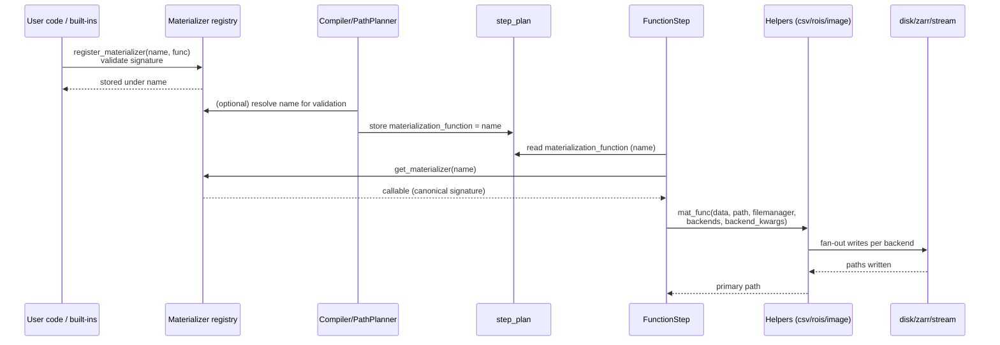
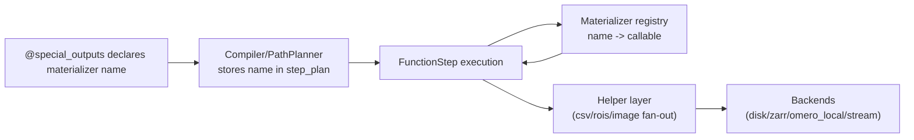

# Materialization Standardization Plan (Detailed)

## Goal
Single, enforced materializer API; registered, name-resolved materializers (built-in and custom); helpers for common formats; zero legacy/shim path.

## Core API (applies everywhere)
- Signature: `(data, path: str, filemanager, backends: List[str], backend_kwargs: Dict[str, dict]) -> str`.
- Invocation contract: `backends` ordered fan-out; `backend_kwargs` keyed by backend; returns path written for the first backend.
- Only allowed backends: disk, zarr, omero_local, streaming (fiji_stream, napari_stream). Capability checks gate everything.

## File-by-file plan
1) **Helper layer (new)**
   - Add `openhcs/processing/materialization/helpers.py` with:
     - `fanout_materialize(data, path, filemanager, backends, backend_kwargs, writer)`
     - Writers: `write_csv_table`, `write_rois`, `write_images` (TIFF/zarr/streaming), each capability-checked.
     - Convenience callables for `@special_outputs`: `csv_table`, `rois`, `image_stack` calling `fanout_materialize`.
     - `REGISTRY = {"csv_table": csv_table, "rois": rois, "image_stack": image_stack, ...}`.
   - Add tests: `tests/materialization/test_helpers.py` to cover fan-out, capability guards, and per-writer behavior.

2) **Materializer registry (mirror FunctionReference pattern)**
   - New module `openhcs/processing/materialization/registry.py` using the same structure as the processing registry:
     - Key = namespace + name (e.g., `builtins/materialization::csv_table`, `custom/<file>::my_csv`) to prevent collisions.
     - Entry stores: callable, module/qualname (for debugging), signature-checked flag, and preserved attrs (if needed).
     - API: `register_materializer(key, func)`, `get_materializer(key)`, `list_materializers()`.
     - Pre-register built-in helpers on import; reject duplicate keys; compiler errors on unknown or ambiguous keys.
   - Wire registration in library bootstrap (e.g., `openhcs/processing/backends/lib_registry/unified_registry.py` or a dedicated init) so built-ins are available before planning; custom registrations go through the same API.

3) **Compiler/Planner: store names, not raw callables**
   - `openhcs/core/pipeline/function_contracts.py`: allow `@special_outputs(("my_output", "csv_table"))` in addition to callables; normalize strings to registry names.
   - `openhcs/core/pipeline/compiler.py`: when preserving attrs for FunctionReference, keep materializer names (strings) rather than raw callables.
   - `openhcs/core/pipeline/path_planner.py`: `extract_attributes`/special outputs should copy materializer names into `step_plans[sid]['special_outputs'][key]['materialization_function']` (string), not callables.

4) **Execution: resolve by name, canonical call**
   - `openhcs/core/steps/function_step.py` in `_materialize_special_outputs`:
     - Resolve string name via materializer registry → callable.
     - Enforce canonical signature; fail fast if missing/invalid.
     - Remove legacy branches; always pass `backends` + `backend_kwargs`.
     - Keep streaming/disk/zarr behavior identical by delegating to helpers.

5) **Built-in materializer migration**
   - Update all materializers to the canonical signature and register them under stable names:
     - `openhcs/processing/backends/analysis/cell_counting_cpu.py` / `_cupy.py` / `_pyclesperanto.py` / `_simple.py` (cell counts, segmentation masks).
     - `openhcs/processing/backends/analysis/multi_template_matching.py` (match results).
     - `openhcs/processing/backends/analysis/hmm_axon*.py` (analysis + trace visualizations).
     - `openhcs/processing/backends/analysis/skan_axon_analysis.py` (axon analysis, skeleton outputs).
     - `openhcs/processing/backends/analysis/consolidate_analysis_results.py` and `consolidate_special_outputs.py`.
     - `openhcs/processing/backends/pos_gen/ashlar_main_cpu.py` / `_gpu.py` (positions).
   - Replace bespoke backend branching with helper calls; ensure OMERO/streaming code paths preserved.
   - Add per-family smoke tests to assert registry resolution + successful write.

6) **Custom materializers (name-resolved, registry-backed)**
   - `openhcs/processing/custom_functions/manager.py`: when loading custom code, detect functions explicitly registered via `register_materializer(name, func)` (or a thin helper) and validate signature; register into materializer registry.
   - Update custom-function template + docs to show:
     ```python
     from openhcs.core.pipeline.function_contracts import special_outputs
     from openhcs.processing.materialization.registry import register_materializer

     def my_csv(data, path, filemanager, backends, backend_kwargs):
         return helpers.csv_table(data, path, filemanager, backends, backend_kwargs)

     register_materializer("my_csv", my_csv)

     @numpy
     @special_outputs(("stats", "my_csv"))
     def my_func(image): ...
     ```
   - Execution resolves `"my_csv"` via registry in workers; no pickling of raw closures.

7) **Docs & UX**
   - Update architecture docs: special I/O + materialization flow with name-based registry resolution and canonical signature.
   - Update user docs: custom materializer authoring, allowed backends, expected data shapes.
   - UI (function editor): surface registry names as suggestions; clarify signature requirements.

8) **Rollout / migration**
   - Full cutover: remove acceptance of non-canonical materializer signatures and raw-callable storage in step plans.
   - Add migration notes + changelog entry (signature change, registry usage, helper names).
   - Validation: add a guard in planning/execution to error if a materialization_function is a callable (legacy) or an unknown name.

## Mermaid diagrams

### Registration and execution flow (sequence)


### Components and data flow (flowchart)

