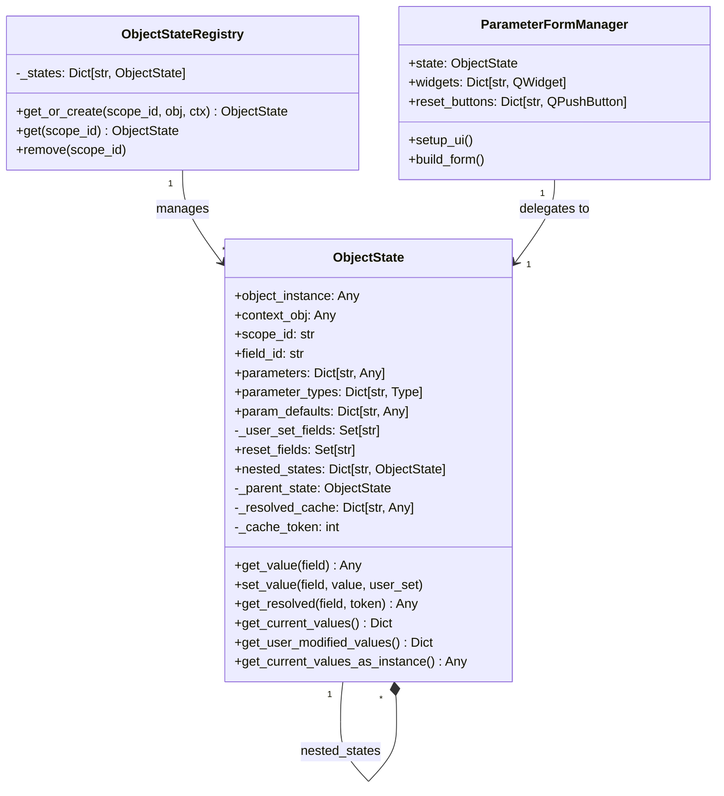
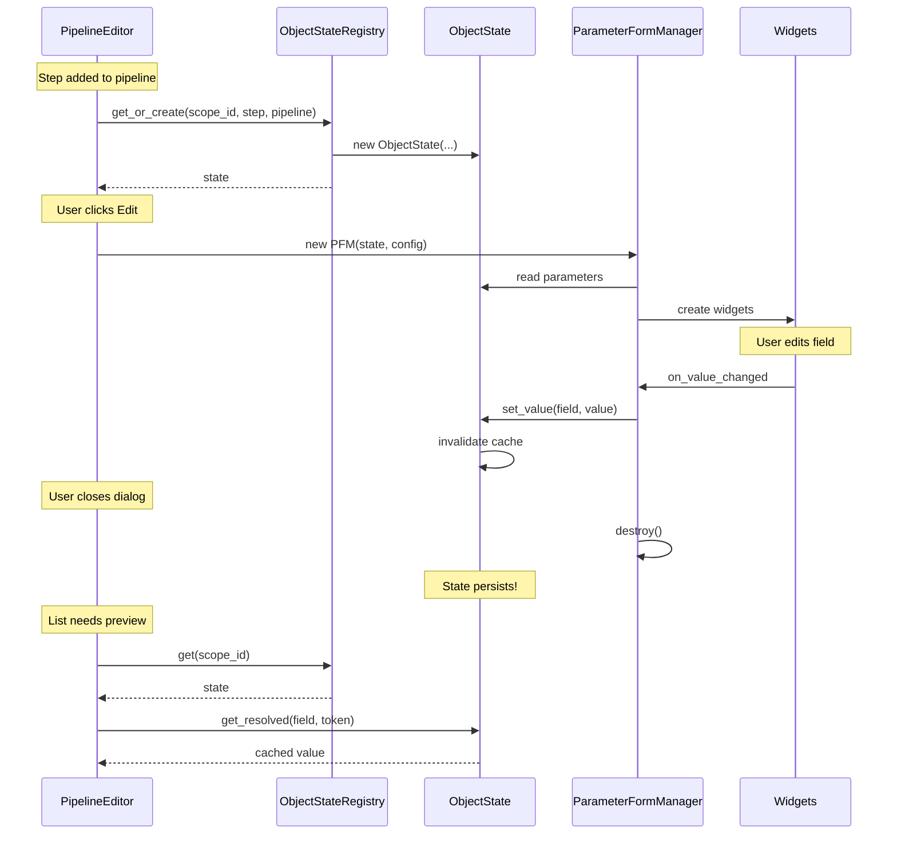

# plan_01_object_state.md
## Component: ObjectState Extraction (MVC Separation)

### Objective

Extract the MODEL from `ParameterFormManager` into a standalone `ObjectState` class, achieving proper MVC separation. This allows resolved configuration state to exist independently of UI widgets, enabling list items and previews to access resolved values without requiring a full PFM instance.

### Problem Statement

**Current Architecture (God Object):**
```
ParameterFormManager (1209 lines)
├── MODEL: parameters, _user_set_fields, object_instance, context_obj, scope_id
├── VIEW: widgets, reset_buttons, setup_ui(), build_form()
└── CONTROLLER: signals, handlers, dispatchers
```

**Core Issue:** Resolved state only exists while PFM (UI) exists.
- List items can't show resolved values without instantiating widgets
- Cross-window preview requires full PFM tree
- State dies when user closes editor dialog

### Solution: Inverted Extraction

Instead of extracting pieces from PFM, we:
1. Copy PFM → ObjectState
2. Strip PyQt-specific code (VIEW)
3. Keep pure Python state/logic (MODEL)
4. Modify PFM to delegate to ObjectState

### Architecture Diagrams

#### Current vs Target State Lifecycle

```mermaid
flowchart TB
    subgraph current["Current: State Tied to UI"]
        A1[Step added to pipeline] --> A2[No state object]
        A2 --> A3[User opens editor]
        A3 --> A4[PFM created with widgets]
        A4 --> A5[State exists in PFM]
        A5 --> A6[User closes editor]
        A6 --> A7[PFM destroyed]
        A7 --> A8[State LOST]
        A8 --> A9[List needs resolved value]
        A9 --> A10[Must re-resolve from scratch]
    end
    
    subgraph target["Target: State Independent of UI"]
        B1[Step added to pipeline] --> B2[ObjectState created]
        B2 --> B3[State registered in registry]
        B3 --> B4[User opens editor]
        B4 --> B5[PFM attaches to ObjectState]
        B5 --> B6[User closes editor]
        B6 --> B7[PFM destroyed]
        B7 --> B8[ObjectState PERSISTS]
        B8 --> B9[List needs resolved value]
        B9 --> B10["state.get_resolved() → O(1)"]
    end
```



#### Class Relationships



#### Data Flow



### Plan

#### Phase 1: Create ObjectState (New File)

**File:** `openhcs/config_framework/object_state.py`

**Method:** Copy PFM, then strip PyQt-specific code using sed/manual editing.

**What to KEEP (MODEL):**

| Attribute/Method | Lines in PFM | Purpose |
|------------------|--------------|---------|
| `object_instance` | 239 | The object being edited |
| `context_obj` | 241 | Parent for inheritance resolution |
| `scope_id` | 244 | Scope identifier for filtering |
| `field_id` | 240 | Unique form identifier |
| `parameters` | 257 | Current field values |
| `parameter_types` | 257 | Type information per field |
| `param_defaults` | 279 | Default values for reset |
| `_user_set_fields` | 283, 290 | Dirty tracking |
| `reset_fields` | 283 | Fields that were reset |
| `nested_managers` | 282 | → becomes `nested_states` |
| `get_current_values()` | 786-837 | Collect all current values |
| `get_user_modified_values()` | 839-927 | Collect only user-edited values |
| `get_current_values_as_instance()` | 931-949 | Reconstruct instance |
| `get_user_modified_instance()` | 951-971 | Reconstruct with user values only |

**What to DELETE (VIEW/PyQt-specific):**

| Item | Lines | Reason |
|------|-------|--------|
| `QWidget` inheritance | 236 | Qt-specific |
| `from PyQt6.*` imports | 12-16, 67-70 | Qt-specific |
| `widgets: Dict` | 282 | VIEW concern |
| `reset_buttons: Dict` | 282 | VIEW concern |
| `setup_ui()` | 338-340 | VIEW concern |
| `build_form()` | 511-526 | VIEW concern |
| `_cross_window_refresh_timer` | QTimer | Qt-specific |
| Widget creation methods | 500+ lines | VIEW concern |
| `pyqtSignal` declarations | 188-194 | Qt-specific |

#### Phase 2: Create ObjectStateRegistry

**File:** `openhcs/config_framework/object_state_registry.py`

**Pattern:** Follow `LiveContextService` singleton pattern.

```python
class ObjectStateRegistry:
    """Global registry for ObjectState instances, keyed by scope_id.

    Follows LiveContextService pattern for consistency.
    """
    _states: Dict[str, ObjectState] = {}

    @classmethod
    def get_or_create(cls, scope_id: str, object_instance: Any,
                      context_obj: Any, field_id: str) -> ObjectState:
        """Get existing or create new ObjectState."""
        if scope_id not in cls._states:
            cls._states[scope_id] = ObjectState(
                object_instance=object_instance,
                context_obj=context_obj,
                scope_id=scope_id,
                field_id=field_id,
            )
            cls._states[scope_id].initialize()  # Extract parameters
        return cls._states[scope_id]

    @classmethod
    def get(cls, scope_id: str) -> Optional[ObjectState]:
        """Get ObjectState by scope_id, or None if not found."""
        return cls._states.get(scope_id)

    @classmethod
    def remove(cls, scope_id: str) -> None:
        """Remove ObjectState when object is deleted from pipeline."""
        cls._states.pop(scope_id, None)

    @classmethod
    def clear(cls) -> None:
        """Clear all states (for testing)."""
        cls._states.clear()
```

#### Phase 3: Modify ParameterFormManager

**Changes to PFM:**

1. Accept `ObjectState` in constructor (or create via registry)
2. Delegate state access to `self.state`
3. Keep only VIEW code (widgets, layout, signals)

```python
class ParameterFormManager(QWidget, metaclass=_CombinedMeta):
    # Signals stay (they're Qt-specific VIEW concern)
    context_changed = pyqtSignal(str, str)

    def __init__(self, state: ObjectState, config: Optional[FormManagerConfig] = None):
        config = config or FormManagerConfig()
        super().__init__(config.parent)

        # THE KEY CHANGE: Delegate to ObjectState
        self.state = state

        # VIEW-only attributes
        self.widgets: Dict[str, QWidget] = {}
        self.reset_buttons: Dict[str, QPushButton] = {}
        self.nested_managers: Dict[str, ParameterFormManager] = {}

        # Backward compatibility via properties
        # (gradual migration - can remove later)

    # Properties for backward compatibility
    @property
    def parameters(self) -> Dict[str, Any]:
        return self.state.parameters

    @property
    def _user_set_fields(self) -> Set[str]:
        return self.state._user_set_fields

    @property
    def object_instance(self) -> Any:
        return self.state.object_instance

    @property
    def context_obj(self) -> Any:
        return self.state.context_obj

    @property
    def scope_id(self) -> str:
        return self.state.scope_id
```

#### Phase 4: Wire Up Pipeline/Plate Managers

**PipelineEditor changes:**

```python
def action_add(self):
    # ... create step ...

    # NEW: Create ObjectState when step added
    scope_id = f"{self.current_plate}::step_{len(self.steps)}"
    ObjectStateRegistry.get_or_create(
        scope_id=scope_id,
        object_instance=step,
        context_obj=self.current_pipeline,
        field_id=step.name,
    )

def _show_item_editor(self, step):
    # NEW: Get existing ObjectState
    state = ObjectStateRegistry.get(step.scope_id)

    # Create PFM with state (not object_instance)
    manager = ParameterFormManager(state, config)
    dialog = StepEditorDialog(manager)
    dialog.exec()
    # PFM destroyed, but ObjectState persists!

def action_delete(self):
    # ... delete step ...

    # NEW: Remove ObjectState
    ObjectStateRegistry.remove(step.scope_id)
```

**AbstractManagerWidget.update_item_list changes:**

```python
def _format_list_item(self, item, index, context):
    # NEW: Get resolved values from ObjectState (no PFM needed!)
    state = ObjectStateRegistry.get(self._get_scope_for_item(item))
    if state:
        token = LiveContextService.get_token()
        resolved_value = state.get_resolved('some_field', token)
        # Use resolved_value in display
```

### Implementation Steps

1. **Create `object_state.py`**
   - Copy PFM
   - Strip PyQt imports/inheritance
   - Convert class to dataclass
   - Keep value methods

2. **Create `object_state_registry.py`**
   - Singleton registry
   - scope_id keyed
   - get_or_create/get/remove

3. **Modify PFM constructor**
   - Accept ObjectState
   - Add property delegates
   - Keep backward compat factory methods

4. **Wire up PipelineEditor**
   - Create ObjectState on step add
   - Pass to PFM on edit
   - Remove on step delete

5. **Wire up PlateManager**
   - Same pattern for plates

6. **Update list item formatting**
   - Use ObjectState.get_resolved()
   - No PFM required for preview

### Estimated Impact

| File | Before | After | Change |
|------|--------|-------|--------|
| `object_state.py` | 0 | ~250 | +250 |
| `object_state_registry.py` | 0 | ~50 | +50 |
| `parameter_form_manager.py` | 1209 | ~700 | -509 |
| `pipeline_editor.py` | 966 | ~990 | +24 |
| `plate_manager.py` | 1193 | ~1210 | +17 |
| `abstract_manager_widget.py` | 1305 | ~1320 | +15 |

**Net:** ~150 fewer lines, proper MVC separation

### Success Criteria

- [ ] ObjectState exists independently of PFM
- [ ] PFM delegates all state access to ObjectState
- [ ] List items can call `ObjectState.get_resolved()` without widgets
- [ ] Cross-window sync still works
- [ ] All existing tests pass
- [ ] No breaking changes to public API

### Phase 5: Update LiveContextService to Use ObjectStateRegistry

**Critical change:** LiveContextService currently queries `_active_form_managers` (WeakSet of PFMs). After migration, it must query `ObjectStateRegistry.get_all()` instead.

**Current (PFM-based):**
```python
class LiveContextService:
    _active_form_managers: WeakSet['ParameterFormManager'] = WeakSet()

    @classmethod
    def collect(cls) -> Dict[str, Dict[Type, Dict[str, Any]]]:
        for manager in cls._active_form_managers:
            values = manager.get_user_modified_values()
            # ... aggregate by scope
```

**Target (ObjectStateRegistry-based):**
```python
class LiveContextService:
    @classmethod
    def collect(cls) -> Dict[str, Dict[Type, Dict[str, Any]]]:
        for state in ObjectStateRegistry.get_all():
            values = state.get_user_modified_values()
            # ... aggregate by scope (same logic, different source)
```

This means:
- `LiveContextService._active_form_managers` is **deleted**
- `ObjectStateRegistry` becomes the **single source of truth**
- Cross-window resolution works for ANY ObjectState, not just open PFMs

### Phase 6: Root Object Requirements for All PFM Users

**Key insight:** Every PFM must have a root object that owns its nested configs. This ensures all configs are reachable via ObjectStateRegistry.

#### Current PFM Usage Patterns

| UI Component | Root Object | Nested Fields | Status |
|--------------|-------------|---------------|--------|
| Config Window | `PipelineConfig` | napari_config, fiji_config, path_planning, etc. | ✅ Has root |
| Config Window | `GlobalPipelineConfig` | same | ✅ Has root |
| Step Editor | `Step` instance | step's config dataclass | ✅ Has root |
| Function Pane | `Callable` (function) | dataclass params (e.g., `dtype_config: LazyDtypeConfig`) | ✅ Has root (function itself) |
| **ImageBrowser** | ❌ **None** | napari_config, fiji_config | ❌ **REGRESSION RISK** |

#### ImageBrowser Fix: Create Namespace Container

**Problem:** ImageBrowser creates two standalone PFMs (`napari_config_form`, `fiji_config_form`) without a parent object. If we switch to ObjectStateRegistry, these would be **invisible** to LiveContextService.

**Solution:** Create a namespace dataclass to contain both configs:

```python
# openhcs/core/config.py (or wherever appropriate)
@dataclass
class ImageBrowserConfig:
    """Container for ImageBrowser's streaming configs.

    This is a namespace that groups related configs under one ObjectState.
    Not decorated with @global_pipeline_config since it's browser-specific.
    """
    napari_config: LazyNapariStreamingConfig = field(default_factory=LazyNapariStreamingConfig)
    fiji_config: LazyFijiStreamingConfig = field(default_factory=LazyFijiStreamingConfig)
```

**ImageBrowser changes:**

```python
# Before (two separate PFMs, no root)
self.lazy_napari_config = LazyNapariStreamingConfig()
self.napari_config_form = ParameterFormManager(object_instance=self.lazy_napari_config, ...)

self.lazy_fiji_config = LazyFijiStreamingConfig()
self.fiji_config_form = ParameterFormManager(object_instance=self.lazy_fiji_config, ...)

# After (one root ObjectState with nested states)
self.browser_config = ImageBrowserConfig()
self.browser_state = ObjectState(
    object_instance=self.browser_config,
    field_id="image_browser",
    scope_id=self.scope_id,
    context_obj=orchestrator.pipeline_config,
)
ObjectStateRegistry.register(self.browser_state)

# PFM for entire config (or just access nested states directly)
self.config_form = ParameterFormManager(state=self.browser_state, ...)
# Nested forms for napari/fiji created automatically from nested ObjectStates
```

**Hierarchy:**
```
ImageBrowser
└── ObjectState(ImageBrowserConfig, scope="plate::image_browser")
    ├── nested: ObjectState(napari_config)
    └── nested: ObjectState(fiji_config)
```

#### Function Pane Pattern (Already Correct)

Function panes already work correctly because they use the **callable as the root object**:

```python
# function_pane.py
self.form_manager = PyQtParameterFormManager(
    object_instance=self.func,       # ← Function IS the root
    field_id=f"func_{self.index}",
    config=FormManagerConfig(
        context_obj=self.step_instance,  # Step for resolution hierarchy
        scope_id=self.scope_id,
        ...
    )
)
```

When the function has a dataclass parameter like:
```python
def my_step_function(image, dtype_config: LazyDtypeConfig = None):
    ...
```

`SignatureAnalyzer` extracts parameters, and `dtype_config` becomes a nested ObjectState.

### Updated Implementation Steps

1. **Create `object_state.py`** ✅ (done)
   - Pure Python state class
   - No PyQt dependencies

2. **Add `ObjectStateRegistry`** to `object_state.py`
   - Singleton registry
   - `register()`, `unregister()`, `get_by_scope()`, `get_all()`

3. **Create `ImageBrowserConfig`** namespace
   - Container for napari_config + fiji_config
   - Allows ImageBrowser to have single root ObjectState

4. **Modify PFM constructor**
   - Accept ObjectState
   - Add property delegates for backward compat

5. **Update ImageBrowser**
   - Create ImageBrowserConfig instance
   - Create single ObjectState with nested states
   - Single root PFM (or access nested directly)

6. **Wire up PipelineEditor**
   - Create ObjectState on step add
   - Pass to PFM on edit
   - Remove on step delete

7. **Update LiveContextService**
   - Replace `_active_form_managers` with `ObjectStateRegistry.get_all()`
   - Delete PFM registration/unregistration code

8. **Update list item formatting**
   - Use ObjectState.get_resolved()
   - No PFM required for preview

### Risks & Mitigations

| Risk | Mitigation |
|------|------------|
| Nested managers complexity | ObjectState has `nested_states` dict, mirrors existing pattern |
| LiveContextService integration | ObjectStateRegistry replaces `_active_form_managers` entirely |
| Resolution cache invalidation | Use existing token-based cache pattern |
| Backward compatibility | Property delegates maintain old attribute access |
| **ImageBrowser regression** | Create `ImageBrowserConfig` namespace to ensure single root ObjectState |
| **Function pane regression** | Already works - callable is root object, dataclass params become nested states |

