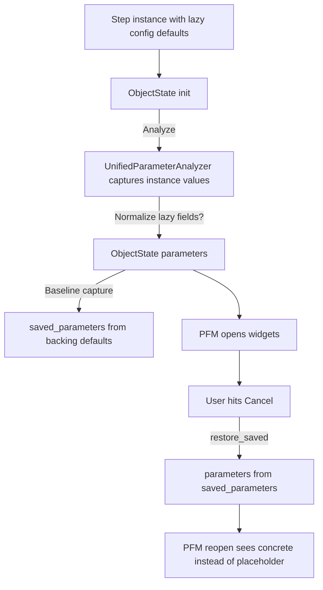

# plan_02_pfm_integration.md
## Component: ParameterFormManager Integration with ObjectState

### Objective
Modify ParameterFormManager (PFM) to delegate all MODEL concerns to ObjectState, making PFM a pure VIEW that:
- Receives ObjectState (not creates it)
- Reads state from ObjectState (`state.parameters`, `state.get_resolved_value()`)
- Writes state via ObjectState (`state.update_parameter()`)
- Renders widgets based on state
- Formats placeholder text for display (VIEW responsibility)

### Findings

#### ObjectState Hierarchy (bound to object instances)
```
GlobalPipelineConfig (singleton)
└── ObjectState (one globally)

Orchestrator
└── PipelineConfig
    └── ObjectState (one per orchestrator)

Orchestrator.pipeline_steps[]
└── Step (N per orchestrator)
    └── ObjectState (one per step)
    └── FunctionStep.functions[]
        └── Function (N per step)
            └── ObjectState (one per function)
```

#### ObjectState Lifecycle (tied to object, not VIEW)
| Object | Created When | Destroyed When | Who Creates ObjectState |
|--------|--------------|----------------|------------------------|
| GlobalPipelineConfig | App startup | App shutdown | Application init |
| PipelineConfig | Orchestrator created | Orchestrator closed | Orchestrator/PlateManager |
| Step | Step added to pipeline | Step removed | PipelineEditorWidget |
| Function | Function added to step | Function removed | FunctionListWidget |

**Key insight:** ObjectState persists when editor closes. PFM attaches/detaches.

#### Current PFM MODEL Attributes (to delegate to ObjectState)
| PFM Attribute | Type | ObjectState Equivalent |
|---------------|------|------------------------|
| `self.parameters` | `Dict[str, Any]` | `state.parameters` |
| `self.parameter_types` | `Dict[str, Type]` | `state.parameter_types` |
| `self.param_defaults` | `Dict[str, Any]` | `state.param_defaults` |
| `self._user_set_fields` | `Set[str]` | `state._user_set_fields` |
| `self.reset_fields` | `Set[str]` | `state.reset_fields` |
| `self.nested_managers` | `Dict[str, PFM]` | VIEW concern (PFM keeps) |
| `self.object_instance` | `Any` | `state.object_instance` |
| `self.context_obj` | `Any` | `state.context_obj` |
| `self.scope_id` | `str` | `state.scope_id` |

#### PFM Constructor Change
**Old:** `PFM(object_instance, field_id, config)` - creates state internally
**New:** `PFM(state: ObjectState, config)` - receives state from caller

### Plan

#### Phase 1: ObjectState Creation Points ✅ COMPLETE
Add ObjectState creation to lifecycle owners:

**Status:** Implemented in commit 0816e7a1
- GlobalPipelineConfig: `OpenHCSApp.setup_application()`
- PipelineConfig: `PlateManagerWidget.init_single_plate()`
- Step: `PipelineEditorWidget._register_step_state()` / `_unregister_step_state()`
- ObjectState constructor enhanced with `exclude_params` and `initial_values`
- Uses `UnifiedParameterAnalyzer` for parameter extraction (handles dataclasses + callables)

**1a. GlobalPipelineConfig (singleton)**
```python
# In application init or GlobalPipelineConfig.__post_init__
ObjectStateRegistry.register(ObjectState(
    object_instance=global_config,
    field_id="GlobalPipelineConfig",
    scope_id="global",
))
```

**1b. PipelineConfig (per orchestrator)**
```python
# In Orchestrator.__init__ or PlateManagerWidget when orchestrator created
ObjectStateRegistry.register(ObjectState(
    object_instance=orchestrator.pipeline_config,
    field_id="PipelineConfig",
    scope_id=str(orchestrator.plate_path),
    context_obj=global_config,
))
```

**1c. Step (per step in pipeline)**
```python
# In PipelineEditorWidget when step added
def _on_step_added(self, step, index):
    state = ObjectState(
        object_instance=step,
        field_id=f"step_{index}",
        scope_id=f"{plate_path}::step_{index}",
        context_obj=orchestrator.pipeline_config,
    )
    ObjectStateRegistry.register(state)
    self._step_states[step] = state
```

**1d. Function (per function in step)**
```python
# In FunctionListWidget when function added
def _on_function_added(self, func, index):
    state = ObjectState(
        object_instance=func,
        field_id=f"func_{index}",
        scope_id=f"{step_scope_id}::func_{index}",
        context_obj=step,
        parent_state=step_state,
    )
    ObjectStateRegistry.register(state)
```

#### Phase 2: PFM Constructor Change
**New signature:** `PFM(state: ObjectState, config: FormManagerConfig)`

```python
def __init__(self, state: ObjectState, config: Optional[FormManagerConfig] = None):
    config = config or FormManagerConfig()
    QWidget.__init__(self, config.parent)

    self.state = state  # Receive state, don't create
    self._parent_manager = config.parent_manager

    # VIEW-only attributes
    self.widgets: Dict[str, QWidget] = {}
    self.reset_buttons: Dict[str, QWidget] = {}
    self.nested_managers: Dict[str, 'ParameterFormManager'] = {}

    # Delegate to state for MODEL
    # (properties below provide backward-compatible access)

    self.setup_ui()
    SignalService.connect_all_signals(self)
```

#### Phase 3: Pass-through properties (backward compatibility)
```python
@property
def parameters(self) -> Dict[str, Any]:
    return self.state.parameters

@property
def parameter_types(self) -> Dict[str, Type]:
    return self.state.parameter_types

@property
def _user_set_fields(self) -> Set[str]:
    return self.state._user_set_fields

@property
def object_instance(self) -> Any:
    return self.state.object_instance

@property
def scope_id(self) -> Optional[str]:
    return self.state.scope_id

@property
def context_obj(self) -> Any:
    return self.state.context_obj
```

#### Phase 4: Update FieldChangeDispatcher
```python
# Change from:
source.parameters[event.field_name] = event.value
source._user_set_fields.add(event.field_name)

# To:
source.state.update_parameter(event.field_name, event.value, user_set=True)
```

#### Phase 5: Update placeholder resolution
PFM reads from state, formats for display:
```python
def _get_placeholder_text(self, param_name: str) -> Optional[str]:
    """VIEW formats placeholder for display."""
    resolved = self.state.get_resolved_value(param_name)
    if resolved is None:
        return None
    from openhcs.core.lazy_placeholder_simplified import LazyDefaultPlaceholderService
    return LazyDefaultPlaceholderService._format_placeholder_text(resolved, self.placeholder_prefix)
```

#### Phase 6: Nested ObjectState + PFM creation
Nested ObjectStates created with parent relationship:
```python
def _create_nested_form_inline(self, param_name: str, param_type: Type, current_value: Any):
    # Get or create nested ObjectState
    if param_name not in self.state.nested_states:
        nested_state = ObjectState(
            object_instance=current_value,
            field_id=param_name,
            parent_state=self.state,  # Inherits scope_id
            context_obj=self.state.context_obj,
        )
        self.state.nested_states[param_name] = nested_state
    else:
        nested_state = self.state.nested_states[param_name]

    # Create PFM for nested state
    nested_config = FormManagerConfig(parent=self, parent_manager=self)
    nested_manager = ParameterFormManager(state=nested_state, config=nested_config)
    self.nested_managers[param_name] = nested_manager
    return nested_manager
```

#### Phase 7: Update callers to create ObjectState first

**StepEditor:**
```python
def __init__(self, step, orchestrator, ...):
    # Get existing ObjectState (created when step was added)
    self.state = self._step_states.get(step)
    if not self.state:
        # Fallback: create if not exists (migration period)
        self.state = ObjectState(step, f"step_{index}", ...)

    self.form_manager = ParameterFormManager(state=self.state, config=...)
```

**ConfigWindow:**
```python
def __init__(self, pipeline_config, ...):
    # Get existing ObjectState (created when orchestrator was created)
    self.state = ObjectStateRegistry.get_by_scope(plate_path)

    self.form_manager = ParameterFormManager(state=self.state, config=...)
```

#### Phase 8: LiveContextService uses ObjectStateRegistry for discovery
LiveContextService stays but switches discovery from tracking PFMs to using ObjectStateRegistry.
ObjectState has the same interface LiveContextService needs (extracted MODEL from PFM).

**Before:**
```python
class LiveContextService:
    _active_form_managers: Dict[str, PFM] = {}  # Manual PFM registration

    def collect(self):
        for pfm in self._active_form_managers.values():
            pfm.get_user_modified_values()  # PFM had MODEL
```

**After:**
```python
class LiveContextService:
    # No more _active_form_managers tracking

    def collect(self):
        for state in ObjectStateRegistry.get_all():  # Discovery via registry
            state.get_user_modified_values()  # ObjectState has MODEL
```

Changes:
1. Remove `_active_form_managers` dict
2. Remove PFM registration/unregistration calls
3. Change `self._active_form_managers.values()` → `ObjectStateRegistry.get_all()`
4. Keep cross-window refresh coordination, signals, debouncing

#### Phase 9: Cleanup ObjectState on object removal
```python
# PipelineEditorWidget
def _on_step_removed(self, step):
    state = self._step_states.pop(step, None)
    if state:
        ObjectStateRegistry.unregister(state.scope_id)

# FunctionListWidget
def _on_function_removed(self, func):
    # Similar pattern
```

#### Phase 10: Simplify PFM - remove pass-through properties
With ObjectState handling all MODEL concerns, PFM becomes a thin VIEW layer.
Remove temporary scaffolding and delete duplicated logic.

**Remove from PFM:**
| Attribute/Method | Reason |
|------------------|--------|
| `self.parameters` property | Use `state.parameters` directly |
| `self.parameter_types` property | Use `state.parameter_types` directly |
| `self._user_set_fields` property | Use `state._user_set_fields` directly |
| `self.object_instance` property | Use `state.object_instance` directly |
| `self.scope_id` property | Use `state.scope_id` directly |
| `self.context_obj` property | Use `state.context_obj` directly |
| `get_user_modified_values()` | Delegate to `state.get_user_modified_values()` |
| `get_current_values()` | Delegate to `state.get_current_values()` |
| Parameter extraction logic | ObjectState does this on creation |

**Simplified PFM (final form):**
```python
class ParameterFormManager(QWidget):
    """Pure VIEW - renders ObjectState as widgets."""

    def __init__(self, state: ObjectState, config: FormManagerConfig):
        QWidget.__init__(self, config.parent)
        self.state = state  # Single source of truth

        # VIEW-only attributes
        self.widgets: Dict[str, QWidget] = {}
        self.reset_buttons: Dict[str, QWidget] = {}
        self.nested_managers: Dict[str, 'ParameterFormManager'] = {}

        self.setup_ui()
```

**Update all callers:**
- Change `manager.parameters` → `manager.state.parameters`
- Change `manager._user_set_fields` → `manager.state._user_set_fields`
- Change `manager.object_instance` → `manager.state.object_instance`

### Nested ObjectState Flow

```
Step added to pipeline
    └── PipelineEditorWidget._on_step_added()
        └── Create ObjectState for step
        └── Register with ObjectStateRegistry

Step editor opened
    └── Get existing ObjectState from registry
    └── Create PFM(state=existing_state)
    └── PFM creates nested ObjectStates for nested dataclasses
    └── PFM creates nested PFMs for nested ObjectStates

Step editor closed
    └── PFM destroyed
    └── ObjectState persists in registry
    └── Nested ObjectStates persist in parent.nested_states

Step removed from pipeline
    └── PipelineEditorWidget._on_step_removed()
    └── Unregister ObjectState from registry
```

### Migration Strategy

**Phase A: Add ObjectState creation points (no PFM changes)**
1. Add ObjectState creation in PipelineEditorWidget for steps
2. Add ObjectState creation in FunctionListWidget for functions
3. Verify states are created/destroyed correctly

**Phase B: Update PFM to receive state**
1. Add `state` parameter to PFM constructor
2. Add pass-through properties
3. Update callers to pass state

**Phase C: Remove duplicate state from PFM**
1. Remove direct MODEL storage from PFM
2. All MODEL access goes through `self.state`

### Current Implementation Order

1. ✅ ObjectState class (done)
2. ✅ ObjectStateRegistry (done)
3. ✅ Resolution in ObjectState (done)
4. ✅ Phase 1: Add ObjectState creation points (commit 0816e7a1)
5. ✅ Phase 2-3: Update PFM constructor + properties (commit ae5c3dbd)
6. ✅ Phase 4: Update FieldChangeDispatcher (uses state.update_parameter())
7. ✅ Phase 5: Update placeholder resolution (uses state.get_resolved_value())
8. ✅ Phase 6: Nested ObjectState creation (ObjectState.__init__ creates nested states, PFM just consumes)
9. ✅ Phase 7: Update callers (done with Phase 2-3)
10. ⬜ Phase 8: LiveContextService uses ObjectStateRegistry for discovery
11. ⬜ Phase 9: Cleanup on removal (step done, function TODO)
12. ⬜ Phase 10: Simplify PFM - remove pass-through properties
13. ✅ Bugfix: Nested ObjectState context + live overlay caching (ObjectState context uses parent object; live context collects cached container overlays)

### Bugfix: Nested Context Visibility

- **Problem:** Nested lazy dataclass placeholders were resolving without the immediate container (e.g., FunctionStep), because nested ObjectStates inherited the parent context_obj (PipelineConfig) instead of the parent object. LiveContextService also dropped container layers after the “eliminate values dict” refactor.
- **Fix:** Nested ObjectStates now set `context_obj=parent.object_instance`, guaranteeing the container layer is present in the resolution stack. ObjectState now exposes `get_user_modified_overlay()` (token-cached) that reconstructs nested dataclass containers; LiveContextService uses this overlay directly when collecting, so container layers survive into `build_context_stack` without per-collect rebuilding.

### Baseline/Cancel Behavior (Why concrete defaults returned)



Root cause: `saved_parameters` captured from backing object defaults. Fix: capture baseline from normalized `parameters` so Cancel restores placeholders/None.

### Signal Handlers - Changes Required

| Current Method | What Changes |
|---------------|--------------|
| `FieldChangeDispatcher.dispatch()` | Call `state.update_parameter()` instead of direct mutation |
| `_schedule_cross_window_refresh()` | Use `ObjectStateRegistry.increment_token()` |
| `_on_live_context_changed()` | Check `state._block_cross_window_updates` |
| `reset_parameter()` | Call `state.reset_parameter()`, then update widget |
| `get_current_values()` | Return `state.get_current_values()` |
| `get_user_modified_values()` | Return `state.get_user_modified_values()` |

### Widget Operations - Read vs Resolved

| Operation | Data Source | Who Formats |
|-----------|-------------|-------------|
| Show concrete value | `state.parameters[field]` | Widget directly |
| Show placeholder | `state.get_resolved_value(field)` | PFM formats as `f"{prefix}: {value}"` |
| User edits widget | Read from widget | PFM → `state.update_parameter()` |
| Reset field | `state.reset_parameter()` | PFM updates widget |

### Backward Compatibility

Property delegation ensures existing code works during migration:
- `manager.parameters` → `manager.state.parameters`
- `manager._user_set_fields` → `manager.state._user_set_fields`
- `manager.object_instance` → `manager.state.object_instance`

### Risk Mitigations

1. **Property delegation** ensures existing code works during migration
2. **ObjectStateRegistry.collect_live_values()** already implemented
3. **Token-based caching** already works in ObjectState
4. **Phase-by-phase** approach allows rollback at each step
