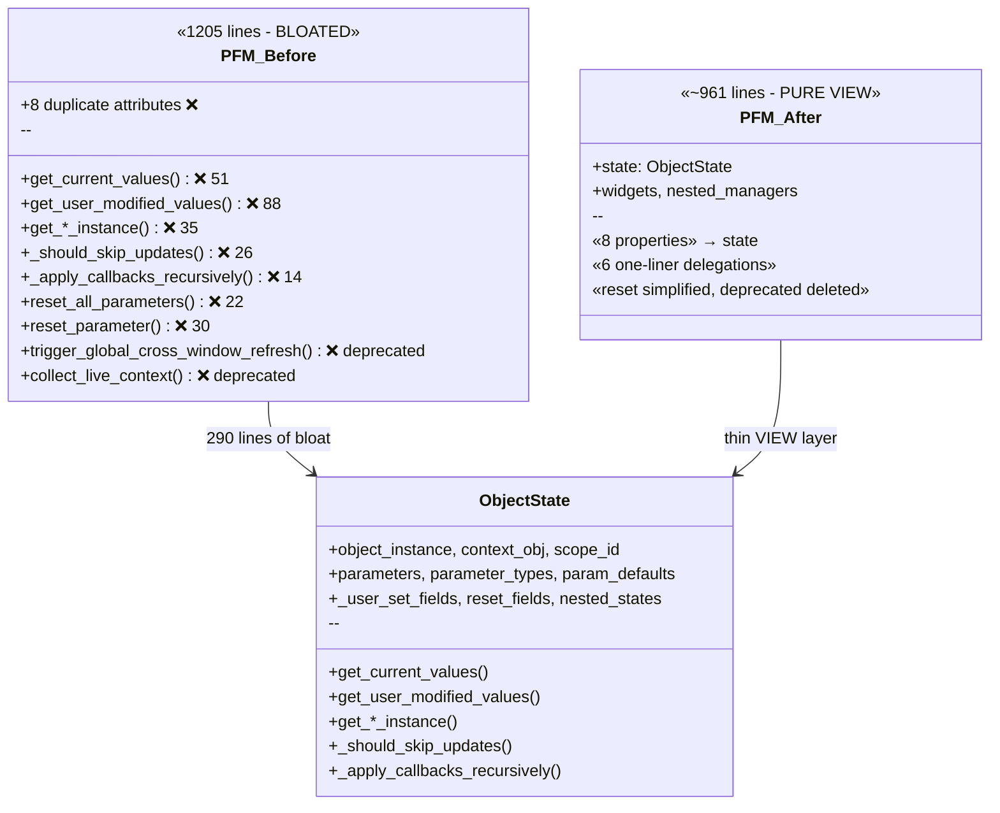
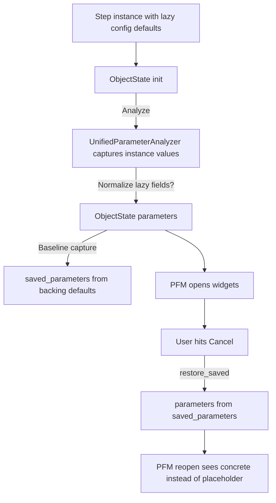

# plan_02_pfm_integration.md
## Component: ParameterFormManager Integration with ObjectState

### Objective
Modify ParameterFormManager (PFM) to delegate all MODEL concerns to ObjectState, making PFM a pure VIEW that:
- Receives ObjectState (not creates it)
- Reads state from ObjectState (`state.parameters`, `state.get_resolved_value()`)
- Writes state via ObjectState (`state.update_parameter()`)
- Renders widgets based on state
- Formats placeholder text for display (VIEW responsibility)

### Findings

#### ObjectState Hierarchy (bound to object instances)
```
GlobalPipelineConfig (singleton)
└── ObjectState (one globally)

Orchestrator
└── PipelineConfig
    └── ObjectState (one per orchestrator)

Orchestrator.pipeline_steps[]
└── Step (N per orchestrator)
    └── ObjectState (one per step)
    └── FunctionStep.functions[]
        └── Function (N per step)
            └── ObjectState (one per function)
```

#### ObjectState Lifecycle (tied to object, not VIEW)
| Object | Created When | Destroyed When | Who Creates ObjectState |
|--------|--------------|----------------|------------------------|
| GlobalPipelineConfig | App startup | App shutdown | Application init |
| PipelineConfig | Orchestrator created | Orchestrator closed | Orchestrator/PlateManager |
| Step | Step added to pipeline | Step removed | PipelineEditorWidget |
| Function | Function added to step | Function removed | FunctionListWidget |

**Key insight:** ObjectState persists when editor closes. PFM attaches/detaches.

#### Current PFM MODEL Attributes (to delegate to ObjectState)
| PFM Attribute | Type | ObjectState Equivalent |
|---------------|------|------------------------|
| `self.parameters` | `Dict[str, Any]` | `state.parameters` |
| `self.parameter_types` | `Dict[str, Type]` | `state.parameter_types` |
| `self.param_defaults` | `Dict[str, Any]` | `state.param_defaults` |
| `self._user_set_fields` | `Set[str]` | `state._user_set_fields` |
| `self.reset_fields` | `Set[str]` | `state.reset_fields` |
| `self.nested_managers` | `Dict[str, PFM]` | VIEW concern (PFM keeps) |
| `self.object_instance` | `Any` | `state.object_instance` |
| `self.context_obj` | `Any` | `state.context_obj` |
| `self.scope_id` | `str` | `state.scope_id` |

#### PFM Constructor Change
**Old:** `PFM(object_instance, field_id, config)` - creates state internally
**New:** `PFM(state: ObjectState, config)` - receives state from caller

### Plan

#### Phase 1: ObjectState Creation Points ✅ COMPLETE
Add ObjectState creation to lifecycle owners:

**Status:** Implemented in commit 0816e7a1
- GlobalPipelineConfig: `OpenHCSApp.setup_application()`
- PipelineConfig: `PlateManagerWidget.init_single_plate()`
- Step: `PipelineEditorWidget._register_step_state()` / `_unregister_step_state()`
- ObjectState constructor enhanced with `exclude_params` and `initial_values`
- Uses `UnifiedParameterAnalyzer` for parameter extraction (handles dataclasses + callables)

**1a. GlobalPipelineConfig (singleton)**
```python
# In application init or GlobalPipelineConfig.__post_init__
ObjectStateRegistry.register(ObjectState(
    object_instance=global_config,
    field_id="GlobalPipelineConfig",
    scope_id="global",
))
```

**1b. PipelineConfig (per orchestrator)**
```python
# In Orchestrator.__init__ or PlateManagerWidget when orchestrator created
ObjectStateRegistry.register(ObjectState(
    object_instance=orchestrator.pipeline_config,
    field_id="PipelineConfig",
    scope_id=str(orchestrator.plate_path),
    context_obj=global_config,
))
```

**1c. Step (per step in pipeline)**
```python
# In PipelineEditorWidget when step added
def _on_step_added(self, step, index):
    state = ObjectState(
        object_instance=step,
        field_id=f"step_{index}",
        scope_id=f"{plate_path}::step_{index}",
        context_obj=orchestrator.pipeline_config,
    )
    ObjectStateRegistry.register(state)
    self._step_states[step] = state
```

**1d. Function (per function in step)**
```python
# In FunctionListWidget when function added
def _on_function_added(self, func, index):
    state = ObjectState(
        object_instance=func,
        field_id=f"func_{index}",
        scope_id=f"{step_scope_id}::func_{index}",
        context_obj=step,
        parent_state=step_state,
    )
    ObjectStateRegistry.register(state)
```

#### Phase 2: PFM Constructor Change
**New signature:** `PFM(state: ObjectState, config: FormManagerConfig)`

```python
def __init__(self, state: ObjectState, config: Optional[FormManagerConfig] = None):
    config = config or FormManagerConfig()
    QWidget.__init__(self, config.parent)

    self.state = state  # Receive state, don't create
    self._parent_manager = config.parent_manager

    # VIEW-only attributes
    self.widgets: Dict[str, QWidget] = {}
    self.reset_buttons: Dict[str, QWidget] = {}
    self.nested_managers: Dict[str, 'ParameterFormManager'] = {}

    # Delegate to state for MODEL
    # (properties below provide backward-compatible access)

    self.setup_ui()
    SignalService.connect_all_signals(self)
```

#### Phase 3: Pass-through properties (backward compatibility)
```python
@property
def parameters(self) -> Dict[str, Any]:
    return self.state.parameters

@property
def parameter_types(self) -> Dict[str, Type]:
    return self.state.parameter_types

@property
def _user_set_fields(self) -> Set[str]:
    return self.state._user_set_fields

@property
def object_instance(self) -> Any:
    return self.state.object_instance

@property
def scope_id(self) -> Optional[str]:
    return self.state.scope_id

@property
def context_obj(self) -> Any:
    return self.state.context_obj
```

#### Phase 4: Update FieldChangeDispatcher
```python
# Change from:
source.parameters[event.field_name] = event.value
source._user_set_fields.add(event.field_name)

# To:
source.state.update_parameter(event.field_name, event.value, user_set=True)
```

#### Phase 5: Update placeholder resolution
PFM reads from state, formats for display:
```python
def _get_placeholder_text(self, param_name: str) -> Optional[str]:
    """VIEW formats placeholder for display."""
    resolved = self.state.get_resolved_value(param_name)
    if resolved is None:
        return None
    from openhcs.core.lazy_placeholder_simplified import LazyDefaultPlaceholderService
    return LazyDefaultPlaceholderService._format_placeholder_text(resolved, self.placeholder_prefix)
```

#### Phase 6: Nested ObjectState + PFM creation
Nested ObjectStates created with parent relationship:
```python
def _create_nested_form_inline(self, param_name: str, param_type: Type, current_value: Any):
    # Get or create nested ObjectState
    if param_name not in self.state.nested_states:
        nested_state = ObjectState(
            object_instance=current_value,
            field_id=param_name,
            parent_state=self.state,  # Inherits scope_id
            context_obj=self.state.context_obj,
        )
        self.state.nested_states[param_name] = nested_state
    else:
        nested_state = self.state.nested_states[param_name]

    # Create PFM for nested state
    nested_config = FormManagerConfig(parent=self, parent_manager=self)
    nested_manager = ParameterFormManager(state=nested_state, config=nested_config)
    self.nested_managers[param_name] = nested_manager
    return nested_manager
```

#### Phase 7: Update callers to create ObjectState first

**StepEditor:**
```python
def __init__(self, step, orchestrator, ...):
    # Get existing ObjectState (created when step was added)
    self.state = self._step_states.get(step)
    if not self.state:
        # Fallback: create if not exists (migration period)
        self.state = ObjectState(step, f"step_{index}", ...)

    self.form_manager = ParameterFormManager(state=self.state, config=...)
```

**ConfigWindow:**
```python
def __init__(self, pipeline_config, ...):
    # Get existing ObjectState (created when orchestrator was created)
    self.state = ObjectStateRegistry.get_by_scope(plate_path)

    self.form_manager = ParameterFormManager(state=self.state, config=...)
```

#### Phase 8: LiveContextService uses ObjectStateRegistry for discovery
LiveContextService stays but switches discovery from tracking PFMs to using ObjectStateRegistry.
ObjectState has the same interface LiveContextService needs (extracted MODEL from PFM).

**Before:**
```python
class LiveContextService:
    _active_form_managers: Dict[str, PFM] = {}  # Manual PFM registration

    def collect(self):
        for pfm in self._active_form_managers.values():
            pfm.get_user_modified_values()  # PFM had MODEL
```

**After:**
```python
class LiveContextService:
    # No more _active_form_managers tracking

    def collect(self):
        for state in ObjectStateRegistry.get_all():  # Discovery via registry
            state.get_user_modified_values()  # ObjectState has MODEL
```

Changes:
1. Remove `_active_form_managers` dict
2. Remove PFM registration/unregistration calls
3. Change `self._active_form_managers.values()` → `ObjectStateRegistry.get_all()`
4. Keep cross-window refresh coordination, signals, debouncing

#### Phase 9: Cleanup ObjectState on object removal
```python
# PipelineEditorWidget
def _on_step_removed(self, step):
    state = self._step_states.pop(step, None)
    if state:
        ObjectStateRegistry.unregister(state.scope_id)

# FunctionListWidget
def _on_function_removed(self, func):
    # Similar pattern
```

#### Phase 10: Simplify PFM - remove pass-through properties ⬜ CURRENT

**Dry Run Analysis (2025-12-07):**

##### Current State
PFM currently does **direct attribute assignment** in `__init__` (lines 250-265):
```python
self.object_instance = state.object_instance
self.field_id = state.field_id
self.context_obj = state.context_obj
self.scope_id = state.scope_id
self.parameters = state.parameters
self.parameter_types = state.parameter_types
self.param_defaults = state.param_defaults
self._user_set_fields = state._user_set_fields
```

These are **reference copies** (not deep copies), so `self.parameters` and `state.parameters` point to the same dict. Mutations work correctly, but:
1. Assignments like `manager.object_instance = x` update PFM, not state (breaks MVC)
2. Conceptually unclear that PFM is just a VIEW

##### Implementation Strategy: Convert to @property Delegation

**Step 1: Replace direct assignments with @property decorators**

Remove from `__init__`:
```python
# DELETE these lines (250-265):
self.object_instance = state.object_instance
self.context_obj = state.context_obj
self.scope_id = state.scope_id
self.parameters = state.parameters
self.parameter_types = state.parameter_types
self.param_defaults = state.param_defaults
self._user_set_fields = state._user_set_fields
self.reset_fields = state.reset_fields
```

Add properties (after class definition, before methods):
```python
# Read-only properties (dicts/sets are mutable, so reads allow mutation)
@property
def parameters(self) -> Dict[str, Any]:
    return self.state.parameters

@property
def parameter_types(self) -> Dict[str, Type]:
    return self.state.parameter_types

@property
def param_defaults(self) -> Dict[str, Any]:
    return self.state.param_defaults

@property
def _user_set_fields(self) -> Set[str]:
    return self.state._user_set_fields

@property
def reset_fields(self) -> Set[str]:
    return self.state.reset_fields

@property
def scope_id(self) -> Optional[str]:
    return self.state.scope_id

# Read-write properties (external code assigns to these)
@property
def object_instance(self) -> Any:
    return self.state.object_instance

@object_instance.setter
def object_instance(self, value: Any) -> None:
    self.state.object_instance = value

@property
def context_obj(self) -> Any:
    return self.state.context_obj

@context_obj.setter
def context_obj(self, value: Any) -> None:
    self.state.context_obj = value
```

**Step 2: Keep `field_id` as direct attribute**
`field_id` is immutable and used in `form_structure`. Keep as direct assignment for simplicity.

##### External Callers Analysis

**No changes needed** - properties maintain backward-compatible attribute access:

| File | Usage | Works After? |
|------|-------|--------------|
| `function_list_editor.py:319` | `pane.form_manager.parameters` | ✅ property returns same dict |
| `enabled_field_styling_service.py:55,80,88,163,220` | `manager.parameters` | ✅ |
| `field_change_dispatcher.py:83,177,253` | `manager.parameters` | ✅ |
| `parameter_ops_service.py:88,136,138` | `manager.parameters` | ✅ |
| `widget_service.py:241,245` | `manager.parameters` | ✅ |
| `signal_service.py:120` | `manager.parameters` | ✅ |
| `widget_creation_config.py:166,366` | `manager.parameters` | ✅ |
| `step_parameter_editor.py:519` | `self.form_manager.parameters` | ✅ |
| `function_pane.py:409` | `self.form_manager.parameters` | ✅ |
| `dual_editor_window.py:405` | `form_manager.object_instance = x` | ✅ setter updates state |
| `config_window.py:398` | `form_manager.object_instance = x` | ✅ setter updates state |
| `dual_editor_window.py:662` | `form_manager.context_obj = x` | ✅ setter updates state |

##### Part A: Properties (conservative)

| File | Change |
|------|--------|
| `parameter_form_manager.py` | Remove 8 assignments, add 10 properties (~40 lines net change) |

##### Part B: Delete ALL Duplicated MODEL Methods

**Key Insight:** The whole point of ObjectState extraction was to move MODEL to ObjectState. PFM should just delegate. FieldChangeDispatcher keeps `state.parameters` in sync with widgets on every change (line 79 calls `state.update_parameter()`).

**Methods to DELETE and replace with one-liner delegations:**

| Method | PFM Lines | Delete | Replace With |
|--------|-----------|--------|--------------|
| `get_current_values()` | 782-833 | 51 | `return self.state.get_current_values()` |
| `get_user_modified_values()` | 835-923 | 88 | `return self.state.get_user_modified_values()` |
| `get_current_values_as_instance()` | 927-945 | 18 | `return self.state.get_current_values_as_instance()` |
| `get_user_modified_instance()` | 947-964 | 17 | `return self.state.get_user_modified_instance()` |
| `_should_skip_updates()` | 971-996 | 26 | `return self.state._should_skip_updates()` |
| `_apply_callbacks_recursively()` | 1005-1018 | 14 | `return self.state._apply_callbacks_recursively(callback_list_name)` |

**Subtotal Part B: 214 lines → 6 one-liners = -208 lines**

##### Part C: Simplify Bloated Methods

**These methods have bloat that can be removed:**

| Method | Current Lines | After | Savings |
|--------|---------------|-------|---------|
| `reset_all_parameters()` | 704-726 (22) | 5 | -17 |
| `reset_parameter()` | 751-780 (30) | 5 | -25 |

**`reset_all_parameters()` before (22 lines):**
```python
def reset_all_parameters(self) -> None:
    with timer(...):  # Unnecessary for simple method
        with FlagContextManager.reset_context(self, block_cross_window=True):
            param_names = [param_info.name for param_info in self.form_structure.parameters]
            for param_name in param_names:
                self.reset_parameter(param_name)
        self._parameter_ops_service.refresh_with_live_context(self)
```

**`reset_all_parameters()` after (5 lines):**
```python
def reset_all_parameters(self) -> None:
    for param_info in self.form_structure.parameters:
        self.reset_parameter(param_info.name)
    self._parameter_ops_service.refresh_with_live_context(self)
```
(FlagContextManager is overkill - reset_parameter handles its own dispatch)

**`reset_parameter()` before (30 lines):**
- 14 lines of DEBUG LOGGING
- FlagContextManager wrapping
- Delegation to parameter_ops_service

**`reset_parameter()` after (5 lines):**
```python
def reset_parameter(self, param_name: str) -> None:
    default = self.param_defaults.get(param_name)
    event = FieldChangeEvent(param_name, default, self, is_reset=True)
    FieldChangeDispatcher.instance().dispatch(event)
```
(Dispatcher already handles state update via `state.update_parameter()`)

**Subtotal Part C: -42 lines**

##### Part D: Delete Deprecated/Useless Wrapper Methods

**Methods to DELETE entirely (deprecated - callers should use service directly):**

| Method | Lines | Why Delete |
|--------|-------|------------|
| `trigger_global_cross_window_refresh()` | 1131-1133 (4) | Just calls `LiveContextService.trigger_global_refresh()` |
| `collect_live_context()` | 1135-1138 (4) | Just calls `LiveContextService.collect()` |

**Callers to update:**
- `function_list_editor.py:463` → `LiveContextService.trigger_global_refresh()`
- `pipeline_editor.py:734,958` → `LiveContextService.collect()`
- `widget_service.py:231` → `LiveContextService.collect()`
- `abstract_manager_widget.py:790` → `LiveContextService.trigger_global_refresh()`
- `dual_editor_window.py:461,645,1009` → `LiveContextService.trigger_global_refresh()`
- `config_window.py:578` → `LiveContextService.trigger_global_refresh()`
- `plate_manager.py:261` → `LiveContextService.collect()`

**Subtotal Part D: -8 lines from PFM, ~10 caller updates**

##### Part E: Trim Verbose Docstrings (optional)

Several methods have docstrings longer than their body:

| Method | Total Lines | Docstring | Body | Could Be |
|--------|-------------|-----------|------|----------|
| `_make_widget_readonly()` | 9 | 5 | 1 | 3 |
| `_apply_to_nested_managers()` | 4 | 1 | 2 | 3 |
| `_convert_widget_value()` | 18 | 5 | 8 | 10 |

**Subtotal Part E: ~8 lines (optional polish)**

##### Part F: Delete/Inline Pointless Wrapper Methods

**Methods where docstring > code, or just delegate to one function:**

| Method | Lines | Body | Action |
|--------|-------|------|--------|
| `create_widget()` | 394-403 (10) | 4 | Inline `_widget_creator()` at call site (widget_creation_config.py:273) |
| `_make_widget_readonly()` | 1044-1052 (9) | 1 | Inline `WidgetService.make_readonly()` at call site |
| `_convert_widget_value()` | 676-693 (18) | 5 | Keep (2 conversions, but after Part B only 1 caller) |
| `_apply_to_nested_managers()` | 1000-1003 (4) | 2 | Keep (abstract method in protocol) |

**Also delete unused factory methods, dead code, and simplify dispatch:**

| Method/Code | Lines | Why Delete/Simplify |
|-------------|-------|---------------------|
| `from_object()` | 467-504 (38) | **ZERO callers** - dead code |
| `_create_widget_for_param()` | 561-589 (29) | Redundant dispatch - `create_widget_parametric` should infer type from `param_info` |
| Debug logging block | 269-279 (10) | Hardcoded debug for one field (`fiji_streaming_config`) |
| Dead assignments | 337-340 (4) | `self.parameter_info`, `self.use_scroll_area`, `self.function_target` - 0 accesses |
| Dead params in `from_dataclass_instance()` | 4 params | `placeholder_prefix`, `force_show_all_fields`, `global_config_type`, `context_event_coordinator` - declared but never used |

**Actions:**
1. Delete `create_widget()` - inline `_widget_creator()` at call site
2. Delete `_make_widget_readonly()` - inline `WidgetService.make_readonly()` at call site
3. Delete `from_object()` - dead code (0 callers)
4. Simplify `_create_widget_for_param()`:
   - Move type inference INTO `create_widget_parametric(manager, param_info)` - it should infer `WidgetCreationType` from `param_info` type
   - `_create_widget_for_param` becomes 1 line: `return create_widget_parametric(self, param_info)`
5. Delete debug logging block (lines 269-279) - hardcoded for one field
6. Delete dead assignments (lines 337-340)
7. Clean `from_dataclass_instance()` signature - remove 4 dead params, update call site (config_window.py)

**Subtotal Part F: -100 lines**

##### Summary: Total Phase 10 Cleanup

| Part | Description | Lines Removed | Lines Added | Net |
|------|-------------|---------------|-------------|-----|
| A | Attribute → properties | 8 | ~30 | +22 |
| B | Delete 6 MODEL methods | 214 | 6 | **-208** |
| C | Simplify reset methods | 52 | 10 | **-42** |
| D | Delete deprecated wrappers | 8 | 0 | **-8** |
| E | Trim docstrings (optional) | 8 | 0 | **-8** |
| F | Delete pointless wrappers + dead code | 100 | 2 | **-98** |
| **Total** | | **390** | **48** | **-342 lines** |

**PFM: 1205 → ~863 lines**

##### Before/After UML



##### Benefits

1. **-244 lines** - PFM reduced from 1205 to ~961 lines (**well under 1000!**)
2. **No duplicate attributes** - 8 properties delegate to state
3. **No duplicate MODEL methods** - 6 one-liner delegations
4. **Simplified reset methods** - removed verbose logging
5. **Deprecated wrappers deleted** - callers use LiveContextService directly
6. **MVC separation complete** - MODEL is ObjectState, PFM is pure VIEW

### Nested ObjectState Flow

```
Step added to pipeline
    └── PipelineEditorWidget._on_step_added()
        └── Create ObjectState for step
        └── Register with ObjectStateRegistry

Step editor opened
    └── Get existing ObjectState from registry
    └── Create PFM(state=existing_state)
    └── PFM creates nested ObjectStates for nested dataclasses
    └── PFM creates nested PFMs for nested ObjectStates

Step editor closed
    └── PFM destroyed
    └── ObjectState persists in registry
    └── Nested ObjectStates persist in parent.nested_states

Step removed from pipeline
    └── PipelineEditorWidget._on_step_removed()
    └── Unregister ObjectState from registry
```

### Migration Strategy

**Phase A: Add ObjectState creation points (no PFM changes)**
1. Add ObjectState creation in PipelineEditorWidget for steps
2. Add ObjectState creation in FunctionListWidget for functions
3. Verify states are created/destroyed correctly

**Phase B: Update PFM to receive state**
1. Add `state` parameter to PFM constructor
2. Add pass-through properties
3. Update callers to pass state

**Phase C: Remove duplicate state from PFM**
1. Remove direct MODEL storage from PFM
2. All MODEL access goes through `self.state`

### Current Implementation Order

1. ✅ ObjectState class (done)
2. ✅ ObjectStateRegistry (done)
3. ✅ Resolution in ObjectState (done)
4. ✅ Phase 1: Add ObjectState creation points (commit 0816e7a1)
5. ✅ Phase 2-3: Update PFM constructor + properties (commit ae5c3dbd)
6. ✅ Phase 4: Update FieldChangeDispatcher (uses state.update_parameter())
7. ✅ Phase 5: Update placeholder resolution (uses state.get_resolved_value())
8. ✅ Phase 6: Nested ObjectState creation (ObjectState.__init__ creates nested states, PFM just consumes)
9. ✅ Phase 7: Update callers (done with Phase 2-3)
10. ✅ Phase 8: LiveContextService uses ObjectStateRegistry for discovery
11. ✅ Phase 9: Cleanup on removal (step + function done via ScopeTokenService, commit 332e3dd)
12. ⬜ Phase 10: Simplify PFM - remove pass-through properties (CURRENT)
13. ✅ Bugfix: Nested ObjectState context + live overlay caching (ObjectState context uses parent object; live context collects cached container overlays)

### Bugfix: Nested Context Visibility

- **Problem:** Nested lazy dataclass placeholders were resolving without the immediate container (e.g., FunctionStep), because nested ObjectStates inherited the parent context_obj (PipelineConfig) instead of the parent object. LiveContextService also dropped container layers after the “eliminate values dict” refactor.
- **Fix:** Nested ObjectStates now set `context_obj=parent.object_instance`, guaranteeing the container layer is present in the resolution stack. ObjectState now exposes `get_user_modified_overlay()` (token-cached) that reconstructs nested dataclass containers; LiveContextService uses this overlay directly when collecting, so container layers survive into `build_context_stack` without per-collect rebuilding.

### Baseline/Cancel Behavior (Why concrete defaults returned)



Root cause: `saved_parameters` captured from backing object defaults. Fix: capture baseline from normalized `parameters` so Cancel restores placeholders/None.

### Signal Handlers - Changes Required

| Current Method | What Changes |
|---------------|--------------|
| `FieldChangeDispatcher.dispatch()` | Call `state.update_parameter()` instead of direct mutation |
| `_schedule_cross_window_refresh()` | Use `ObjectStateRegistry.increment_token()` |
| `_on_live_context_changed()` | Check `state._block_cross_window_updates` |
| `reset_parameter()` | Call `state.reset_parameter()`, then update widget |
| `get_current_values()` | Return `state.get_current_values()` |
| `get_user_modified_values()` | Return `state.get_user_modified_values()` |

### Widget Operations - Read vs Resolved

| Operation | Data Source | Who Formats |
|-----------|-------------|-------------|
| Show concrete value | `state.parameters[field]` | Widget directly |
| Show placeholder | `state.get_resolved_value(field)` | PFM formats as `f"{prefix}: {value}"` |
| User edits widget | Read from widget | PFM → `state.update_parameter()` |
| Reset field | `state.reset_parameter()` | PFM updates widget |

### Backward Compatibility

Property delegation ensures existing code works during migration:
- `manager.parameters` → `manager.state.parameters`
- `manager._user_set_fields` → `manager.state._user_set_fields`
- `manager.object_instance` → `manager.state.object_instance`

### Risk Mitigations

1. **Property delegation** ensures existing code works during migration
2. **ObjectStateRegistry.collect_live_values()** already implemented
3. **Token-based caching** already works in ObjectState
4. **Phase-by-phase** approach allows rollback at each step
