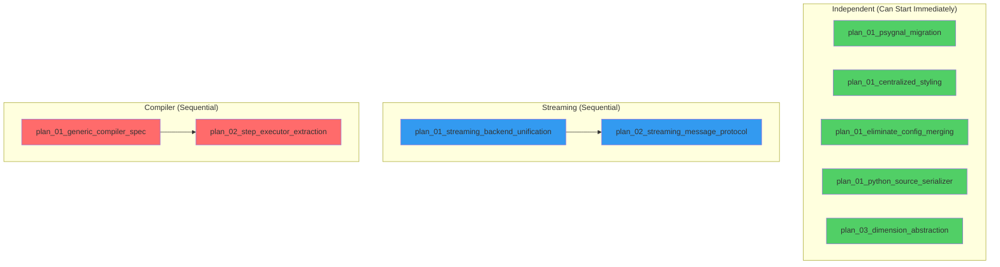

# Rot Elimination Master Plan

## Overview

9 plans to eliminate ~3500 lines of rot. No wrappers. No backwards compatibility.

## ❌ PROJECT-LEVEL ANTIPATTERNS TO AVOID

**DO NOT add "temporary" compatibility during migration:**
```python
# ❌ WRONG: "We'll remove this later"
def old_api():
    warnings.warn("Deprecated, use new_api()", DeprecationWarning)
    return new_api()  # DON'T - there is no "later"
```
Delete old API. Update callers. One PR. No deprecation period.

**DO NOT create parallel implementations "for safety":**
```python
# ❌ WRONG: Keep both paths
if USE_NEW_SYSTEM:
    result = new_executor.execute(plan)
else:
    result = step.process(context)  # DON'T KEEP OLD PATH
```
One path. New system only. Old path deleted.

**DO NOT squash multiple plans into one commit:**
```
# ❌ WRONG: One commit for everything
commit: "Implement streaming unification + message protocol + executor extraction"
```
One plan per commit. Test after each. Can revert individual commits if broken.

Multiple plans in one PR is fine — just use separate commits.

**DO NOT add feature flags for gradual rollout:**
```python
# ❌ WRONG: Feature flag
ENABLE_TYPED_PLANS = os.environ.get('ENABLE_TYPED_PLANS', False)
if ENABLE_TYPED_PLANS:
    plan = StepPlan(...)  # DON'T
else:
    plan = {'input_dir': ...}
```
No flags. New system is THE system. Ship it or don't.

**DO NOT "clean up later":**
```python
# ❌ WRONG: TODO for future
# TODO: Remove this once all callers are migrated
def legacy_helper():  # DON'T LEAVE THESE
    ...
```
If it's not deleted in this PR, it never gets deleted. Clean up NOW.

**DO NOT add tests for deprecated behavior:**
```python
# ❌ WRONG: Testing the old way still works
def test_legacy_callback_system_still_works():
    ObjectStateRegistry.add_register_callback(...)  # DON'T TEST DELETED CODE
```
Tests verify NEW behavior. Old behavior doesn't exist.

**The principle: Every PR should make the codebase strictly simpler. If line count goes up, you're doing it wrong.**

## Dependency Graph



## Execution Order

### Wave 1: Independent Plans (Parallel)
These have no dependencies and can be implemented in any order:

| Plan | Lines Saved | Risk | Effort |
|------|-------------|------|--------|
| `plan_01_psygnal_migration` | ~120 | Low | 2h |
| `plan_01_centralized_styling` | ~200 | Low | 4h |
| `plan_01_eliminate_config_merging` | ~90 | Low | 1h |
| `plan_01_python_source_serializer` | ~950 | Low | 4h |
| `plan_03_dimension_abstraction` | ~400 | Low | 3h |

### Wave 2: Streaming Plans (Sequential)
Must be done in order:

| Plan | Lines Saved | Risk | Effort |
|------|-------------|------|--------|
| `plan_01_streaming_backend_unification` | ~300 | Low | 3h |
| `plan_02_streaming_message_protocol` | ~100 | Low | 2h |

### Wave 3: Compiler Plans (Sequential, Highest Risk)
Must be done in order. Touches core execution path.

| Plan | Lines Saved | Risk | Effort |
|------|-------------|------|--------|
| `plan_01_generic_compiler_spec` | ~200 | Medium | 6h |
| `plan_02_step_executor_extraction` | ~647 | Medium | 8h |

## Testing Strategy

### End-to-End Test (Required)

Every plan must pass this before merge:

```bash
pytest tests/integration/test_main.py::test_main[disk-ImageXpress-3d-multiprocessing-direct-none-none] -v
```

This is THE integration test. If it passes, core execution works.

### Per-Plan Testing

1. **E2E Test** — Above command must pass
2. **Unit Tests** — Run in terminal, don't save to files
3. **Manual Testing** — User tests UI/streaming where applicable

### What Needs Manual Testing (by user)

| Area | Why Manual |
|------|------------|
| Streaming to Napari | Requires running viewer |
| Streaming to Fiji | Requires Fiji installation |
| UI Styling | Visual verification |
| Flash animations | Visual verification |
| Config window behavior | Interactive testing |

### Regression Watchlist

| Area | What to Watch | How to Test |
|------|---------------|-------------|
| Execution | Steps actually run | E2E test above |
| Streaming | Data reaches viewers | Manual by user |
| Config | Resolution works | E2E test covers basic resolution |
| UI | Styling looks right | Manual by user |

## Success Criteria

- [ ] All 9 plans implemented
- [ ] ~3500 lines deleted
- [ ] Zero new wrappers or compatibility shims
- [ ] All existing tests pass
- [ ] Manual smoke test passes
- [ ] No regressions in core functionality

## Risk Mitigation

1. **Compiler plans are highest risk** — Do them last, after all other plans prove the pattern works
2. **Test after each plan** — Don't batch multiple plans before testing
3. **Revert fast** — If a plan causes regressions, revert and reassess

## Plan Summaries

| Plan | What It Does |
|------|--------------|
| `plan_01_psygnal_migration` | Replace 8 callback lists with psygnal Signals |
| `plan_01_centralized_styling` | Move 227 setStyleSheet calls to app-level stylesheet |
| `plan_01_eliminate_config_merging` | Delete 90 lines that duplicate config framework |
| `plan_01_python_source_serializer` | Replace 950-line pickle_to_python with type-dispatched formatters |
| `plan_03_dimension_abstraction` | Replace 103 channel/slice/frame references with HyperstackDimensions |
| `plan_01_streaming_backend_unification` | Merge Napari/Fiji backends into one ABC |
| `plan_02_streaming_message_protocol` | Replace stringly-typed JSON with typed dataclasses |
| `plan_01_generic_compiler_spec` | Replace Dict[str, Any] plans with typed frozen StepPlan |
| `plan_02_step_executor_extraction` | Move 647-line process() to dedicated StepExecutor |

