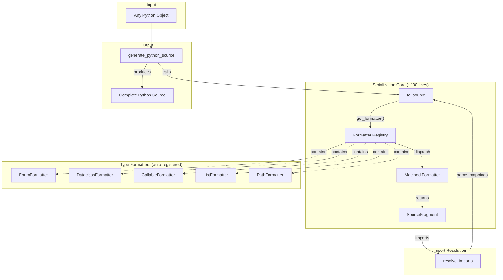

# plan_01_python_source_serializer.md
## Component: Declarative Python Source Serializer

### Objective

Replace 1142 lines of copy-pasted imperative code in `pickle_to_python.py` with a declarative serialization framework. Types declare how they serialize. System derives the rest.

### The Rot

**7 public functions doing the same dance:**
```python
def generate_complete_function_pattern_code(...)   # 45 lines
def generate_clean_dataclass_repr(...)             # 90 lines  
def generate_readable_function_repr(...)           # 95 lines
def generate_step_code(...)                        # 12 lines (wrapper)
def generate_complete_pipeline_steps_code(...)     # 86 lines
def generate_complete_orchestrator_code(...)       # 300+ lines
def generate_config_code(...)                      # 35 lines
```

**Every function repeats:**
1. `all_function_imports = defaultdict(set)` — import collection
2. `all_enum_imports = defaultdict(set)` — more import collection
3. Walk data structure manually
4. Handle special cases (Enum, dataclass, callable, lazy dataclass, Path, list, dict)
5. Two-pass generation (collect imports → resolve collisions → regenerate)
6. Build code string with f-strings

**Evidence of rot:**
```python
# String matching for type detection (line 260)
elif is_dataclass(value) and 'Lazy' in value.__class__.__name__:

# Same import collection in 4+ functions
all_function_imports = defaultdict(set)
all_enum_imports = defaultdict(set)
all_decorated_functions = set()

# Two-pass pattern copy-pasted everywhere
temp_import_lines, temp_name_mappings = format_imports_as_strings(...)
# ... generate code ...
if final_name_mappings != temp_name_mappings:
    # regenerate everything
```

### The Insight

This is **serialization**. Converting Python objects to Python source code.

The cracked pattern:
1. **Type → Formatter dispatch** — Each type knows how to serialize
2. **Import collection is automatic** — Formatter returns `(code, imports)`
3. **One traversal** — Walk once, collect imports AND generate code
4. **Collision resolution as post-process** — Not interleaved with generation

### Plan

#### 1. Define Serialization Result

```python
@dataclass(frozen=True)
class SourceFragment:
    """Result of serializing a value to Python source."""
    code: str
    imports: FrozenSet[Tuple[str, str]]  # (module, name) pairs
    
    def __add__(self, other: 'SourceFragment') -> 'SourceFragment':
        return SourceFragment(
            code=self.code + other.code,
            imports=self.imports | other.imports
        )
```

#### 2. Define Formatter Protocol (via ABC)

```python
class SourceFormatter(ABC):
    """Formats a value to Python source code."""
    
    @abstractmethod
    def can_format(self, value: Any) -> bool:
        """Return True if this formatter handles this value type."""
        ...
    
    @abstractmethod
    def format(self, value: Any, context: 'FormatContext') -> SourceFragment:
        """Format value to Python source, returning code and required imports."""
        ...
```

#### 3. Define Format Context

```python
@dataclass
class FormatContext:
    """Context passed through serialization."""
    indent: int = 0
    clean_mode: bool = False
    name_mappings: Dict[Tuple[str, str], str] = field(default_factory=dict)
    
    def indented(self) -> 'FormatContext':
        return replace(self, indent=self.indent + 1)
    
    @property
    def indent_str(self) -> str:
        return "    " * self.indent
```

#### 4. Implement Type-Specific Formatters

```python
class EnumFormatter(SourceFormatter):
    def can_format(self, value: Any) -> bool:
        return isinstance(value, Enum)
    
    def format(self, value: Enum, ctx: FormatContext) -> SourceFragment:
        cls = value.__class__
        import_pair = (cls.__module__, cls.__name__)
        name = ctx.name_mappings.get(import_pair, cls.__name__)
        return SourceFragment(
            code=f"{name}.{value.name}",
            imports=frozenset([import_pair])
        )

class DataclassFormatter(SourceFormatter):
    def can_format(self, value: Any) -> bool:
        return is_dataclass(value) and not isinstance(value, type)
    
    def format(self, value: Any, ctx: FormatContext) -> SourceFragment:
        cls = value.__class__
        import_pair = (cls.__module__, cls.__name__)
        
        # Get all field fragments
        field_fragments = []
        all_imports = {import_pair}
        
        for f in fields(value):
            field_value = object.__getattribute__(value, f.name)
            
            # Skip None in clean_mode for lazy dataclasses
            if ctx.clean_mode and field_value is None:
                continue
            
            frag = to_source(field_value, ctx.indented())
            all_imports |= frag.imports
            field_fragments.append(f"{f.name}={frag.code}")
        
        if not field_fragments:
            return SourceFragment(f"{cls.__name__}()", frozenset(all_imports))
        
        inner = f",\n{ctx.indented().indent_str}".join(field_fragments)
        code = f"{cls.__name__}(\n{ctx.indented().indent_str}{inner}\n{ctx.indent_str})"
        return SourceFragment(code, frozenset(all_imports))

class CallableFormatter(SourceFormatter):
    def can_format(self, value: Any) -> bool:
        return callable(value) and not isinstance(value, type)
    
    def format(self, value: Callable, ctx: FormatContext) -> SourceFragment:
        import_pair = (value.__module__, value.__name__)
        name = ctx.name_mappings.get(import_pair, value.__name__)
        return SourceFragment(name, frozenset([import_pair]))

class ListFormatter(SourceFormatter):
    def can_format(self, value: Any) -> bool:
        return isinstance(value, list)
    
    def format(self, value: list, ctx: FormatContext) -> SourceFragment:
        if not value:
            return SourceFragment("[]", frozenset())
        
        item_frags = [to_source(item, ctx.indented()) for item in value]
        all_imports = frozenset().union(*(f.imports for f in item_frags))
        
        inner = f",\n{ctx.indented().indent_str}".join(f.code for f in item_frags)
        code = f"[\n{ctx.indented().indent_str}{inner}\n{ctx.indent_str}]"
        return SourceFragment(code, all_imports)

# ... PathFormatter, DictFormatter, StrFormatter, etc.
```

#### 5. Formatter Registry with `__init_subclass__`

```python
class SourceFormatter(ABC):
    """Base formatter with auto-registration."""
    
    _registry: ClassVar[List['SourceFormatter']] = []
    
    def __init_subclass__(cls, **kwargs):
        super().__init_subclass__(**kwargs)
        if not getattr(cls, '__abstract__', False):
            SourceFormatter._registry.append(cls())
    
    @classmethod
    def get_formatter(cls, value: Any) -> 'SourceFormatter':
        for formatter in cls._registry:
            if formatter.can_format(value):
                return formatter
        raise TypeError(f"No formatter for {type(value)}")
```

#### 6. Single Entry Point

```python
def to_source(value: Any, ctx: FormatContext = None) -> SourceFragment:
    """Convert any value to Python source code."""
    ctx = ctx or FormatContext()
    formatter = SourceFormatter.get_formatter(value)
    return formatter.format(value, ctx)
```

#### 7. Import Resolution as Post-Process

```python
def resolve_imports(imports: FrozenSet[Tuple[str, str]]) -> Tuple[List[str], Dict]:
    """Resolve import collisions and generate import lines."""
    # Group by name to detect collisions
    name_to_modules = defaultdict(list)
    for module, name in imports:
        name_to_modules[name].append(module)
    
    import_lines = []
    name_mappings = {}
    
    for module, name in sorted(imports):
        if len(name_to_modules[name]) > 1:
            # Collision - use qualified alias
            alias = f"{name}_{module.split('.')[-1]}"
            import_lines.append(f"from {module} import {name} as {alias}")
            name_mappings[(module, name)] = alias
        else:
            import_lines.append(f"from {module} import {name}")
            name_mappings[(module, name)] = name
    
    return import_lines, name_mappings
```

#### 8. Public API (ONE Function)

```python
def generate_python_source(obj: Any, header: str = "", clean_mode: bool = False) -> str:
    """Generate complete Python source with imports.

    THIS IS THE ONLY PUBLIC FUNCTION. All legacy functions are DELETED.
    """
    # First pass: collect imports
    ctx = FormatContext(clean_mode=clean_mode)
    fragment = to_source(obj, ctx)

    # Resolve collisions
    import_lines, name_mappings = resolve_imports(fragment.imports)

    # Second pass: regenerate with resolved names
    ctx = FormatContext(clean_mode=clean_mode, name_mappings=name_mappings)
    fragment = to_source(obj, ctx)

    # Combine
    code_lines = []
    if header:
        code_lines.append(header)
        code_lines.append("")
    code_lines.extend(import_lines)
    code_lines.append("")
    code_lines.append(fragment.code)

    return "\n".join(code_lines)
```

### Cleanup — DELETE ALL OF THIS

**Functions to DELETE from `pickle_to_python.py` (NO WRAPPERS):**
```python
def generate_complete_function_pattern_code(...)  # DELETE
def generate_clean_dataclass_repr(...)            # DELETE
def generate_readable_function_repr(...)          # DELETE
def generate_step_code(...)                       # DELETE
def generate_complete_pipeline_steps_code(...)    # DELETE
def generate_complete_orchestrator_code(...)      # DELETE
def generate_config_code(...)                     # DELETE
```

**Call sites to update:**
Every caller of the deleted functions gets updated to call `generate_python_source()` directly. No wrappers. No shims. No deprecation period.

### Why This Is Cracked

| Old (1142 lines) | New (~200 lines) |
|------------------|------------------|
| 7 functions doing same thing | 1 generic `to_source()` |
| Manual type dispatch in each function | `__init_subclass__` auto-registration |
| Import collection repeated everywhere | Returns `SourceFragment` with imports |
| Two-pass interleaved with generation | Two-pass as separate concern |
| String matching `'Lazy' in __name__` | Proper `can_format()` predicates |
| Copy-paste for each context | ONE function, callers pass header |

**Adding a new type:** Define formatter, done. Auto-registered.

**Adding a new output context:** Call `generate_python_source()` with different header.

### Architecture Diagram



### Dependencies

None. This is a standalone refactor.

### External Module Setup

This should be extracted as `uneval` (or `pyuneval`) — an external module following the same pattern as other externals.

#### 1. Create GitHub Repository

Create `https://github.com/OpenHCSDev/uneval.git` (or similar name).

#### 2. Repository Structure

```
uneval/
├── README.md
├── LICENSE
├── pyproject.toml
├── src/
│   └── uneval/
│       ├── __init__.py          # Public API: to_source, generate_python_source
│       ├── core.py              # SourceFragment, FormatContext, SourceFormatter ABC
│       ├── formatters.py        # EnumFormatter, DataclassFormatter, CallableFormatter, etc.
│       └── imports.py           # resolve_imports
├── tests/
│   ├── test_core.py
│   ├── test_formatters.py
│   └── test_integration.py
└── docs/
    └── ...
```

#### 3. pyproject.toml Template

```toml
[build-system]
requires = ["hatchling"]
build-backend = "hatchling.build"

[project]
name = "uneval"
version = "0.1.0"
description = "Declarative Python source code generation from objects"
readme = "README.md"
requires-python = ">=3.10"
dependencies = []

[project.optional-dependencies]
dev = ["pytest", "pytest-cov"]

[tool.hatch.build.targets.wheel]
packages = ["src/uneval"]
```

#### 4. Add as Git Submodule

```bash
cd /path/to/openhcs
git submodule add https://github.com/OpenHCSDev/uneval.git external/uneval
git submodule update --init --recursive
```

This adds to `.gitmodules`:
```ini
[submodule "external/uneval"]
    path = external/uneval
    url = https://github.com/OpenHCSDev/uneval.git
```

#### 5. Update OpenHCS pyproject.toml

Add editable dependency (same pattern as other externals):
```toml
[project.optional-dependencies]
dev = [
    # ... existing deps ...
    "uneval @ file:///external/uneval",
]
```

Or for editable install during development:
```bash
pip install -e external/uneval
```

#### 6. Update Imports in OpenHCS

Replace imports in callers:
```python
# Before
from openhcs.debug.pickle_to_python import generate_complete_orchestrator_code

# After
from uneval import generate_python_source
```

#### 7. Keep OpenHCS-Specific Integration

Create thin adapter in `openhcs/debug/pickle_to_python.py` (~50 lines) that:
1. Imports from `uneval`
2. Registers OpenHCS-specific formatters (FunctionStep, lazy dataclasses, etc.)
3. Provides any OpenHCS-specific headers/context

```python
# openhcs/debug/pickle_to_python.py (AFTER refactor)
from uneval import generate_python_source, SourceFormatter, SourceFragment, FormatContext
from openhcs.core.steps.function_step import FunctionStep

class FunctionStepFormatter(SourceFormatter):
    """OpenHCS-specific formatter for FunctionStep objects."""
    def can_format(self, value) -> bool:
        return isinstance(value, FunctionStep)

    def format(self, value, ctx: FormatContext) -> SourceFragment:
        # ... OpenHCS-specific logic ...
        pass

# Register on import
SourceFormatter.register(FunctionStepFormatter())
```

### ❌ ANTIPATTERNS TO AVOID

**DO NOT keep the old functions as wrappers:**
```python
# ❌ WRONG: Wrapper for backwards compatibility
def generate_pipeline_code(pipeline):
    return generate_python_source(pipeline, header="# Pipeline")  # DON'T KEEP
```
Delete all 7 old functions. Callers use `generate_python_source()` directly.

**DO NOT create separate formatter registries per context:**
```python
# ❌ WRONG: Multiple registries
PIPELINE_FORMATTERS = {}
CONFIG_FORMATTERS = {}
STEP_FORMATTERS = {}
```
ONE registry. Formatters are context-agnostic. Header varies, formatters don't.

**DO NOT add can_format() methods that check module paths:**
```python
# ❌ WRONG: String matching on module names
def can_format(self, obj) -> bool:
    return 'openhcs.config' in type(obj).__module__  # DON'T
```
Use `isinstance()` or structural checks. No string matching on module paths.

**DO NOT create separate two-pass logic per output context:**
```python
# ❌ WRONG: Duplicated import resolution
def generate_pipeline_code(pipeline):
    # ... generate code ...
    imports = resolve_imports(...)  # DON'T DUPLICATE
```
Import resolution is ONE function called by `generate_python_source()`. Not per-context.

**DO NOT add special cases for "Lazy" types:**
```python
# ❌ WRONG: String matching on type names
if 'Lazy' in type(obj).__name__:
    return format_lazy(obj)  # DON'T
```
Lazy types get their own formatter with proper `isinstance()` check.

### Implementation Draft

*Awaiting smell loop approval.*
