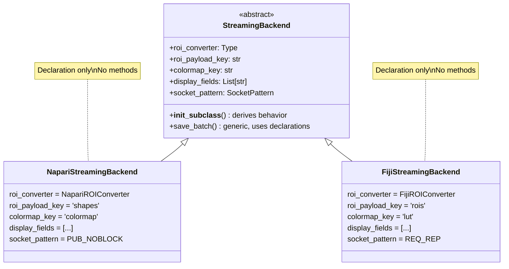

# plan_01_streaming_backend_unification.md
## Component: Declarative Streaming Backend

### Objective

Eliminate duplication between `NapariStreamingBackend` and `FijiStreamingBackend` by making implementations **purely declarative**. No methods to override. Declare class attributes, `__init_subclass__` derives behavior.

**Manifesto alignment:**
- *"When you see duplication, you don't copy. You extract."* (§IX)
- *"Declare what, derive how"* (OpenHCS pattern)

### Findings

**Current state — 80% duplication in `save_batch()`**

Both backends do the same 8-step dance. The genuine differences are **static configuration**, not polymorphic behavior:

| Aspect | Napari | Fiji |
|--------|--------|------|
| ROI converter class | `NapariROIConverter` | `FijiROIConverter` |
| ROI payload key | `'shapes'` | `'rois'` |
| Colormap key | `'colormap'` | `'lut'` |
| Extra display fields | `['variable_size_handling']` | `['auto_contrast']` |
| Socket pattern | `SocketPattern.PUB_NOBLOCK` | `SocketPattern.REQ_REP` |

**These are not behaviors. They are declarations.**

### The Insight

If differences are static, they should be CLASS ATTRIBUTES, not methods:

```python
class NapariStreamingBackend(StreamingBackend):
    # DECLARATION ONLY - no methods
    _backend_type = Backend.NAPARI_STREAM.value
    roi_converter = NapariROIConverter
    roi_payload_key = 'shapes'
    colormap_key = 'colormap'
    display_fields = ['colormap', 'variable_size_handling']
    socket_pattern = SocketPattern.PUB_NOBLOCK
```

The ABC reads these declarations and **derives** `save_batch()` behavior.

### Plan

#### 1. Define Socket Pattern Enum

```python
class SocketPattern(Enum):
    PUB_NOBLOCK = "pub_noblock"   # Non-blocking publish
    REQ_REP = "req_rep"           # Request-reply with ack
```

#### 2. StreamingBackend ABC with `__init_subclass__`

```python
class StreamingBackend(DataSink):
    """Streaming backend with derived behavior.

    Subclasses declare attributes. ABC derives save_batch().
    """

    # Required declarations (enforced by __init_subclass__)
    roi_converter: Type[ROIConverter]
    roi_payload_key: str
    colormap_key: str
    display_fields: List[str]
    socket_pattern: SocketPattern

    def __init_subclass__(cls, **kwargs):
        super().__init_subclass__(**kwargs)

        # Validate all required declarations exist
        required = ['roi_converter', 'roi_payload_key', 'colormap_key',
                    'display_fields', 'socket_pattern']
        missing = [r for r in required if not hasattr(cls, r)]
        if missing and not getattr(cls, '__abstract__', False):
            raise TypeError(f"{cls.__name__} missing declarations: {missing}")

        # Derive socket sender from pattern
        cls._send = cls._derive_sender(cls.socket_pattern)

    @staticmethod
    def _derive_sender(pattern: SocketPattern) -> Callable:
        """Return send function for socket pattern."""
        if pattern == SocketPattern.PUB_NOBLOCK:
            return lambda pub, msg: pub.send_json(msg, zmq.NOBLOCK)
        elif pattern == SocketPattern.REQ_REP:
            return lambda pub, msg: (pub.send_json(msg), pub.recv())

    def save_batch(self, data_list, file_paths, **kwargs) -> None:
        """Generic save_batch derived from class declarations."""
        # Build batch items (same for all backends)
        batch_items = []
        for data, path in zip(data_list, file_paths):
            if self._is_roi(data):
                item = self._prepare_roi(data, path)
            else:
                item = self._prepare_image(data, path)
            batch_items.append(item)

        # Build message using declared keys
        message = {
            'type': 'batch',
            'items': batch_items,
            'display_config': self._build_display_config(kwargs),
        }

        # Send using derived sender
        self._send(self._publisher, message)

    def _prepare_roi(self, data, path) -> dict:
        """Prepare ROI using declared converter and key."""
        converted = self.roi_converter.convert(data)
        return {'path': str(path), self.roi_payload_key: converted}

    def _build_display_config(self, kwargs) -> dict:
        """Build display config using declared fields."""
        config = kwargs.get('display_config', {})
        return {field: getattr(config, field, None) for field in self.display_fields}
```

#### 3. Implementations Are Pure Declaration

```python
class NapariStreamingBackend(StreamingBackend):
    """Napari streaming. Declaration only."""
    _backend_type = Backend.NAPARI_STREAM.value

    roi_converter = NapariROIConverter
    roi_payload_key = 'shapes'
    colormap_key = 'colormap'
    display_fields = ['colormap', 'variable_size_handling']
    socket_pattern = SocketPattern.PUB_NOBLOCK


class FijiStreamingBackend(StreamingBackend):
    """Fiji streaming. Declaration only."""
    _backend_type = Backend.FIJI_STREAM.value

    roi_converter = FijiROIConverter
    roi_payload_key = 'rois'
    colormap_key = 'lut'
    display_fields = ['lut', 'auto_contrast']
    socket_pattern = SocketPattern.REQ_REP
```

**Zero methods. Pure declaration. Behavior derived.**

### Why This Is Cracked

| Old (Competent) | New (Cracked) |
|-----------------|---------------|
| Abstract methods to override | Class attributes to declare |
| 4 methods per implementation | 0 methods per implementation |
| Manual `save_batch()` in each | One generic `save_batch()` in ABC |
| Polymorphic dispatch | Structural derivation from declarations |
| Implementations have behavior | Implementations have configuration |

### Architecture Diagram



### Cleanup — DELETE ALL OF THIS

**Code to DELETE from `napari_stream.py` and `fiji_stream.py`:**
- All duplicated `save_batch()` method bodies → replaced by ABC generic implementation
- All per-backend ROI conversion logic → moved to ABC, dispatched by `roi_converter` declaration
- All per-backend colormap handling → moved to ABC, keyed by `colormap_key` declaration

**No wrappers. No backwards compatibility.**
- `save_batch()` is DELETED from implementations
- Implementations become declaration-only classes (~10 lines each)
- If something breaks, fix the caller — don't add a shim

### ❌ ANTIPATTERNS TO AVOID

**DO NOT keep abstract methods in the ABC:**
```python
# ❌ WRONG: Abstract methods to override
class StreamingBackend(ABC):
    @abstractmethod
    def convert_roi(self, roi): ...  # DON'T - use class attribute

    @abstractmethod
    def get_colormap_key(self) -> str: ...  # DON'T - use class attribute
```
Use class attributes (`roi_converter`, `colormap_key`) that the ABC reads. No abstract methods.

**DO NOT override save_batch() in implementations:**
```python
# ❌ WRONG: Override with "minor differences"
class NapariStreamingBackend(StreamingBackend):
    def save_batch(self, ...):
        # "Just a small tweak for Napari..."
        super().save_batch(...)  # DON'T
```
If there's a difference, parameterize it via class attribute. One `save_batch()` in ABC.

**DO NOT create helper methods in implementations:**
```python
# ❌ WRONG: Helper methods
class NapariStreamingBackend(StreamingBackend):
    def _prepare_napari_payload(self, data):  # DON'T
        ...
```
Implementations have ZERO methods. All logic in ABC, parameterized by declarations.

**DO NOT use if/elif chains for backend dispatch:**
```python
# ❌ WRONG: Type dispatch in ABC
def save_batch(self):
    if isinstance(self, NapariStreamingBackend):
        ...
    elif isinstance(self, FijiStreamingBackend):
        ...
```
Read from class attributes. No isinstance checks.

**The test: Implementation classes should be ~10 lines of pure attribute declarations. If you're adding methods, you're doing it wrong.**

### Implementation Draft

*Awaiting smell loop approval.*
