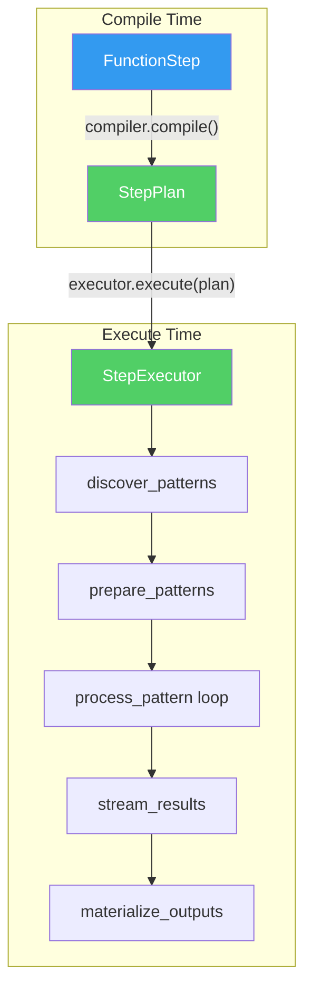

# plan_02_step_executor_extraction.md
## Component: Derived Step Execution

### Objective

Eliminate the 647-line `FunctionStep.process()` god method by extracting execution into a **single generic executor** that reads typed plans. Not a "phase pipeline" — the complexity is real and must be preserved. The cracked solution is **one place** instead of scattered across step classes.

### The Rot

```python
# openhcs/core/steps/function_step.py — 647 lines of execution logic
class FunctionStep(AbstractStep):
    def process(self, context: ProcessingContext, step_index: int) -> None:
        step_plan = context.step_plans[step_index]
        func = step_plan.get('func')  # Stringly-typed Dict[str, Any]
        ...
```

### The Reality (Not Oversimplified)

The 647 lines handle REAL complexity that can't be abstracted away:

1. **Pattern discovery** — `microscope_handler.get_patterns_for_well()`
2. **Grouping** — `prepare_patterns_and_functions()` groups by component
3. **Function chains** — `_execute_chain_core()` for `[func1, func2, ...]`
4. **Dict patterns** — different functions per channel: `{'ch1': func_a, 'ch2': func_b}`
5. **Special I/O** — loading ROIs, saving auxiliary outputs via `funcplan`
6. **Memory stacking** — `stack_slices()` / `unstack_slices()` for 3D arrays
7. **Streaming** — sending results to Napari/Fiji after processing
8. **Materialization** — writing memory-backend data to disk

**The previous plan's "composable phases" was wrong.** These aren't linear phases — they're interleaved concerns. The complexity is intrinsic.

### The Actual Insight

The problem isn't the complexity — it's the LOCATION. This logic is:
1. Inside `FunctionStep` (coupling step declaration to execution)
2. Scattered across module-level functions (`_execute_function_core`, `_execute_chain_core`, `_process_single_pattern_group`)
3. Reading from `Dict[str, Any]` instead of typed plan

**Cracked solution:** ONE `StepExecutor` class that:
- Takes typed `StepPlan` (not dict)
- Contains ALL execution logic (not scattered)
- Is called by orchestrator, not by step

### Plan

#### 1. Typed StepPlan (from compiler spec)

```python
@dataclass(frozen=True)
class StepPlan:
    """Typed, frozen plan. Not Dict[str, Any]."""
    step_name: str
    axis_id: str
    input_dir: Path
    output_dir: Path
    func: Union[Callable, List[Callable], Dict[str, Callable]]
    variable_components: List[str]
    group_by: Optional[GroupBy]
    special_inputs: Dict[str, SpecialInputInfo]
    special_outputs: OrderedDict[str, SpecialOutputInfo]
    funcplan: Dict[str, List[str]]
    read_backend: Backend
    write_backend: Backend
    input_memory_type: MemoryType
    output_memory_type: MemoryType
    streaming_configs: List[StreamingConfig]
    zarr_config: Optional[ZarrConfig]
    device_id: Optional[int]
```

#### 2. Single StepExecutor (Contains ALL Logic)

```python
class StepExecutor:
    """ONE class with ALL execution logic.

    Not phases. Not polymorphism. Just consolidated code.
    The 647 lines move HERE — they don't disappear.
    """

    def execute(self, plan: StepPlan, context: ProcessingContext) -> None:
        """Execute a compiled step plan."""
        # Pattern discovery
        patterns_by_well = self._discover_patterns(plan, context)

        # Grouping
        grouped_patterns, comp_to_funcs, comp_to_args = self._prepare_patterns(
            patterns_by_well[plan.axis_id], plan
        )

        # Process each group
        for comp_val, patterns in grouped_patterns.items():
            func_or_chain = comp_to_funcs[comp_val]
            base_args = comp_to_args[comp_val]

            for pattern in patterns:
                self._process_pattern(
                    pattern, func_or_chain, base_args, plan, context, comp_val
                )

        # Streaming (after all patterns processed)
        self._stream_results(plan, context)

        # Materialization
        self._materialize_outputs(plan, context)

    def _process_pattern(self, pattern, func, args, plan, context, comp_val) -> None:
        """Process single pattern — load, stack, execute, unstack, save."""
        # Load and stack
        data_stack = self._load_and_stack(pattern, plan, context)

        # Execute (handles single func, chain, or dict pattern)
        if isinstance(func, list):
            result = self._execute_chain(data_stack, func, args, plan, context, comp_val)
        else:
            result = self._execute_single(data_stack, func, args, plan, context, comp_val)

        # Unstack and save
        self._unstack_and_save(result, pattern, plan, context)

    # ... rest of the 647 lines, consolidated here
```

#### 3. FunctionStep Becomes Pure Declaration

```python
@dataclass
class FunctionStep(AbstractStep):
    """Declaration only. Zero execution logic."""
    func: FuncPattern

    # NO process() method
    # Compiler produces StepPlan
    # Orchestrator calls StepExecutor.execute(plan)
```

#### 4. Orchestrator Calls Executor

```python
class Orchestrator:
    def run_step(self, step: AbstractStep, step_index: int) -> None:
        # Compilation already happened — plan is in context
        plan = self.context.step_plans[step_index]

        # One executor, takes any plan
        executor = StepExecutor()
        executor.execute(plan, self.context)
```

### Why This Is Actually Cracked

| Old | New |
|-----|-----|
| Execution in `FunctionStep.process()` | Execution in `StepExecutor.execute()` |
| Scattered module functions | Consolidated in one class |
| `Dict[str, Any]` plan | Typed frozen `StepPlan` |
| Step knows how to execute itself | Step is pure declaration |
| 647 lines in step file | 647 lines in executor file (moved, not deleted) |

**The lines don't shrink. The coupling shrinks.** FunctionStep goes from 1467 → ~50 lines. The execution logic moves to a dedicated executor.

### What This Enables

1. **Other step types** reuse the same executor (if they produce compatible StepPlan)
2. **Testing** can mock StepExecutor without mocking steps
3. **Debugging** has one place to look for execution issues
4. **Future optimization** (parallelism, caching) has one entry point

### Architecture Diagram



### Dependencies

- `plan_01_generic_compiler_spec.md` — Typed StepPlan with all execution info

### Cleanup — DELETE ALL OF THIS

**Files to modify:**

1. **`openhcs/core/steps/function_step.py`** (1467 → ~50 lines)
   - DELETE: `process()` method (lines 821-1036)
   - DELETE: `_execute_function_core()` (lines 384-491)
   - DELETE: `_execute_chain_core()` (lines 493-571)
   - DELETE: `_process_single_pattern_group()` (lines 573-798)
   - DELETE: All streaming/materialization helpers
   - KEEP: `__init__()`, class attributes, `func` property

2. **NEW: `openhcs/core/execution/step_executor.py`** (~500 lines)
   - All deleted code moves here, consolidated
   - Takes typed `StepPlan` instead of `Dict[str, Any]`
   - Single entry point: `StepExecutor.execute(plan, context)`

3. **`openhcs/core/orchestrator.py`**
   - CHANGE: `step.process(context, i)` → `StepExecutor().execute(plan, context)`

**No wrappers. No backwards compatibility.**
- Steps lose `process()` method entirely
- Orchestrator calls executor directly
- If something breaks, fix the plan structure — don't add special cases

### ❌ ANTIPATTERNS TO AVOID

**DO NOT create per-step executor subclasses:**
```python
# ❌ WRONG: Polymorphic dispatch
class ExecutorBase(ABC):
    @abstractmethod
    def execute(self, plan, context): ...

class FunctionStepExecutor(ExecutorBase): ...
class CustomStepExecutor(ExecutorBase): ...
```
ONE `StepExecutor` class. Dispatch on plan structure, not step type.

**DO NOT keep process() as a delegation wrapper:**
```python
# ❌ WRONG: Wrapper method
class FunctionStep:
    def process(self, context, step_index):
        plan = context.step_plans[step_index]
        StepExecutor().execute(plan, context)  # DON'T KEEP process()
```
Delete `process()` entirely. Orchestrator calls executor directly.

**DO NOT create "ExecutionPhase" abstractions:**
```python
# ❌ WRONG: Over-engineering
class LoadPhase(ExecutionPhase): ...
class TransformPhase(ExecutionPhase): ...
class SavePhase(ExecutionPhase): ...
```
The 647 lines are interleaved concerns, not linear phases. Keep them as methods in `StepExecutor`, not as separate classes.

**DO NOT add step_type field to dispatch on:**
```python
# ❌ WRONG: Type field dispatch
if plan.step_type == "function":
    self._execute_function(plan)
elif plan.step_type == "custom":
    self._execute_custom(plan)
```
The plan structure IS the dispatch. If `plan.func` is a list, execute as chain. If dict, execute as dict pattern. No type field.

**DO NOT create abstract methods in AbstractStep for execution:**
```python
# ❌ WRONG: Execution in step hierarchy
class AbstractStep(ABC):
    @abstractmethod
    def get_executor(self) -> StepExecutor: ...
```
Steps are DECLARATION only. They don't know about execution.

### Implementation Draft

*Awaiting smell loop approval.*
