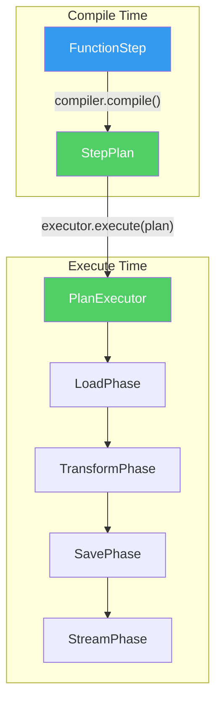

# plan_02_step_executor_extraction.md
## Component: Derived Step Execution

### Objective

Eliminate the 647-line `FunctionStep.process()` god method by making execution **derived from the typed plan**. The plan contains everything needed — the executor reads it and acts. No polymorphism, no per-step executor classes. One generic executor that dispatches on plan structure.

### The Rot

```python
# openhcs/core/steps/function_step.py
class FunctionStep(AbstractStep):
    def process(self, context: ProcessingContext, step_index: int) -> None:
        # 647 LINES of imperative execution
        step_plan = context.step_plans[step_index]
        func = step_plan.get('func')  # Stringly-typed
        ...
```

### The Insight

If the plan is fully typed (from `plan_01`), execution is **deterministic from plan structure**:

```python
@dataclass(frozen=True)
class StepPlan:
    func: Callable
    input_paths: List[Path]
    output_paths: List[Path]
    input_memory_type: MemoryType
    output_memory_type: MemoryType
    parameters: Dict[str, Any]
    group_by: Optional[GroupBy]
    streaming_config: Optional[StreamingConfig]
```

The execution algorithm is GENERIC:
1. Load from `plan.input_paths` as `plan.input_memory_type`
2. Group by `plan.group_by`
3. Call `plan.func(**plan.parameters)`
4. Convert to `plan.output_memory_type`
5. Save to `plan.output_paths`
6. Stream if `plan.streaming_config`

**This doesn't need polymorphism. It needs one executor that reads the plan.**

### Plan

#### 1. Single Generic Executor

```python
class PlanExecutor:
    """Executes any StepPlan. No subclasses needed.

    The plan IS the specification. Execution is derived.
    """

    def execute(self, plan: StepPlan, context: ProcessingContext) -> None:
        # Dispatch on plan structure, not step type
        if plan.group_by:
            self._execute_grouped(plan, context)
        else:
            self._execute_simple(plan, context)

    def _execute_simple(self, plan: StepPlan, context: ProcessingContext) -> None:
        for input_path, output_path in zip(plan.input_paths, plan.output_paths):
            data = self._load(input_path, plan.input_memory_type)
            result = plan.func(data, **plan.parameters)
            self._save(output_path, result, plan.output_memory_type)
            if plan.streaming_config:
                self._stream(result, plan.streaming_config)

    def _execute_grouped(self, plan: StepPlan, context: ProcessingContext) -> None:
        groups = self._group_paths(plan.input_paths, plan.group_by)
        for group_key, group_paths in groups.items():
            # ... same pattern, grouped
```

#### 2. Execution Phases as Composable Units

The 647 lines decompose into **phases** that can be declaratively composed:

```python
class ExecutionPhase(ABC):
    """Single responsibility execution phase."""

    @abstractmethod
    def __call__(self, data: Any, plan: StepPlan, context: ProcessingContext) -> Any:
        ...

class LoadPhase(ExecutionPhase):
    def __call__(self, path: Path, plan: StepPlan, context: ProcessingContext) -> Any:
        return context.io_backend.load(path, plan.input_memory_type)

class TransformPhase(ExecutionPhase):
    def __call__(self, data: Any, plan: StepPlan, context: ProcessingContext) -> Any:
        return plan.func(data, **plan.parameters)

class SavePhase(ExecutionPhase):
    def __call__(self, data: Any, plan: StepPlan, context: ProcessingContext) -> Any:
        context.io_backend.save(data, plan.output_path, plan.output_memory_type)
        return data

class StreamPhase(ExecutionPhase):
    def __call__(self, data: Any, plan: StepPlan, context: ProcessingContext) -> Any:
        if plan.streaming_config:
            context.streaming_backend.send(data, plan.streaming_config)
        return data
```

#### 3. Pipeline of Phases (Derived from Plan)

```python
class PlanExecutor:
    """Execution pipeline derived from plan structure."""

    def __init__(self):
        # Phase pipeline - order matters
        self.phases = [LoadPhase(), TransformPhase(), SavePhase(), StreamPhase()]

    def execute(self, plan: StepPlan, context: ProcessingContext) -> None:
        for input_path in plan.input_paths:
            data = input_path
            for phase in self.phases:
                data = phase(data, plan, context)
```

#### 4. Steps Have No Execution Logic

```python
@dataclass
class FunctionStep(AbstractStep):
    """Pure declaration. No process() method. No executor_class property."""

    func: FuncPattern
    processing_config: ProcessingConfig

    # Compilation produces StepPlan
    # Execution reads StepPlan
    # Step is ONLY declaration
```

### Why This Is Cracked

| Old (Competent) | New (Cracked) |
|-----------------|---------------|
| `FunctionStepExecutor` with 647 lines | `PlanExecutor` with ~50 lines |
| Per-step executor classes | One generic executor |
| Polymorphic dispatch on step type | Structural dispatch on plan fields |
| Manual phase ordering | Composable phase pipeline |
| Execution logic in executor | Execution derived from plan structure |

**The plan IS the execution specification. Reading it IS executing it.**

### Architecture Diagram



### Dependencies

- `plan_01_generic_compiler_spec.md` — Typed StepPlan with all execution info

### Cleanup — DELETE ALL OF THIS

**Code to DELETE from `function_step.py`:**
- The entire 647-line `process()` method body → replaced by `PlanExecutor.execute(plan)`
- All per-step execution logic → derived from `StepPlan` structure
- All manual phase management → replaced by composable `ExecutionPhase` pipeline

**No wrappers. No backwards compatibility.**
- `FunctionStep.process()` becomes: `PlanExecutor().execute(self.compile(context), context)`
- One-liner that delegates to the generic executor
- If something breaks, fix the plan structure — don't add special cases to the executor

### Implementation Draft

*Awaiting smell loop approval.*

