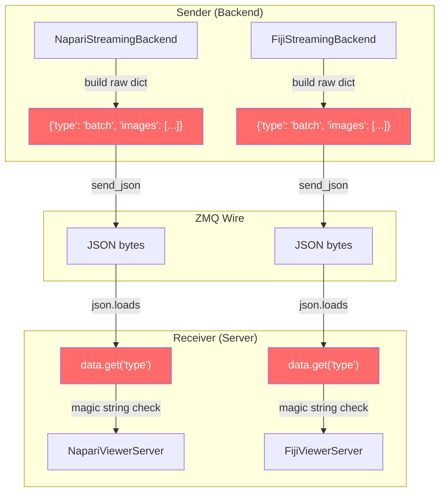
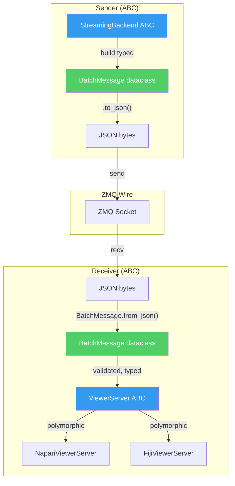
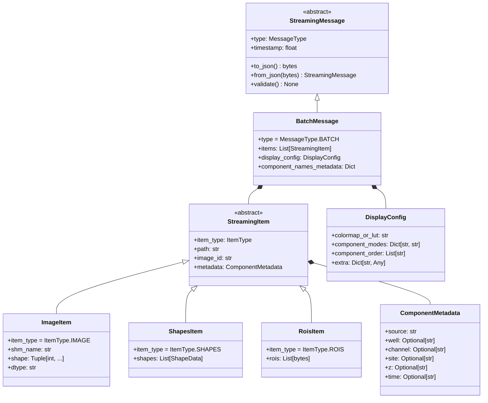

# plan_02_streaming_message_protocol.md
## Component: Typed Streaming Message Protocol

### Objective

Eliminate stringly-typed JSON message handling in streaming infrastructure. Replace copy-pasted dict building/parsing with typed dataclasses that fail loud on malformed data.

**Manifesto alignment:**
- *"No silent failures. If something is wrong, Python raises an error."* (§V)
- *"Declarative code is read structurally. The shape of the data IS the shape of the system."* (§VI)
- *"Each abstraction must solve one problem completely, generically, once."* (§II)

### Findings

**Current state — JavaScript-tier stringly-typed messaging:**

The codebase has `zmq_messages.py` with typed dataclasses (`ExecuteRequest`, `ImageAck`, `ROIMessage`) — but streaming ignores them entirely. Instead:

1. **Sender** (`napari_stream.py`, `fiji_stream.py`) builds raw dicts with magic strings
2. **Receiver** (`napari_stream_visualizer.py`, `fiji_viewer_server.py`) parses with `.get()` and fallback defaults
3. **No validation** — malformed messages silently produce garbage
4. **Duplicated parsing** — both servers have identical `process_image_message()` parsing logic

**Evidence of rot:**

```python
# SENDER: napari_stream.py line 145
message = {
    'type': 'batch',
    'images': batch_images,
    'display_config': {'colormap': ..., 'component_modes': ...},
}

# RECEIVER: napari_stream_visualizer.py line 1338
msg_type = data.get("type")
if msg_type == "batch":
    images = data.get("images", [])
```

Magic strings. No types. Silent fallbacks. Copy-pasted between Napari and Fiji.

### Current Architecture (Rot)



**Problems visible in diagram:**
- Two parallel paths doing identical work
- Raw dicts at sender, raw parsing at receiver
- No type safety crossing the wire

### Proposed Architecture (Clean)



**Improvements:**
- Single code path through ABCs
- Typed dataclasses cross the wire
- Validation happens once in `from_json()`
- Implementations only handle viewer-specific display logic

### Message Type Hierarchy



### Plan

1. **Define message enums in `zmq_messages.py`:**
   ```python
   class StreamingMessageType(Enum):
       BATCH = "batch"
       SINGLE = "single"  # legacy
   
   class StreamingItemType(Enum):
       IMAGE = "image"
       SHAPES = "shapes"
       POINTS = "points"
       ROIS = "rois"
   ```

2. **Define typed dataclasses for all message components** (see hierarchy above)

3. **Add validation in `from_json()`:**
   ```python
   @classmethod
   def from_json(cls, data: bytes) -> 'BatchMessage':
       d = json.loads(data)
       if d.get('type') != StreamingMessageType.BATCH.value:
           raise ValueError(f"Expected batch message, got {d.get('type')}")
       # ... validate and construct
   ```

4. **Refactor sender (StreamingBackend ABC):**
   - Build `BatchMessage` dataclass instead of raw dict
   - Call `.to_json()` before sending

5. **Refactor receiver (ViewerServer ABC):**
   - Call `BatchMessage.from_json()` to parse
   - Pass typed objects to `_process_single_item(item: StreamingItem)`

6. **Push common parsing to ABC:**
   - `ZMQServer` ABC gets `_parse_streaming_message()`
   - Implementations only override display logic

### Cleanup — DELETE ALL OF THIS

**Code to DELETE from `napari_stream.py` and `fiji_stream.py`:**
```python
message = {
    'type': 'batch',
    'images': [...],
    'display_config': {...}
}  # DELETE all raw dict building
```

**Code to DELETE from `napari_stream_visualizer.py` and `fiji_viewer_server.py`:**
```python
msg_type = data.get("type")
if msg_type == "batch":
    images = data.get("images", [])
    # ... DELETE all stringly-typed parsing with .get() fallbacks
```

**No wrappers. No backwards compatibility.**
- Senders build `BatchMessage` dataclass → call `.to_json()`
- Receivers call `BatchMessage.from_json()` → get typed object or fail loud
- If old code sends raw dicts, it breaks — update the sender

### ❌ ANTIPATTERNS TO AVOID

**DO NOT add fallback parsing for untyped dicts:**
```python
# ❌ WRONG: Fallback for old format
def from_json(cls, data: bytes) -> 'BatchMessage':
    d = json.loads(data)
    try:
        return cls._parse_typed(d)
    except KeyError:
        return cls._parse_legacy_dict(d)  # DON'T ADD FALLBACK
```
Fail loud. If the message is malformed, raise. Update the sender.

**DO NOT use .get() with default fallbacks:**
```python
# ❌ WRONG: Silent fallback to default
item_type = data.get('type', 'image')  # DON'T - fails silently
items = data.get('items', [])  # DON'T - hides missing field
```
Access directly. Missing field = KeyError = fail loud.

**DO NOT create separate message classes per backend:**
```python
# ❌ WRONG: Per-backend messages
class NapariBatchMessage(BatchMessage): ...
class FijiBatchMessage(BatchMessage): ...
```
ONE `BatchMessage` class. Backend differences are in display config, not message structure.

**DO NOT keep raw dict building "for debugging":**
```python
# ❌ WRONG: Parallel paths
if DEBUG:
    message = {'type': 'batch', ...}  # DON'T KEEP RAW DICTS
else:
    message = BatchMessage(...).to_json()
```
One path. Always typed dataclass. Debug by inspecting the dataclass.

**DO NOT add optional fields to avoid migration:**
```python
# ❌ WRONG: All fields optional
@dataclass
class BatchMessage:
    items: Optional[List[StreamingItem]] = None  # DON'T - hides bugs
    display_config: Optional[DisplayConfig] = None
```
Required fields are required. Optional means semantically optional, not "might be missing in legacy code."

### Implementation Draft

*Pending smell loop approval.*
