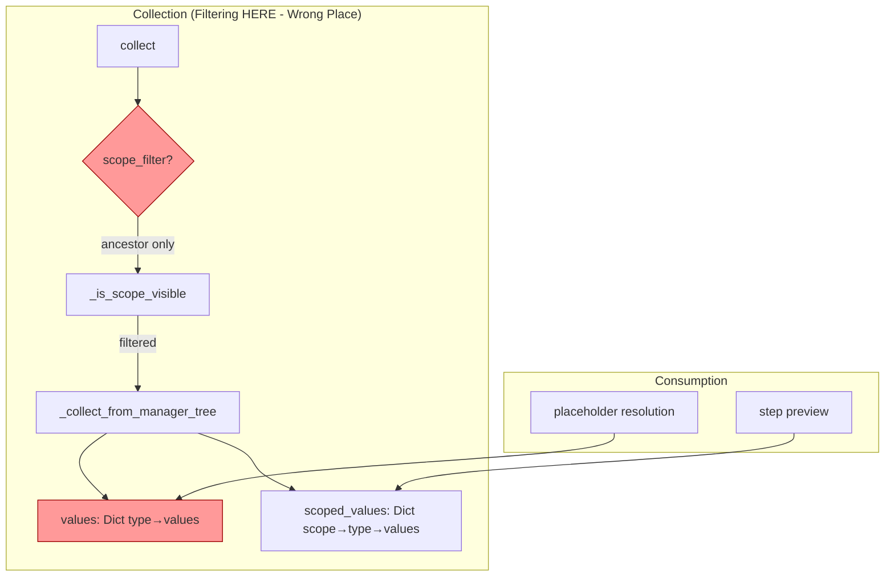
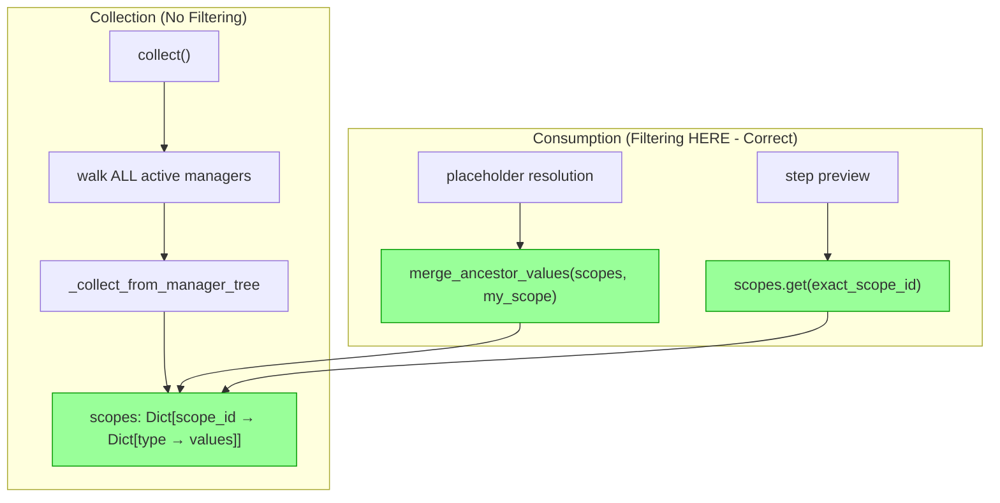

# plan_14_eliminate_values_dict.md
## Component: LiveContextSnapshot Simplification

### Objective

Eliminate accidental complexity by removing the `values` dict from `LiveContextSnapshot`, keeping only `scoped_values` (renamed to `scopes`). This creates a single, coherent data structure and moves filtering from collection-time to consumption-time.

### Problem Analysis

**Current state has 2 orthogonal concerns conflated:**

1. **`values`** - Pre-merged dict losing scope info, arbitrary last-writer-wins
2. **`scoped_values`** - Full info preserved, exact lookup

**The `values` dict is problematic:**
- Loses scope information during collection
- If 2 step editors open, `values[FunctionStep]` = arbitrary winner
- Forces filtering at collection time (incomplete, causes bugs)
- Consumer can't make correct decisions without scope info

### Before Architecture



**Problems:**
- 2 data structures with different semantics
- 2 filter parameters (scope_filter, for_type) 
- Filtering at collection loses information
- `values` has arbitrary last-writer-wins for same types

### After Architecture



**Benefits:**
- 1 data structure
- 0 filter parameters on collect()
- Full information preserved
- Consumer applies correct filtering with full context
- Consumer's scope_id already encodes plate path

### Plan

#### Phase 1: Simplify LiveContextSnapshot

1. Rename `scoped_values` → `scopes`
2. Remove `values` field
3. Update dataclass:
   ```python
   @dataclass(frozen=True)
   class LiveContextSnapshot:
       token: int
       scopes: Dict[str, Dict[type, Dict[str, Any]]]
   ```

#### Phase 2: Simplify collect() API

1. Remove ALL parameters from `collect()` - no filtering at collection time
2. Remove `_is_scope_visible()` method entirely
3. Remove `for_type` parameter and hierarchy filtering logic
4. Just walk all active managers and collect everything:
   ```python
   @classmethod
   def collect(cls) -> LiveContextSnapshot:
       """Collect live context from ALL active form managers."""
       scopes = {}
       for manager in cls._active_form_managers:
           cls._collect_from_manager_tree(manager, scopes)
       return LiveContextSnapshot(token=cls._live_context_token_counter, scopes=scopes)
   ```

#### Phase 3: Add consumption-time helpers

1. Create `merge_ancestor_values()` helper for placeholder resolution:
   ```python
   def merge_ancestor_values(
       scopes: Dict[str, Dict[type, Any]], 
       my_scope: str,
       my_type: type = None
   ) -> Dict[type, Dict[str, Any]]:
       """Merge values from ancestor scopes (less-specific → more-specific)."""
   ```

2. Update `parameter_ops_service.py` to use helper

#### Phase 4: Update consumers

1. **pipeline_editor.py** - Already uses exact lookup, just rename:
   ```python
   # Before: scoped_values.get(scope_id)
   # After:  snapshot.scopes.get(scope_id)
   ```

2. **parameter_ops_service.py** - Use new helper:
   ```python
   # Before: live_context = snapshot.values
   # After:  live_context = merge_ancestor_values(snapshot.scopes, manager.scope_id)
   ```

### Findings

**Files to modify:**
- `openhcs/pyqt_gui/widgets/shared/services/live_context_service.py` - Core changes
- `openhcs/pyqt_gui/widgets/shared/services/parameter_ops_service.py` - Use helper
- `openhcs/pyqt_gui/widgets/pipeline_editor.py` - Rename access

**Consumers of `snapshot.values` (must migrate):**
- `parameter_ops_service.py` lines 328, 398

**Consumers of `snapshot.scoped_values` (just rename):**
- `pipeline_editor.py` line 679

**Code to remove:**
- `_is_scope_visible()` method entirely
- `scope_filter` parameter from collect()
- `for_type` parameter and its filtering logic
- `values` field from LiveContextSnapshot
- Cache key complexity (just use token)

### Risk Assessment

| Risk | Mitigation |
|------|------------|
| Breaking placeholder resolution | Helper function provides same semantics |
| Performance regression | Filtering is O(n) where n=scopes, typically <5 |
| Cache invalidation | Token mechanism unchanged |

### Implementation Draft

*To be written after smell review passes.*

