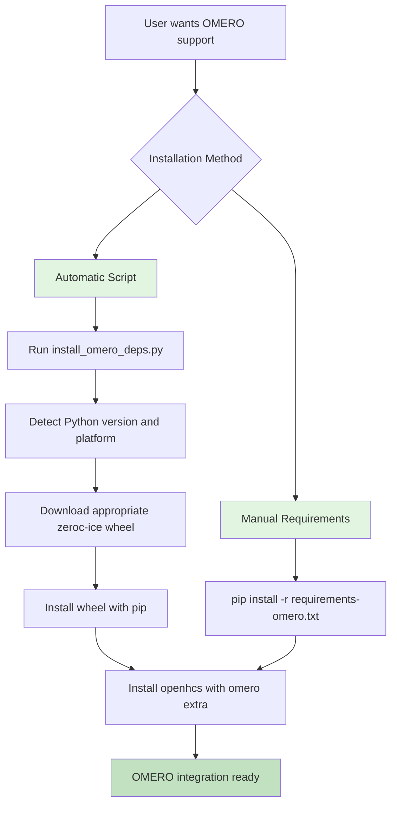

# ZeroC-Ice Dependency Solution Plan

## Problem

The `omero-py` package depends on `zeroc-ice`, which is not available on PyPI. The binaries must be obtained from Glencoe Software's download repository.

## Solution Approach

We will create a custom installation script that:
1. Detects the current Python version and platform
2. Downloads the appropriate zeroc-ice wheel from Glencoe Software
3. Installs the wheel before installing openhcs with OMERO dependencies

## Implementation Plan

### 1. Create Installation Script (`scripts/install_omero_deps.py`)

The script will:
- Detect Python version (3.11 or 3.12)
- Detect platform (Windows, Linux, macOS)
- Map to the appropriate zeroc-ice wheel URL
- Download and install the wheel
- Provide clear error messages if download fails

### 2. Update `pyproject.toml`

Add comments and documentation about the OMERO dependency requirements:
- Note that zeroc-ice must be installed separately
- Reference the installation script
- Provide clear instructions for users

### 3. Create Documentation

Create or update documentation in:
- `README.md` - Quick start with OMERO
- `omero_openhcs/INSTALL.md` - Detailed installation instructions
- New `docs/omero_installation.md` - Complete guide

## ZeroC-Ice Wheel URL Pattern

Based on Glencoe Software's download repository:

```
Base URL: https://downloads.openmicroscopy.org/ice/

Python 3.11:
  - Linux: https://downloads.openmicroscopy.org/ice/python-3.11/zeroc_ice-3.7.x-py3-none-any.whl
  - macOS: https://downloads.openmicroscopy.org/ice/python-3.11/zeroc_ice-3.7.x-py3-none-any.whl
  - Windows: https://downloads.openmicroscopy.org/ice/python-3.11/zeroc_ice-3.7.x-py3-none-any.whl

Python 3.12:
  - Linux: https://downloads.openmicroscopy.org/ice/python-3.12/zeroc_ice-3.7.x-py3-none-any.whl
  - macOS: https://downloads.openmicroscopy.org/ice/python-3.12/zeroc_ice-3.7.x-py3-none-any.whl
  - Windows: https://downloads.openmicroscopy.org/ice/python-3.12/zeroc_ice-3.7.x-py3-none-any.whl
```

*Note: The exact version number (3.7.x) should be configurable and updated as new versions are released.*

## Installation Script Design

### `scripts/install_omero_deps.py`

```python
#!/usr/bin/env python3
"""
Install ZeroC-Ice dependency for OMERO integration.

This script downloads and installs the appropriate zeroc-ice wheel
from Glencoe Software's download repository based on the current
Python version and platform.
"""

import sys
import platform
import urllib.request
import subprocess
from pathlib import Path
from typing import Optional

# ZeroC-Ice wheel URL mapping
ZEROC_ICE_BASE_URL = "https://downloads.openmicroscopy.org/ice/"
ZEROC_ICE_VERSION = "3.7.9"  # Update as needed

def get_python_version() -> str:
    """Get current Python version (e.g., '3.11', '3.12')."""
    return f"{sys.version_info.major}.{sys.version_info.minor}"

def get_platform() -> str:
    """Get current platform identifier."""
    system = platform.system().lower()
    if system == "windows":
        return "windows"
    elif system == "darwin":
        return "macos"
    elif system == "linux":
        return "linux"
    else:
        raise RuntimeError(f"Unsupported platform: {system}")

def get_wheel_url(python_version: str, platform_name: str) -> str:
    """
    Construct the zeroc-ice wheel URL for the given Python version and platform.

    Args:
        python_version: Python version (e.g., '3.11', '3.12')
        platform_name: Platform name ('windows', 'linux', 'macos')

    Returns:
        URL to the appropriate zeroc-ice wheel
    """
    # Glencoe Software provides platform-specific wheels
    # The URL pattern may vary - check the blog post for exact format
    url = f"{ZEROC_ICE_BASE_URL}python-{python_version}/zeroc_ice-{ZEROC_ICE_VERSION}-py3-none-any.whl"
    return url

def download_wheel(url: str, dest_dir: Path) -> Path:
    """
    Download a wheel file from the given URL.

    Args:
        url: URL to download from
        dest_dir: Directory to save the wheel file

    Returns:
        Path to the downloaded wheel file
    """
    dest_dir.mkdir(parents=True, exist_ok=True)
    filename = url.split("/")[-1]
    dest_path = dest_dir / filename

    print(f"Downloading {url}...")
    urllib.request.urlretrieve(url, dest_path)
    print(f"Downloaded to {dest_path}")

    return dest_path

def install_wheel(wheel_path: Path) -> bool:
    """
    Install a wheel file using pip.

    Args:
        wheel_path: Path to the wheel file

    Returns:
        True if installation succeeded, False otherwise
    """
    try:
        subprocess.run(
            [sys.executable, "-m", "pip", "install", str(wheel_path)],
            check=True
        )
        return True
    except subprocess.CalledProcessError as e:
        print(f"Failed to install wheel: {e}")
        return False

def main():
    """Main installation function."""
    print("=" * 60)
    print("ZeroC-Ice Installation Script for OMERO Integration")
    print("=" * 60)

    python_version = get_python_version()
    platform_name = get_platform()

    print(f"Python version: {python_version}")
    print(f"Platform: {platform_name}")

    # Validate Python version
    if python_version not in ["3.11", "3.12"]:
        print(f"Warning: Python {python_version} may not have a pre-built zeroc-ice wheel.")
        print("Supported versions: 3.11, 3.12")
        response = input("Continue anyway? (y/N): ")
        if response.lower() != 'y':
            sys.exit(1)

    # Get wheel URL
    wheel_url = get_wheel_url(python_version, platform_name)
    print(f"Wheel URL: {wheel_url}")

    # Download wheel
    dest_dir = Path.home() / ".openhcs" / "wheels"
    wheel_path = download_wheel(wheel_url, dest_dir)

    # Install wheel
    print("Installing zeroc-ice...")
    if install_wheel(wheel_path):
        print("Successfully installed zeroc-ice!")
        print("\nYou can now install openhcs with OMERO support:")
        print("  pip install 'openhcs[omero]'")
        return 0
    else:
        print("Failed to install zeroc-ice.")
        return 1

if __name__ == "__main__":
    sys.exit(main())
```

### Alternative: Use `--find-links` Approach

Create a `requirements-omero.txt` file:

```txt
# OMERO dependencies with zeroc-ice from Glencoe Software
--find-links https://downloads.openmicroscopy.org/ice/python-3.11
--find-links https://downloads.openmicroscopy.org/ice/python-3.12
omero-py>=5.19.0
```

Users can then install with:
```bash
pip install -r requirements-omero.txt
```

## pyproject.toml Updates

Add comments to the OMERO optional dependencies section:

```toml
# OMERO integration dependencies
# NOTE: zeroc-ice is a dependency of omero-py but is not available on PyPI.
# You must install zeroc-ice manually before installing OMERO dependencies.
#
# Quick installation:
#   python scripts/install_omero_deps.py
#   pip install 'openhcs[omero]'
#
# Or use the requirements file:
#   pip install -r requirements-omero.txt
omero = [
    "omero-py>=5.19.0",
]
```

## Documentation Updates

### README.md

Add a section on OMERO installation:

```markdown
## OMERO Integration

To use OMERO integration features, you need to install the zeroc-ice dependency
which is not available on PyPI:

### Quick Installation

```bash
# Install zeroc-ice (automatic)
python scripts/install_omero_deps.py

# Install openhcs with OMERO support
pip install 'openhcs[omero]'
```

### Manual Installation

See [omero_openhcs/INSTALL.md](omero_openhcs/INSTALL.md) for detailed instructions.
```

## Files to Create/Modify

1. **Create**: `scripts/install_omero_deps.py` - Installation script
2. **Create**: `requirements-omero.txt` - Alternative requirements file
3. **Modify**: `pyproject.toml` - Add comments and documentation
4. **Modify**: `README.md` - Add OMERO installation section
5. **Modify**: `omero_openhcs/INSTALL.md` - Update with new installation method

## Testing Checklist

- [ ] Test script on Python 3.11 (Windows, Linux, macOS)
- [ ] Test script on Python 3.12 (Windows, Linux, macOS)
- [ ] Verify omero-py installation after zeroc-ice is installed
- [ ] Test OMERO integration functionality
- [ ] Update documentation with any platform-specific notes

## Mermaid Diagram


